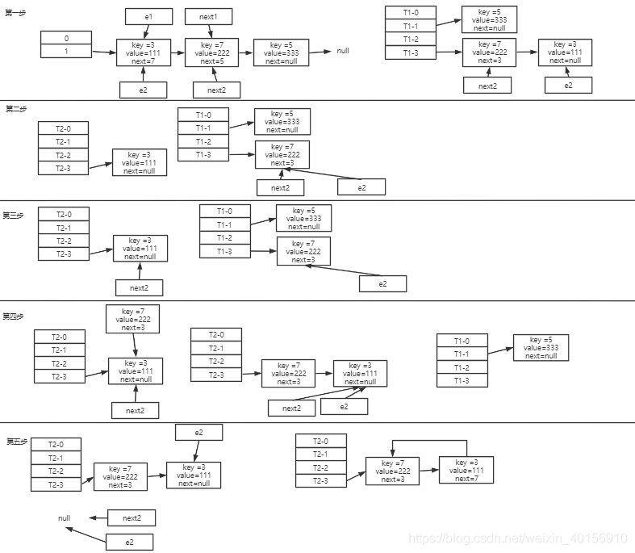

# HashMap扩容死锁

HashMap在JDK1.7使用的是数组+链表的方式，而在JDK1.8及以后则使用的是数组+链表+红黑树的方式进行数据存储。本文主要是对JDK1.7中存在的死锁问题进行分析。

## transfer()函数
```java
 /**
     * Transfers all entries from current table to newTable.
     */
    void transfer(Entry[] newTable, boolean rehash) {
        int newCapacity = newTable.length;
        for (Entry<K,V> e : table) {
            while(null != e) {
                Entry<K,V> next = e.next;//第一行
                if (rehash) {
                    e.hash = null == e.key ? 0 : hash(e.key);
                }
                int i = indexFor(e.hash, newCapacity);//第二行
                e.next = newTable[i];//第三行
                newTable[i] = e;//第四行
                e = next;//第五行
            }
        }
    }
```
第一行：记录oldhash表中e.next;
第二行：rehash计算数组的位置；
第三行：e要插入到链表的头部，所以要将e.next指向new hash的表中的第一个元素；
第四行：将e放入到newTable当中；
第五行：将e指向下一个节点。
## 原Entry数组转移到新Entry数组
数组的容量首先是2的指数次方大小，如果无构造参数，默认大小为16。当数组的大小超过扩容阈值的时候，就会扩容，一般扩容为之前的2倍。在JDK1.7中主要使用的是头插法的方式进行数组扩容。从原数组转移数据到新数组时，假设所有数据还是会落在同一索引下，那么同一链表下的数据的存储位置会发生反转，头变成尾，尾变成头。

## 扩容死锁
### 单线程扩容
假设：hash的算法就是简单的key与length(数组长度)的求余。hash表的长度为2，如果不扩容，那么元素3，5，7按照计算(key%length)都应该碰撞到table\[1]上。
扩容：将hash表的长度将会变成4，然后重新计算hash。
第一步：e指向key(3)，next指向key(7)；
第二步：计算key(3)将会落在new\[3]上面(3%4=3)，将key(3)指向new\[3]，并将key(3)放到new\[3]；
第三步：e指向key(7)；
第四步：next指向key(5)；
第五步：计算key(7)将会落在new\[3]上面(7%4=3)，key(7)的next指向key(3)，采用头部插入法，将key(7)插入new\[3]；
第六步：同上。直到e指向null跳出循环。


### 多线程扩容死锁
假设有两个T1、T2线程同时put，同时进入到transfer()。
在`Entry<K,V> next = e.next;`代码块处，线程T2中断，此时T1线程执行完线程扩容，T2继续执行。
第一步：e2和next2当前指向的位置为T1处的值；
第二步：：计算key(3)将会落在new2\[3]上面(3%4=3)，将key(3)指向new2\[3]，并将key(3)放到new\[3]，e2和next2指向key(7)；
第三步：next2指向key(7).next，也就是T2中的key(3)，e2指向T1的key(7)；
第四步：将key(7)插入到T2的new\[3]位置，根据e2 =next2，此时e2和next2都指向key(3)；
第五步：此时next2=e2.next，next2指向null，key(3)重新插入到T2-3中，key(3).next = key(7)，此时e2指向null，形成闭环。


当再有新的key插入T2-3时，首先要判断当前key是否存在时，在`for (Entry<K,V> e = table[i]; e != null; e = e.next)`就会进入死循环。

```java
public V put(K key, V value) {
        if (table == EMPTY_TABLE) {
            inflateTable(threshold);
        }
        if (key == null)
            return putForNullKey(value);
        int hash = hash(key);
        int i = indexFor(hash, table.length);
        for (Entry<K,V> e = table[i]; e != null; e = e.next) {
            Object k;
            if (e.hash == hash && ((k = e.key) == key || key.equals(k))) {
                V oldValue = e.value;
                e.value = value;
                e.recordAccess(this);
                return oldValue;
            }
        }

        modCount++;
        addEntry(hash, key, value, i);
        return null;
    }
```
JDK1.8对死锁的改进请见:[HashMap扩容改进分析](https://blog.csdn.net/weixin_40156910/article/details/114640219)

