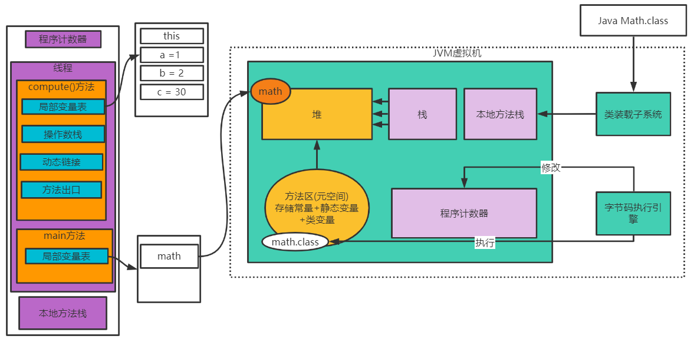
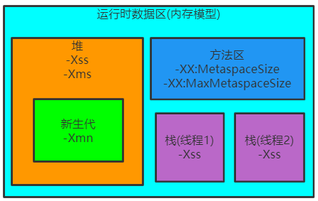

# JVM内存模型剖析和优化

## JVM内存模型

类装载子系统：C++代码实现，将类加入到JVM虚拟机。

字节码装载引擎：执行加载到JVM中的类。

堆：存放对象

栈：运行一个线程开启一个栈

程序计数器：记录代码执行位置，避免中断后执行时找不到位置，字节码执行引擎对程序计数器进行修改。

方法区：方法区存放了一些常量，静态变量，以及类的字节码文件的类信息(主要是把类中信息都按照一定方式存储)。

## JVM整体结构及内存模型





## 线程栈运行原理

```java
public class Math {

    public static void main(String[] args) {
        
        Math math = new Math();
        math.compute();
    }
    
    public int compute(){
        int a = 1;
        int b = 2;
        int c = (a+b)*10;
        return c;
    }
}
```

动态链接：程序运行到方法处，方法此时放在常量池中，此时运行此行代码，就需要找到在方法区中找到方法内部对应的变量，并将这个符号引号转变成地址的直接引用。在类的加载过程中，对于这种非静态方法只会把他们当作一个符号。

1. 字节码执行引擎执行Math，找到找到main方法开启线程；
2. main()方法进栈，在堆中创建Math实例对象；
3. compute()方法入栈；
4. 将常量1放入到操作数栈中，将a放入局部变量表，将变量值赋给a，并放回局部变量表中，此时a的索引是1，索引0表示的是this；
5. 重复4 5可以将变量b赋值；
6. 将a 和b的值仿佛到操作数栈中，加载到CPU中执行加法操作了，操作数栈中加入10，并执行乘法操作；
7. 执行返回方法，作为方法出口；
8. 方法 执行完毕，compute()出栈。

## JVM内存参数设置



-XX:MaxMetaspaceSize：设置元空间最大值，默认是-1，即不限制，或者说是受限于本地内存大小。

-XX:MetaspaceSize：指定元空间出发Full gc的初始阈值(元空间无固定初始大小)，以字节为单位，默认是21M，达到该值就会触发full gc进行类型卸载，同时收集器会对该值进行调整：如果释放了大量的空间，就会适当降低该空间的值；如果释放了很少空间，那么在不超过-XX:MaxMetaspaceSize的情况下，适当提高该值。