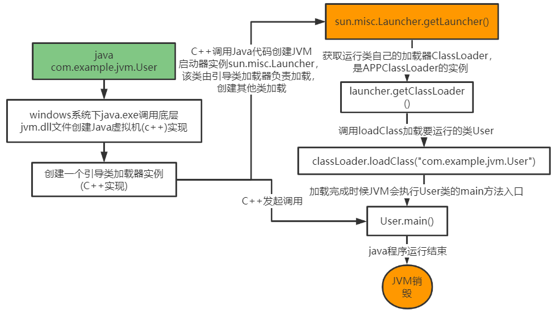

# JVM类加载机制

## 1.类加载器

引导类加载器：负责加载支撑JVM运行的位于jre的lib目录下的核心类库，比如，rt.jar、charsets.jar等。

扩展类加载器：负责加载支撑JVM运行的位于jre的lib目录下ext扩展目录中的jar类包。

应用程序类加载器：负责加载ClassPath路径下的类包，主要是加载自己写的类。

自定义加载器：负责加载用户自定义路径下的类包。

## 2.类加载过程


1. 首先生成Java类编译打包jar包或者war包

2. 使用类时，加载类，同时new一个类、用类的main()方法等。在加载阶段，会在内存中生成java.lang.Class对象，作为这个类的各种数据的访问入口。
3. 验证：校验字节码文件的格式，规范
4. 准备：类静态变量分配内存，并赋予默认值，这里的默认值是系统给的，比如int类型静态变量默认为0.
5. 解析：将符号引用替换为直接引用，把静态方法替换为指向数据所存内存的指针或者句柄。
6. 初始化：对类的静态变量初始化为设定的值，并执行静态代码块。

主要的部分是在loadclass中




1. 首先创建Java虚拟机;
2. Java虚拟机会创建一个引导类加载器，这里的加载器是C++实现的;
3. 创建Launcher类加载器，初始化使用了单例设计模式，保证每个虚拟机内只有一个Launcher类实例;
4. 通过getLauncher()方法，创建APPClassLoader加载器的实例;
5. 通过loaderClass()方法加载需要运行的类;
6. 加载完成后JVM会执行加载类的main()方法入口。

## 3.类加载初始化过程

在Launcher类中，直接new一个Launcher，保证在一个JVM中只有一个Launcher类。```private static Launcher launcher = new Launcher();```

在Launcher类构造方法中，创建了两个类加载器ExtClassLoader和AppClassLoader。

JVM默认使用Launcher的getAppClassLoader()方法返回的类加载器AppClassLoader的实例加载应用程序。 `this.loader = Launcher.AppClassLoader.getAppClassLoader(var1);`

```java
 public Launcher() {
        Launcher.ExtClassLoader var1;
        try {
            var1 = Launcher.ExtClassLoader.getExtClassLoader();
        } catch (IOException var10) {
            throw new InternalError("Could not create extension class loader", var10);
        }

        try {
            //初始的ClassLoader是AppClassLoader
            this.loader = Launcher.AppClassLoader.getAppClassLoader(var1);
        } catch (IOException var9) {
            throw new InternalError("Could not create application class loader", var9);
        }

        Thread.currentThread().setContextClassLoader(this.loader);
        String var2 = System.getProperty("java.security.manager");
        if (var2 != null) {
            SecurityManager var3 = null;
            if (!"".equals(var2) && !"default".equals(var2)) {
                try {
                    var3 = (SecurityManager)this.loader.loadClass(var2).newInstance();
                } catch (IllegalAccessException var5) {
                } catch (InstantiationException var6) {
                } catch (ClassNotFoundException var7) {
                } catch (ClassCastException var8) {
                }
            } else {
                var3 = new SecurityManager();
            }

            if (var3 == null) {
                throw new InternalError("Could not create SecurityManager: " + var2);
            }

            System.setSecurityManager(var3);
        }

    }
```


## 4.双亲委派机制


双亲委派机制说的是类加载的层级关系。


当加载某个类时，首先委托父加载器寻找目标类，找不到再委托上层的父加载器寻找目标类，如果所有的父类在自己的加载路径下都找不到目标类，则在自己的类加载器中查找并载入目标类。

1. User类，最先找到应用程序类加载器加载，判断User类是否已经加载进来，加载进来直接用，如果没有加载进来，委托扩展类加载器进行加载；
2. 扩展类加载器判断User类是否加载进来，如果加载进来直接用，没有加载进来，在委托引导类加载器进行加载；
3. 顶层的引导类加载器在自己的类加载路径下面找不到目标类，退回到下一级扩展类加载器中加载；
4. 扩展类加载器没有在加载路径下面找到对应的User类，退回给应用程序类加载器进行加载；
5. 应用程序类加载器在自己的类加载路径下面找到了User类，结果自己加载。


```java
protected Class<?> loadClass(String name, boolean resolve)
        throws ClassNotFoundException
    {
        synchronized (getClassLoadingLock(name)) {
            // First, check if the class has already been loaded
            Class<?> c = findLoadedClass(name);
            if (c == null) {
                long t0 = System.nanoTime();
                try {
                    if (parent != null) {
                        //加载父加载器
                        c = parent.loadClass(name, false);
                    } else {
                        c = findBootstrapClassOrNull(name);
                    }
                } catch (ClassNotFoundException e) {
                    // ClassNotFoundException thrown if class not found
                    // from the non-null parent class loader
                }
				//当前目录下加载name类
                if (c == null) {
                    // If still not found, then invoke findClass in order
                    // to find the class.
                    long t1 = System.nanoTime();
                    c = findClass(name);

                    // this is the defining class loader; record the stats
                    sun.misc.PerfCounter.getParentDelegationTime().addTime(t1 - t0);
                    sun.misc.PerfCounter.getFindClassTime().addElapsedTimeFrom(t1);
                    sun.misc.PerfCounter.getFindClasses().increment();
                }
            }
            if (resolve) {
                resolveClass(c);
            }
            return c;
        }
    }
```


## 5.为什么要设置双亲委派机制

### 5.1.沙箱安全机制

防止外部加载器加载内部核心类，核心类不会被篡改。

### 5.2.避免类的重复加载

当父类已经加载了当前类，没必要子ClassLoader在加载一次，保证类被加载的唯一性。


## 6.自定义类加载器

自定义类加载器只需要继承java.lang.ClassLoader类，该类有两个核心方法，一个是loadClass实现双亲委派机制，还有一个是findClass，默认实现空方法，自定义类加载器只需要重写findClass就可以。

```java
public class MyClassLoaderTest {

    static class MyClassLoader extends ClassLoader{
        private String classPath;

        public MyClassLoader(String classPath){
            this.classPath = classPath;
        }

        private byte[] loadByte(String name) throws Exception{
            name = name.replaceAll("\\.","/");
            FileInputStream fis = new FileInputStream(classPath+"/"+name+".class");
            int len = fis.available();
            byte[] data = new byte[len];
            fis.read(data);
            fis.close();
            return data;
        }

        protected Class<?> findClass(String name)
                throws ClassNotFoundException
        {
            try {
                byte[] data =loadByte(name);
                return defineClass(name,data,0,data.length);
            } catch (Exception e) {
                throw new ClassNotFoundException();
            }
        }
    }

    public static void main(String[] args) throws Exception {
        MyClassLoader classLoader = new MyClassLoader("D:\\test");
        Class clazz = classLoader.loadClass("com.example.jvm.User");
        Object object = clazz.newInstance();
        Method method = clazz.getDeclaredMethod("information",null);
        method.invoke(object,null);
        System.out.println(clazz.getClassLoader().getClass().getName());
    }
}

```

## 7.打破双亲委派机制

只需要在loadClass方法中重写加载方式。将需要加载的类不在委托父加载器进行加载，而是直接由当前类加载器进行加载。

```java
public class MyClassLoaderTest {

    static class MyClassLoader extends ClassLoader {
        private String classPath;

        public MyClassLoader(String classPath) {
            this.classPath = classPath;
        }

        private byte[] loadByte(String name) throws Exception {
            name = name.replaceAll("\\.", "/");
            FileInputStream fis = new FileInputStream(classPath + "/" + name + ".class");
            int len = fis.available();
            byte[] data = new byte[len];
            fis.read(data);
            fis.close();
            return data;
        }

        protected Class<?> findClass(String name)
                throws ClassNotFoundException {
            try {
                byte[] data = loadByte(name);
                return defineClass(name, data, 0, data.length);
            } catch (Exception e) {
                throw new ClassNotFoundException();
            }
        }

        protected Class<?> loadClass(String name, boolean resolve)
                throws ClassNotFoundException {
            synchronized (getClassLoadingLock(name)) {
                // First, check if the class has already been loaded
                Class<?> c = findLoadedClass(name);
                if (c == null) {
                    long t0 = System.nanoTime();
					//不是自定义类中的类依然采用双亲委派机制进行类加载
                    if (!name.startsWith("com.example.jvm")) {
                        c = this.getParent().loadClass(name);
                    } else {
                        //自定义类直接选择当前类加载
                        c = findClass(name);
                    }
                    long t1 = System.nanoTime();
                    // this is the defining class loader; record the stats
                    sun.misc.PerfCounter.getParentDelegationTime().addTime(t1 - t0);
                    sun.misc.PerfCounter.getFindClassTime().addElapsedTimeFrom(t1);
                    sun.misc.PerfCounter.getFindClasses().increment();

                }
                if (resolve) {
                    resolveClass(c);
                }
                return c;
            }
        }
    }

    public static void main(String[] args) throws Exception {
        MyClassLoader classLoader = new MyClassLoader("D:\\test");
        Class clazz = classLoader.loadClass("com.example.jvm.User");
        Object object = clazz.newInstance();
        Method method = clazz.getDeclaredMethod("information", null);
        method.invoke(object, null);
        System.out.println(clazz.getClassLoader().getClass().getName());
    }
}
```


