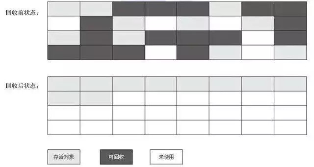
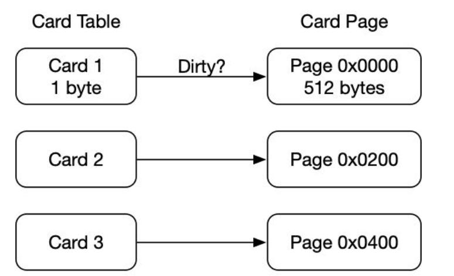

垃圾回收算法

# 1分代收集理论

当前虚拟机的垃圾收集都采用分代收集算法，只是根据对象存活周期的不同将内存分为几块。一般将Java堆分为年轻代和老年代，这样可以根据各个年代的特点选择不同的垃圾收集算法。

比如在年轻代中，每次收集都有大量的对象(90%)死去，所以可以选择复制算法，只需要付出少量的复制成本就可以完成每次的垃圾收集。而老年代的对象存活几率是比较高的，而且没有额外的空间对其进行分配担保，所以必须要采用“标记-清除”或“标记-整理”算法进行垃圾收集。注意，“标记-清除”和“标记-整理”算法会比复制算法慢10倍以上。

# **2标记-复制算法**

为了解决效率问题，“复制”收集算法出现了。它可以将内存分为大小相同的两块，每次使用其中的一块。当这一块用完以后，就将存活的对象移动到另一块去，然后再把当前块的使用空间全部清除掉，这样就使每次的内存回收都是对内存区间的一半进行回收。


# **3标记-清除算法**

算法分为“标记”和“清除”阶段：标记存活的对象，统一回收所有未被标记的对象，也可以反过来，标出所有需要收集的对象，在标记完成后，统一收回标记的对象。这是最基础的收集算法，比较简单，但是会带来两个明显的问题：

1.效率问题(如果需要标记的对象太多，效率不高)

2.空间问题(标记清除后会产生大量不连续的碎片)


# 4标记-整理算法

根据老年代的特点出来的一种算法，标记过程仍然与“标记-清除”一样，但后续算法不是直接回收对象，而是让所有存活的对象都向一边移动，然后直接清理掉边界以外的对象。



垃圾收集器


如果说垃圾收集算法是内存回收的方法论，那么垃圾回收器就是内存回收的具体实现。

虽然对垃圾回收器进行比较，并非为了挑选出一个最好的回收器。因为当前没有最好的回收器出现，也没有万能的垃圾回收器，只有根据不同的场景下， 选择最合适的垃圾回收器。

# **5 Serial收集器(-XX:+UseSerialGC  -XX:+UseSerialOldGC)**

Serial(串行)收集器是最基本、历史最悠久的垃圾收集器。是一个单线程收集器。它的“单线程”并不是说它只是用一条垃圾收集线程去完成垃圾收集工作，更重要的是在进行垃圾收集工作的时候必须暂停其他的所有的工作线程("stop the world")，直到它收集结束。

**新生代采用复制算法，老年代采用标记-整理算法。**


Serial垃圾收集器简单而高效(与其他收集器的单线程相比)。Serial收集器没有线程交互的开销，自然可以获得很高的单线程收集效率。

Serial old收集器是Serial收集器的老年代版本，同样是一个单线程收集器。主要有两大用途：一种用途是在JDK1.5以及以前的版本中与Parallel Scavenge收集器搭配使用，**另一种用途是作为CMS收集器的后备方案**。

Parallel Scavenge收集器**(-XX:+UseParallelGC(年轻代),-XX:+UseParallelOldGC(老年代))**

Parallel收集器其实就是Serial收集器的多线程版本，除了使用多线程进行垃圾收集外，其余行为(控制参数、收集算法、回收策略等)和Serial收集算法类似。默认的收集线程数和CPU的核数相同，当然也可以用参数(-XX:ParallelGCThreads)指定收集线程数，一般不推荐修改。

Parallel Scavenge收集器关注的是吞吐量(高效的利用CPU)。CMS等垃圾收集器的关注点更多的是用户线程的停顿时间(提升用户体验)，Parallel Scavenge收集器提供了很多参数供用户找到最合适的停顿时间或最大吞吐量，如果对于收集器运作不太了解的话，可以选择把内存管理优化交给虚拟机去完成也是一个不错的选择。

**新生代采用复制算法，老年代采用标记-整理算法。**


Parallel old收集器是Parallel Scavenge收集器的老年版本。使用多线程和‘’‘标记-整理算法’。在注重吞吐量以及CPU资源的场合，都可以优先考虑 Parallel Scavenge收集器和Parallel Old收集器(**JDK8默认的新生代和老年代收集器**)。

# 6 ParNew收集器**(-XX:+UseParNewGC)**

ParNew收集器其实跟Parallel收集器很类似，区别主要是ParNew可以和CMS收集器进行配合。

**新生代采用复制算法，老年代采用标记-整理算法。**


它是许多运行在server模式下的虚拟机的首要选择，除了Serial收集器外，只用它能和CMS收集器(真正意义上的并发收集器)配合工作。

# 7 CMS收集器**(-XX:+UseConcMarkSweepGC(old))**

CMS(concurrent Mark sweep)收集器是一种以获取最短回收停顿时间为目标的收集器。它非常符合在注重用户体验上使用，他是hotspot虚拟机第一款真正意义上的并发收集器。他第一次实现了让垃圾收集线程与用户线程(基本上)同时工作。

从名字中可以看出，CMS收集器是一种“**标记-清除**”的算法，它的运行过程相比较之前的几种垃圾回收器来说更加复杂一些。整个过程分为四个步骤：

- 初始标记：暂停所有其他线程(STW)，并记录下gc roots直接引用的对象，速度很快。

- 并发标记：并发标记阶段就是从GC roots的直接关联对象开始遍历整个对象图的过程，这个过程耗时较长但是不需要停止用户线程，可以和垃圾收集线程一起并发运行。因为用户程序继续运行，可能会导致已经标记过的对象状态发生改变。

- 重新标记：重新标记是为了修改并发标记过程中因为用户程序运行而导致的标记产生变化的那一部分对象的标记记录，这段时间停顿的时间会比初始标记阶段的时间稍长，远远比并发标记的时间短。主要是用三色标记里的增量更新算法做重新标记。

- 并发清理：开启用户线程，同时GC线程开始对未标记的区域进行清理。如果这个阶段有新增对象会被标记为黑色而不作处理。

- 并发重置：重置本次GC过程中的标记数据。


从它的名字看就是一款优秀的垃圾收集器，主要优点：并发收集、低停顿。但是有下面几个明显的缺点：

1.对CPU资源敏感（会和服务抢资源）

2.无法处理浮动垃圾(并发标记和并发清理阶段产生的垃圾，这种浮动垃圾只能等到下次gc时再次清理)

3.它使用的算法是标记-清除算法会导致垃圾收集结束会产生大量的空间碎片，当然可以使用参数-XX:+UseCMSCompactAtFullCollection可以让JVM在执行完标记清除后在做整理。

4.执行过程中的不确定性，会存在上一次的垃圾还没有收集完，然后垃圾回收又被触发的情况，特别是在并发标记和并发清理阶段会出现，一边回收，系统一边运行，也许没有回收完成就有发生full gc，也就是“concurrent mode failure”，此时会进入“stop the world”，用serial old垃圾收集器回收。

**CMS的相关核心参数**

1. -XX:+UseConcMarkSweepGC：启用cms 
2. -XX:ConcGCThreads：并发的GC线程数
3. -XX:+UseCMSCompactAtFullCollection：FullGC之后做压缩整理（减少碎片）
4. -XX:CMSFullGCsBeforeCompaction：多少次FullGC之后压缩一次，默认是0，代表每次FullGC后都会压缩一次  
5. -XX:CMSInitiatingOccupancyFraction: 当老年代使用达到该比例时会触发FullGC（默认是92，这是百分比）
6. -XX:+UseCMSInitiatingOccupancyOnly：只使用设定的回收阈值(-XX:CMSInitiatingOccupancyFraction设定的值)，如果不指定，JVM仅在第一次使用设定值，后续则会自动调整
7. -XX:+CMSScavengeBeforeRemark：在CMS GC前启动一次minor gc，降低CMS GC标记阶段**(**也会对年轻代一起做标记，如果在minor gc就干掉了很多对垃圾对象，标记阶段就会减少一些标记时间**)**时的开销，一般CMS的GC耗时 80%都在标记阶段
8. -XX:+CMSParallellnitialMarkEnabled：表示在初始标记的时候多线程执行，缩短STW
9. -XX:+CMSParallelRemarkEnabled：在重新标记的时候多线程执行，缩短STW;

# 8 垃圾收集底层算法实现

**三色标记**

在并发标记的过程中，因为标记过程中用户程序线程还在运行，对象间的引用可能发生变化，多标和漏标的情况就有可能发生。

在这里引入“三色标记”，把GC root可达性分析遍历对象过程中遇到的对象，按照“是否访问过”这个条件标记成三种颜色：

- 黑色：表示对象已经被垃圾收集器访问过，且这个对象的所有引用都已经扫描过。黑色的对象代表已经扫描过，他是安全存活的，如果有其它对象引用指向了黑色对象，无需重新扫描。**黑色对象不可能直接指向(不经过灰色对象)某个白色对象。**
- 灰色：表示对象已经被垃圾收集器访问过，但这个对象至少存在一个引用还没有被扫描到。
- 白色：表示对象尚未被垃圾收集器访问过。显然在可达性分析的初始阶段，所有对象都是白色的，若在结束阶段还是白色的对象，即代表不可达。

```java
/**
 * 垃圾收集算法细节之三色标记
 * 为了简化例子，代码写法可能不规范，请忽略
 * Created by 诸葛老师
 */
public class ThreeColorRemark {

    public static void main(String[] args) {
        A a = new A();
        //开始做并发标记
        D d = a.b.d;   // 1.读
        a.b.d = null;  // 2.写
        a.d = d;       // 3.写
    }
}

class A {
    B b = new B();
    D d = null;
}

class B {
    C c = new C();
    D d = new D();
}

class C {
}

class D {
}
```

第一步：首先扫描对象A，发现B创建对象，而D没有创建对象，此是A扫描完成，变成黑色。


第二步：此时开始做并发标记，下图是某一时刻的对象状态，这时候B还没有完全扫描完引用对象，因此对象B此是灰色的，C对象没有任何引用，已扫描完成，故是黑色的，D对象还没有扫描到，故此时是白色的。当扫描完成B后，B和D都将变成黑色。


第三步：当程序继续执行，```a.b.d = null;```此时，对节点B引用的对象进行修改，颜色变为灰色，A变成灰色，接着增加A引用D对象，此时D变为黑色。


**多标-浮动垃圾**

在并发标记的过程中，如果由于方法运行结束而导致部分变量(gcroot)被销毁，这个gcroot引用的对象之前又被扫描过(标记为非垃圾对象)，那么本轮GC不会回收这部分内存。**这部分本应该回收但是没有被回收的垃圾，被称之为“浮动垃圾”。**浮动垃圾并不会影响垃圾回收的正确性，只要需要等到下一轮垃圾回收中才被清除。

另外，针对并发标记(还有并发清理)开始后产生新对象，通常的做法是直接全部变成黑色，本轮不会清理。这部分对象期间可能变为垃圾，这也算是浮动垃圾的一部分。

**漏标-读写屏障**

漏标会导致被引用对象被当成垃圾删除，这是严重bug，必须解决，有两种解决方案：增量更新(Incremental Update)和原始快照(Snapshot At The Beginning，SATB)。

**增量更新**就是当黑色对象插入新的指向白色对象的引用关系时，就将这个新插入的引用记录下来，等并发扫描结束以后，再将这些记录过的引用关系中的黑色对象(这时候变为灰色)为根，重新扫描一遍。**当黑色对象一旦插入了指向白色对象的引用以后，他就变回了灰色对象。**

**原始快照**就是当灰色对象要删除指向白色对象的引用关系时，就将这个要删除的引用记录下来，在并发扫描结束以后，再将这些记录过的引用关系中的灰色对象为根，重新扫描一次，这样就能扫描到白色对象，将白色对象直接标为黑色(目的就是让这种对象在本轮gc清理中存活下来，待下一轮gc的时候重新扫描，这个对象也有可能是浮动垃圾)。总之就是之前引用的关系对，在本次gc中不会被删除，尽管这种引用对象可能是浮动垃圾。

以上无论是对引用关系记录的插入还是删除，虚拟机的记录操作都是通过写屏障实现的。

**写屏障**

给某个成员对象赋值时，底层代码

```c++
/**
* @param field 某对象的成员变量，如 a.b.d 
* @param new_value 新值，如 null
*/
void oop_field_store(oop* field, oop new_value) { 
    *field = new_value; // 赋值操作
} 
```

所谓的写屏障，就是指在赋值操作前后，加入一些处理(类似于AOP)

```c++
void oop_field_store(oop* field, oop new_value) {  
    pre_write_barrier(field);          // 写屏障-写前操作
    *field = new_value; 
    post_write_barrier(field, value);  // 写屏障-写后操作
}
```

使用队列，异步进行操作。

**写屏障实现SATB**

当对象B的成员变量的引用发生变化时，比如引用消失(a.b.d = null)，可以利用写屏障，将B原来成员变量的引用对象D记录下来：

```c++
void pre_write_barrier(oop* field) {
    oop old_value = *field;    // 获取旧值
    remark_set.add(old_value); // 记录原来的引用对象
}
```

**写屏障实现增量更新**

当对象A的成员变量的引用发生变化时，比如新增引用(a.d = d)，可以利用写屏障，将A新的成员变量引用对象D记录下来：

```c++
void post_write_barrier(oop* field, oop new_value) {  
    remark_set.add(new_value);  // 记录新引用的对象
}
```

**读屏障**

```c++
oop oop_field_load(oop* field) {
    pre_load_barrier(field); // 读屏障-读取前操作
    return *field;
}
```

读屏障是针对第一步，D d = a.b.d，当读取成员变量时，一律记录下来，当前记录的时赋值的这个变量的地址。

```c++
void pre_load_barrier(oop* field) {  
    oop old_value = *field;
    remark_set.add(old_value); // 记录读取到的对象
}
```

对于读写屏障，以JAVA hotspot VM为例，其并发标记时对漏标的处理方案如下：

CMS：写屏障 + 增量更新

G1：写屏障 + SATB

ZGC：读屏障

实现过程中，读写屏障还有其他的功能，比如写屏障可以用于记录跨代/区引用的变化，读屏障可以用于支持移动对象的并发执行等。

记忆集与卡表

为新生代GCRoots可达性扫描过程中可能碰到跨代引用的对象，这种如果再去对老年代进行扫描效率太低。为此，为新生代引入记录集(Remeber set)的数据结构(记录从非收集区到收集区的指针集合)，避免把整个老年代都加入到GCRoots扫描范围。事实上并不只是新生代、老年代之间才有跨代引用的问题，所有涉及部分区域收集行为的垃圾收集器，典型的如G1、ZGC等收集器，都有相似问题。

垃圾收集中，收集器只需要通过记忆集判断出某一块非收集区域是否存在指向收集区域的指针即可，无需了解跨代引用指针的细节。

hotspot使用一种卡表(cardtable)的方式实现记忆集，也是最常见的一种方式。关于卡表和记忆集的关系，可以比作hashmap和map之间的关系。


卡表是使用一个字节数组表示：CARD_TABLE[]，每个元素对应着其标识的内存区域一块特定大小的内存块，称为卡页。一个卡页中可能包含多个对象，只要一个对象存在跨代指针，其对应的卡表的元素标识就变成1，表示该元素变脏，否则为0。



卡表的维护

如何让卡表变脏，即发生引用字段赋值时，如何更新对象卡表的标识为1。hotspot使用写屏障维护卡表状态。

