# 0.目标

### 1.Kafka的使用场景和快速实战

### 2.broker、topic、partition基本概念

### 3.Kafka集群架构和原理详解

### 4.Kafka发送和消费原理详解

# 1.Kafka使用场景

日志收集：使用Kafka收集各种服务的log，通过Kafka以统一接口服务的方式开放给各种consumer，例如Hadoop、hbase。

消息系统：解耦和生产者、消费者、缓存消息等。

用户活动跟踪：Kafka经常用来记录web用户或者app用户的各种活动，如浏览网页、搜素、点击等活动，这些活动消息被各个服务器分布到Kafka的topic忠，然后订阅者通过订阅这些topic做实时的监控分析，或者装载到Hadoop、数据仓库中做离线分析和挖掘。

# 2.Kafka基本概念

kafka是一个分布式的，分区的消息(官方称之为commit log)服务。它提供一个消息系统应该具备的功能，但是确有着独特的设计。可以这样来说，Kafka借鉴了JMS规范的思想，但是确并**没有完全遵循JMS规范。**

首先，让我们来看一下基础的消息(Message)相关术语：

| **名称**      | **解释**                                                     |
| ------------- | :----------------------------------------------------------- |
| Broker        | 消息中间件处理节点，一个Kafka节点就是broker，一个或者或多个broker可以组成一个Kafka集群。 |
| topic         | Kafka根据topic对消息进行分类，发布到Kafka集群的每条消息都需要指定一个topic |
| producer      | 消息生产者，向broker发送消息的客户端                         |
| consumer      | 消息消费者，从broker读取消息的客户端                         |
| consumerGroup | 每个consumer属于一个特定的consumer Group，一条消息可以被多个不同的consumer Group消费，但是一个consumer Group只能有一个consumer能够消费该消息。 |
| partition     | 物理上的概念，一个topic可以分为多个partition，每个partition内部消息是有序的。 |

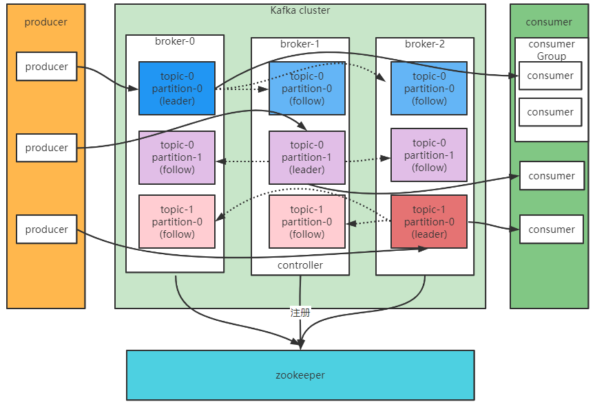


服务端(brokers)和客户端(producer、consumer)之间通信通过**TCP协议**来完成。

# 3.Kafka基本使用

server.properties核心配置详解：

| property                   | default          | description                                                  |
| -------------------------- | ---------------- | ------------------------------------------------------------ |
| broker.id                  | 0                | 每个broker都可以用一个唯一的非负整数来表示，这个id可以作为broker的名字，可以选择任意的数字进行标识，只要id是唯一。 |
| log.dirs                   | /tmp/kafka-logs  | Kafka的存放数据的路径，这个路径并不是唯一的，可以是多个，路径之间只需要使用逗号分隔，每创建一个partition，都会选择在包含最少partition的路径下进行。 |
| listeners                  | PLAINTEXT://9092 | server接受客户端连接的端口，ip配置Kafka本机IP                |
| zookeeper.connect          | localhost:2181   | zookeeper连接字符串格式hostname:port，此处hostname和port分别是zookeeper集群中某个节点的host和port；如果zookeeper是集群，连接方式为 hostname1:port1, hostname2:port2, hostname3:port3 |
| log.retention.hours        | 168              | 每个日志文件删除之前保存的时间，默认数据保存的时间对所有topic都一样。 |
| num.properties             | 1                | 创建topic的默认分区                                          |
| default.replication.factor | 1                | 自动创建topic的默认副本数量，建议设置大于等于2               |
| min.insync.replicas        | 1                | 当producer设置acks为-1时，min.insync.replicas指定replicas的最小数目(必须确认每个replica的写数据都是成功的)，如果这个数目没有达到，producer发送消息会产生异常 |
| delete.topic.enable        | false            | 是否允许删除主题                                             |

基本的命令其实还是比较简单的，但是一点就是再增加topic的分区数，有点问题。这里不是单纯的增加partition，而是把partition的数量变为4，只能增加。

```shell
bin/kafka-topics.sh -alter --partitions 4 --zookeeper 127.0.0.1:2181 --topic test3
```

```shell
bin/kafka-topics.sh --describe --zookeeper 127.0.0.1:2181 --topic test3
```

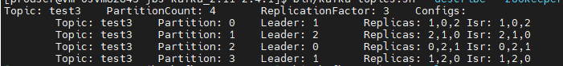

# 4.主题topic和消息日志log

topic是个逻辑的表示，每个topic可以包含多个partition，消息发送到topic，会分配到不同的partition下面。

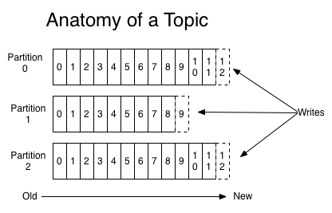

partition是一个有序的message序列，这些message按照顺序添加到commit log文件中。每个partition中的消息都有唯一的一个序号，叫做offset，用来唯一表示partition中的message。

**每个partition，都对应一个commit log文件。**一个partiton中message的offset都是唯一，但是不同的partition中的message的offset可能是相同的，每个partition只需要维护自己分区中的offset即可。

Kafka一般不会删除消息，不管消息有没有被消费。只会根据配置的日志文件保留时间来确认消息是否删除，默认保留最近一周的日志消息。Kafka的性能与保留的消息数据量大小没有关系，因此保存大量的数据消息日志不会产生什么影响。

**每个consumer是基于自己在commitlog中的消费进度(offset)来进行工作的。在Kafka中，消费offset由consumer自己维护，**一般情况下按照顺序逐条消费commitlog中的消息，当然可以通过指定offset来重复消费某些消息，或者跳过消息。

Kafka中的consumer对集群的影响是非常小的，添加或者减少一个consumer，对于集群或者其他consumer来说，都是没有影响，因为每个consumer都维护各自的offset。

下图是一个topic的分区情况

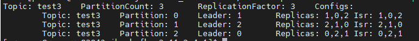

第一行是分区的概要消息，partitionCount表示有几个partition，replicationFactor表示每个partition的有多少个副本(包括leader)。

下面的配置：

leader：表示leader位于那个broker机器上面，

replicas表示当前partition在哪几台机器上面存在备份。这里不管是不是leader或者机器挂没挂掉，都会显示。

ISR:表示当前还存活的分区，并且已经同步备份了partition的节点。

**需要强调的是，leader是属于partition副本的一部分，只不过属性是leader。**

Kafka 一个分区的消息数据对应存储在一个文件夹下，以topic名称+分区号命名，消息在分区内是分段(segment)存储，每个段的消息都存储在不一样的log文件里，这种特性方便old segment file快速被删除，kafka规定了一个段位的 log 文件最大为 1G，做这个限制目的是为了方便把 log 文件加载到内存去操作。下图是log文件中存储的topic消息日志：

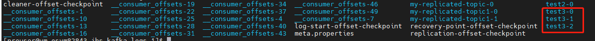

消息日志文件主要存放在分区文件夹里的以log结尾的日志文件里：

```shell
# 部分消息的offset索引文件，kafka每次往分区发4K(可配置)消息就会记录一条当前消息的offset到index文件，
# 如果要定位消息的offset会先在这个文件里快速定位，再去log文件里找具体消息
00000000000000000000.index
# 消息存储文件，主要存offset和消息体
00000000000000000000.log
# 消息的发送时间索引文件，kafka每次往分区发4K(可配置)消息就会记录一条当前消息的发送时间戳与对应的offset到timeindex文件，
# 如果需要按照时间来定位消息的offset，会先在这个文件里查找
00000000000000000000.timeindex

00000000000005367851.index
00000000000005367851.log
00000000000005367851.timeindex

00000000000009936472.index
00000000000009936472.log
00000000000009936472.timeindex
```

这个9936472此类的数字代表这个日志段文件中的offset的起始位置，同时也说明这个日志文件中存放了接近100W条数据。

Kafka broker中有一个参数，log.segment.bytes，限定了每个日志段的大小，最大就是1G。

一个日志段满了，就自动开启一个新的日志段文件写入数据，避免单个文件过大，映像文件的读写性能，这个过程叫做log rolling，正在被写入的那个日志段文件，叫做active log segment。

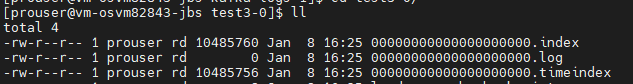

这里的日志消息都存放在.log中。

.index文件中存放的是偏移量的信息，这里就特别像MySQL的存储方式B+树了，通过index回溯到.log日志中进行查找数据，

.timeindex则是根据时间戳找到对应offset，然后通过index回溯到.log查找消息。

一个topic，代表一个逻辑上的数据集，比如数据库中不同的数据放入到不同topic，订单相关的操作放入到订单topic，等，对于后端拥有海量数据的公司而言，可以在topic中划分出多个partition在进行分片储存数据，不同的partition可以放入到不同的机器中，每台机器都运行一个Kafka进行的broker。


**为什么要对topic下面的数据进行分区？**

1.commitlog文件受到所在机器的文件系统大小的限制，分区之后将不同的分区放在不同的机器上，相当于对数据做分布式存储，理论上一个topic可以出任意数量的数据。

2.为了提高并行度。

# 5.集群模式

## 5.1**集群消费**

log的partitions分布在Kafka集群中不同的broker上，每个broker可以请求备份其他broker上partition上的数据。Kafka集群支持配置一个partition备份的数量。针对每个partition，都有一个broker起到```leader```的作用，0个或者多个其他的broker作为```followers```的作用。leader处理所有针对这个partition读写请求，而followers被动复制leader的结果，不提供读写(主要是为了保证多副本数据于消费的一致性)。如果这个leader失效了，其中的一个follower将会自动变成新的leader。

## 5.2**producers**

生产者将消息发送到topic中，同时负责将message发送到topic的某一个partition中。通过```round-robin```做简单的负载均衡。也可以根据消息中的某一个关键字来进行区分。通常使用关键字的当时比较多。

## 5.3**consumers**

传统的消息传递模式有两种：队列(queue)和(publish-subscribe)

queue：多个consumer从服务器读取数据，消息只会到达一个consumer。

publish-subscribe：所有的consumer都有唯一归属的consumerGroup。

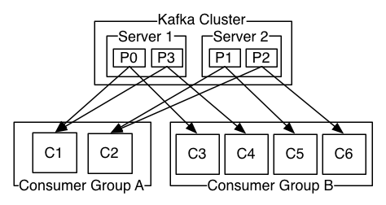

上图中可以看到，有两个broker，某个topic下面都有四个partition，分别位于两个broker中。现在有两个consumerGroup进行消费。对于某个partition(p0-p4)只能被consumerGroup的某个consumer消费，每个consumerGroup都可以消费partition。一个partition同一个时刻在一个consumer group中只能有一个consumer instance在消费，从而保证消费顺序。

通常一个topic会有几个consumer group，每个consumer group都是一个逻辑上的订阅者（ logical subscriber ）。每个consumer group由多个consumer instance组成，从而达到可扩展和容灾的功能。

## 5.4**消费顺序**

consumergroup中的consumer instance的数量不能比一个topic中的partition的数量多，否则多出来的consumer消费 不到消息。

Kafka只在partition的范围内保证消息消费的局部顺序性，不能在同一个topic中的多个partition中保证总的消费顺序性。

如果在总体上保证消费顺序的需求，那么我们可以通过将topic的partition数量设置为1，将consumergroup的consumer instance数量也设置为1，但是会影响性能，所以Kafka的顺序消费很少用。

# 6.设计原理

## 6.1**Kafka核心总控制器controller**

在Kafka集群中会有一个或者多个broker，其中有一个broker被选举为控制器(Kafka controller)，它负责管理整个集群中所有分区和副本的状态。

当某个分区的leader副本出现故障时，由控制器负责为该分区选举新的leader副本。

当检测到某个分区的ISR集合发生变化时，由控制器负责通知所有broker更新元数据信息。

当使用Kafka-topics.sh脚本为某个topic增加分区数量，同样还是由控制器负责让新分区被其他节点感知到。


## 6.2 **controller选举机制**

当所有的broker启动时，都会向zookeeper发送create /controller的命令，zookeeper执行是按照队列的方式，因此第一个创建成功的broker就会成为controller，其他broker创建controller的时候会创建不成功。

当controller所在broker挂掉了，此是zookeeper中的controller临时节点会消失，及群里其他broker会一直监听这个临时节点，发现临时节点消失，就会重新竞争创建临时节点，按照上面的执行方式，会选举出新的controller。

具备控制器身份的broker需要比其他的broker多一份职责，具体细节如下:

1.监听broker相关的变化。为zookeeper中的/broker/ids节点添加brokerchangelistener，用来处理broker增减的变化。

2.监听topic相关的变化。为zookeeper中的/broker/topics节点添加topicchangelistener，用来处理topic增减的变化，为zookeeper中的/admin/delete_topics节点添加topicdeletionlistener，用来处理删除topic的动作。

3.从zookeeper中读取获取所有与topic、partition以及broker相关的信息并进行相应的管理。对于所有topic所对应的zookeeper中的/broker/topics/[topic]节点添加partitionModificationsListener用来监听topic中的分区分配变化。

4.更新集群的元数据信息，同步到其他普通的broker节点中。

当前未启动任何Kafka，可以看到没有controller节点。

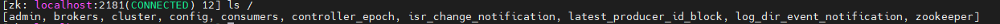

当启动Kafka以后

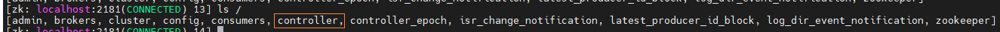


## 6.3**partition副本选举leader机制**

controller感知到分区leader所在broker挂了(controller监听很多zk节点可以感知到broker存活)，controller会从ISR列表(unclean.leader.election.enable=false的前提下)里条第一个broker作为leader(第一个最先放进ISR列表，可能是同步数据最多的副本)，如果参数unclean.leader.election.enable为true，代表在ISR列表里所有副本都挂了的时候可以在ISR列表以外的副本中选leader，这种设置，可以提高可用性，但是选出的新的leader有可能数据少很多。

副本进入ISR列表有两个条件：

1.副本节点不能产生分区，必须能与zookeeper保持会话以及跟leader副本网络连通。

2.副本能复制leader上的所有写操作，并且不能落后太多。(与leader副本同步滞后的副本，是由replica.lag.time.max.ms配置决定的，超过这个时间没有跟leader同步过的一次的副本会被移出ISR列表)。

下面的图是topic是test3时的partition的情况。现在停掉broker-2以后

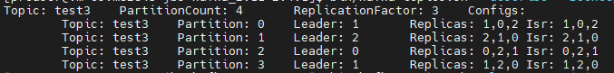

根据选举规则，partition为1的leader由broker-2变为broker-1，取值于ISR。ISR中挂掉的broker-2已经被移除。

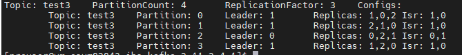


## 6.4**消费者消费消息的offset记录机制**

每个consumer会定期将自己消费分区的offset提交给Kafka内部topic：**__consumer_offsets**，提交过去的时候，**key是consumerGroup+topic+分区号，value就是当前offset的值，**Kafka会定期清理topic里的消息，最后就保留最新的那条数据。

因为__consumer_offsets可能会接收高并发的请求，Kafka默认给其分配50个分区(可以通过offsets.topic.num.partition设置)，这样可以通过加机器的方式抗大并发量。

通过如下公式可以选出consumer消费的offset要提交到__consumer_offsets的哪个分区

公式：**hash(consumerGroupId)  %  __consumer_offsets主题的分区数**

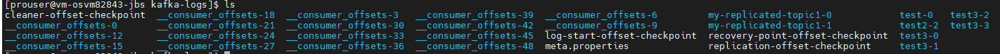


## 6.5**消费者rebalance机制**

rebalance消费组里的消费者数量有变化或消费分区数量有变化，Kafka会重新分配消费者消费分区的关系。比如consumerGroup中某个consumer挂了，此是会主动把分配给他的分区交给其他的消费者，如果他又重启了，那么会又把一些分区重新交还给他。

注意：rebalance只针对subscribe这种不指定分区消费的情况，如果通过assign这种消费指定了分区，Kafka不会进行rebalance。

下面的情况可能会出发消费者的rebalance

1.消费组里的consumer数量减少

2.动态给topic增加了分区

3.消费组订阅了更多的topic

rebalance过程中，消费者无法从Kafka消费消息，这对Kafka的TPS会有影响，如果Kafka集群内节点较多，比如数百个，那重平衡可能会耗时更多，所以应该尽量避免在系统高峰期的重平衡发生。

### 6.5.1**消费者rebalance分区分配策略**

主要是有三种rebalance的策略：range、round-Robin、sticky。

Kafka提供了消费者客户端参数partition.assignme.strategy来设置消费者与订阅主体之间的分区分配策略。默认情况range分配策略。

假设一个主题有10个分区(0-9)，现在有三个consumer消费：

**range策略**就是按照分区序号排序，假设 n＝分区数／消费者数量 = 3， m＝分区数%消费者数量 = 1，那么前 m 个消费者每个分配 n+1 个分区，后面的（消费者数量－m ）个消费者每个分配 n 个分区。

比如分区0~3给一个consumer，分区4~6给一个consumer，分区7~9给一个consumer。

round-Robin策略就是轮询策略，比如分区0、3、9给一个consumer，分区1、4、7给一个consumer，分区2、5、8给一个consumer

sticky策略初始时分配和round-Robin类似，但是在rabalance，需要保证下面两个原则。

1.分区的分配尽可能均匀

2.分区的分配尽可能与上次分配的保持一致。

当两者发生冲突时，第一个目标优先于第二个目标 。这样可以最大程度维持原来的分区分配的策略。

比如对于第一种range情况的分配，如果第三个consumer挂了，那么重新用sticky策略分配的结果如下：

consumer1除了原有的0~3，会再分配一个7

consumer2除了原有的4~6，会再分配8和9


### 6.5.2**rebalance过程如下**

**第一阶段：选择组协调器**

组协调器GroupCoordinator：每个consumergroup都会选择一个broker作为自己的组协调器coordinator，负责监控这个消费者组的所有消费者的心跳，以及判断是否宕机，然后开启消费者的rebalance。

consumergroup的每个consumer启动时会向Kafka集群中的某个节点发送FindCoordinatorRequest请求来查找对应的组协调器GroupCoordinator，并跟其建立网络连接。

**组协调器选择方式：**

consumer消费的offset提交到__consumer_offsets的那个分区，这个分区的leader所在broker就是这个consumergroup的coordinator。

__consumer_offsets_x作为一个partition，这个副本leader所在的broker就会是consumergroup的coordinator。

**第二阶段：加入消费组join group**

在成功找到消费组对应的GroupCoordinator之后就进入加入消费组的阶段，在此节点的消费者会向GroupCoordinator发送JoinGroupRequest请求，并处理响应。然后GroupCoordinator会选择第一个向GroupCoordinator发送请求的consumer作为leader(消费者组协调器)，把consumergroup的情况发送给这个leader，接着这个leader会负责指定分区方案。

**第三阶段：sync group**

consumer leader通过给group coordinator发送sync group request，接着group coordinator就把分区方案下发给各个consumer，他们根据指定分区的leader broker进行网络连接以及消费消息。

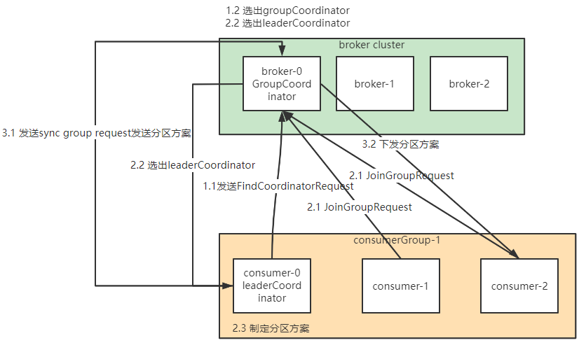

## 6.6HW和LEO详解

HW俗称高水位，highwatermark缩写，取一个partition对应的ISR中最小的LEO(log-end-offset)作为HW，consumer最多只能取到HW所在的位置。每一个replica都有一个HW，leader和follower都只负责维护自己的HW的状态。对于leader新写入的消息，consumer不能立即消费，leader会等到该消息被所有ISR中的replicas同步后更新HW，此是消息才能够被consumer进行消费。这样就保证了如果leader所在的broker失效，该消息仍然可以从新选举的leader中获取。对于来自内部broker 读取请求，没有HW的限制。

下图详细解释了当producer生产消息到broker，ISR以及LEO和HW的流转过程：


由此可见，Kafka的复制机制并不是完全的同步复制机制，也不是单纯的异步复制。事实上，同步机制要求所有能工作的follower都复制完，这条消息才会commit，这种方式极大的影响了系统的吞吐量。而在异步复制中，follower从leader中复制数据，只要是leader将数据写入log就可以commit，这种情况下如果follower没有复制完数据，落后于leader，突然leader宕机，则会丢失数据。而Kafka利用ISR的方式很好的均衡了确保数据不丢失以及吞吐率。其实，在ISR内部本质上就是同步机制。

**结合HW和LEO看下 acks=1的情况**


## 6.7**producer发布消息机制剖析**

**1、写入方式**

producer 采用 push 模式将消息发布到 broker，每条消息都被 append 到 patition 中，属于顺序写磁盘（顺序写磁盘效率比随机写内存要高，保障 kafka 吞吐率）。

**2、消息路由**

producer 发送消息到 broker 时，会根据分区算法选择将其存储到哪一个 partition。其路由机制为：

1. 指定了 patition，则直接使用； 
2. 未指定 patition 但指定 key，通过对 key 的 value 进行hash 选出一个 patition
3.  patition 和 key 都未指定，使用轮询选出一个 patition。

**3、写入流程**

1. producer 先从 zookeeper 的 "/brokers/.../state" 节点找到该 partition 的 leader 

2. producer 将消息发送给该 leader 
3. leader 将消息写入本地 log 
4. followers 从 leader pull 消息，写入本地 log 后 向leader 发送 ACK 
5.  leader 收到**所有 ISR 中**的 replica 的 ACK 后，增加 HW（high watermark，最后 commit 的 offset） 并向 producer 发送 ACK


# 7代码详解

```java
public static void main(String[] args) throws ExecutionException, InterruptedException {
        Properties properties = new Properties();
    	//多个服务器之间用逗号	
        properties.put(ProducerConfig.BOOTSTRAP_SERVERS_CONFIG, "10.225.9.237:9092,10.225.9.237:9093,10.225.9.237:9094");
        /*
         发出消息持久化机制参数
        （1）acks=0： 表示producer不需要等待任何broker确认收到消息的回复，就可以继续发送下一条消息。性能最高，但是最容易丢消息。
        （2）acks=1： 至少要等待leader已经成功将数据写入本地log，但是不需要等待所有follower是否成功写入。就可以继续发送下一
             条消息。这种情况下，如果follower没有成功备份数据，而此时leader又挂掉，则消息会丢失。
        （3）acks=-1或all： 需要等待 min.insync.replicas(默认为1，推荐配置大于等于2) 这个参数配置的副本个数都成功写入日志，这种策略
            会保证只要有一个备份存活就不会丢失数据。这是最强的数据保证。一般除非是金融级别，或跟钱打交道的场景才会使用这种配置。
         */
        properties.put(ProducerConfig.ACKS_CONFIG, "1");
        /*
        发送失败会重试，默认重试间隔100ms，重试能保证消息发送的可靠性，但是也可能造成消息重复发送，比如网络抖动，所以需要在
        接收者那边做好消息接收的幂等性处理
        */
        //properties.put(ProducerConfig.RETRIES_CONFIG, 3);
        //重试间隔设置
        //properties.put(ProducerConfig.RETRY_BACKOFF_MS_CONFIG, 300);
        //设置发送消息的本地缓冲区，如果设置了该缓冲区，消息会先发送到本地缓冲区，可以提高消息发送性能，默认值是33554432，即32MB
        //properties.put(ProducerConfig.BUFFER_MEMORY_CONFIG, 33554432);
    
        /*
        kafka本地线程会从缓冲区取数据，批量发送到broker，
        设置批量发送消息的大小，默认值是16384，即16kb，就是说一个batch满了16kb就发送出去
        */
        properties.put(ProducerConfig.BATCH_SIZE_CONFIG, 16384);
        /*
        默认值是0，意思就是消息必须立即被发送，但这样会影响性能
        一般设置10毫秒左右，就是说这个消息发送完后会进入本地的一个batch，如果10毫秒内，这个batch满了16kb就会随batch一起被发送出去
        如果10毫秒内，batch没满，那么也必须把消息发送出去，不能让消息的发送延迟时间太长
        */
        properties.put(ProducerConfig.LINGER_MS_CONFIG, 10);
        //把发送的key从字符串序列化为字节数组
        properties.put(ProducerConfig.KEY_SERIALIZER_CLASS_CONFIG, StringSerializer.class.getName());
        //把发送消息value从字符串序列化为字节数组
        properties.put(ProducerConfig.VALUE_SERIALIZER_CLASS_CONFIG, StringSerializer.class.getName());
        Producer<String, String> producer = new KafkaProducer<String, String>(properties);

        int msgNum = 5;
        //final CountDownLatch countDownLatch = new CountDownLatch(msgNum);
        for (int i = 1; i <= msgNum; i++) {
            Order order = new Order(i, 100 + i, 1, 1000.00);
            //指定发送分区
            /*ProducerRecord<String, String> producerRecord = new ProducerRecord<String, String>(TOPIC_NAME
                    , 0, order.getOrderId().toString(), JSON.toJSONString(order));*/
            //未指定发送分区，具体发送的分区计算公式：hash(key)%partitionNum
            ProducerRecord<String, String> producerRecord = new ProducerRecord<String, String>(TOPIC_NAME
                    , order.getOrderId().toString(), JSON.toJSONString(order));

            //等待消息发送成功的同步阻塞方法
            RecordMetadata metadata = producer.send(producerRecord).get();
            System.out.println("同步方式发送消息结果：" + "topic-" + metadata.topic() + "|partition-"
                    + metadata.partition() + "|offset-" + metadata.offset());

            //异步回调方式发送消息
            /*producer.send(producerRecord, new Callback() {
                public void onCompletion(RecordMetadata metadata, Exception exception) {
                    if (exception != null) {
                        System.err.println("发送消息失败：" + exception.getStackTrace());

                    }
                    if (metadata != null) {
                        System.out.println("异步方式发送消息结果：" + "topic-" + metadata.topic() + "|partition-"
                                + metadata.partition() + "|offset-" + metadata.offset());
                    }
                    countDownLatch.countDown();
                }
            });*/

            //送积分 TODO

        }

        //countDownLatch.await(5, TimeUnit.SECONDS);
        producer.close();


    }
```

```java
public static void main(String[] args) {
        Properties props = new Properties();
        props.put(ConsumerConfig.BOOTSTRAP_SERVERS_CONFIG, "10.225.9.237:9092,10.225.9.237:9093,10.225.9.237:9094");
        // 消费分组名
        props.put(ConsumerConfig.GROUP_ID_CONFIG, CONSUMER_GROUP_NAME);
        // 是否自动提交offset，默认就是true
        props.put(ConsumerConfig.ENABLE_AUTO_COMMIT_CONFIG, "false");
        // 自动提交offset的间隔时间
       // props.put(ConsumerConfig.AUTO_COMMIT_INTERVAL_MS_CONFIG, "1000000");
        //props.put(ConsumerConfig.ENABLE_AUTO_COMMIT_CONFIG, "false");
        /*
        当消费主题的是一个新的消费组，或者指定offset的消费方式，offset不存在，那么应该如何消费
        latest(默认) ：只消费自己启动之后发送到主题的消息
        earliest：第一次从头开始消费，以后按照消费offset记录继续消费，这个需要区别于consumer.seekToBeginning(每次都从头开始消费)
        */
       // props.put(ConsumerConfig.AUTO_OFFSET_RESET_CONFIG, "latest");
		/*
		consumer给broker发送心跳的间隔时间，broker接收到心跳如果此时有rebalance发生会通过心跳响应将
		rebalance方案下发给consumer，这个时间可以稍微短一点
		*/
        props.put(ConsumerConfig.HEARTBEAT_INTERVAL_MS_CONFIG, 1000);
        /*
        服务端broker多久感知不到一个consumer心跳就认为他故障了，会将其踢出消费组，
        对应的Partition也会被重新分配给其他consumer，默认是10秒
        */
        props.put(ConsumerConfig.SESSION_TIMEOUT_MS_CONFIG, 10 * 1000);


        //一次poll最大拉取消息的条数，如果消费者处理速度很快，可以设置大点，如果处理速度一般，可以设置小点
        props.put(ConsumerConfig.MAX_POLL_RECORDS_CONFIG, 50);
        /*
        如果两次poll操作间隔超过了这个时间，broker就会认为这个consumer处理能力太弱，
        会将其踢出消费组，将分区分配给别的consumer消费
        */
        props.put(ConsumerConfig.MAX_POLL_INTERVAL_MS_CONFIG, 30 * 1000);

        props.put(ConsumerConfig.KEY_DESERIALIZER_CLASS_CONFIG, StringDeserializer.class.getName());
        props.put(ConsumerConfig.VALUE_DESERIALIZER_CLASS_CONFIG, StringDeserializer.class.getName());
        KafkaConsumer<String, String> consumer = new KafkaConsumer<>(props);

        consumer.subscribe(Arrays.asList(TOPIC_NAME));
        // 消费指定分区
        //consumer.assign(Arrays.asList(new TopicPartition(TOPIC_NAME, 0)));

        //消息回溯消费
        /*consumer.assign(Arrays.asList(new TopicPartition(TOPIC_NAME, 0)));
        consumer.seekToBeginning(Arrays.asList(new TopicPartition(TOPIC_NAME, 0)));*/

        //指定offset消费
        /*consumer.assign(Arrays.asList(new TopicPartition(TOPIC_NAME, 0)));
        consumer.seek(new TopicPartition(TOPIC_NAME, 0), 10);*/

        //从指定时间点开始消费

        /*List<PartitionInfo> topicPartitions = consumer.partitionsFor(TOPIC_NAME);
        //从1小时前开始消费
        long fetchDataTime = new Date().getTime() - 1000 * 60 * 60;
        Map<TopicPartition, Long> map = new HashMap<>();
        for (PartitionInfo par : topicPartitions) {
            map.put(new TopicPartition(TOPIC_NAME, par.partition()), fetchDataTime);
        }
        Map<TopicPartition, OffsetAndTimestamp> parMap = consumer.offsetsForTimes(map);
        for (Map.Entry<TopicPartition, OffsetAndTimestamp> entry : parMap.entrySet()) {
            TopicPartition key = entry.getKey();
            OffsetAndTimestamp value = entry.getValue();
            if (key == null || value == null) continue;
            Long offset = value.offset();
            System.out.println("partition-" + key.partition() + "|offset-" + offset);
            System.out.println();
            //根据消费里的timestamp确定offset
            if (value != null) {
                consumer.assign(Arrays.asList(key));
                consumer.seek(key, offset);
            }
        }*/


        while (true) {
            /*
             * poll() API 是拉取消息的长轮询
             */
            ConsumerRecords<String, String> records = consumer.poll(Duration.ofMillis(1000));
            for (ConsumerRecord<String, String> record : records) {
                System.out.printf("收到消息：partition = %d,offset = %d, key = %s, value = %s%n", record.partition(),
                        record.offset(), record.key(), record.value());
            }

            if (records.count() > 0) {
                // 手动同步提交offset，当前线程会阻塞直到offset提交成功
                // 一般使用同步提交，因为提交之后一般也没有什么逻辑代码了
                consumer.commitSync();

                // 手动异步提交offset，当前线程提交offset不会阻塞，可以继续处理后面的程序逻辑
                /*consumer.commitAsync(new OffsetCommitCallback() {
                    @Override
                    public void onComplete(Map<TopicPartition, OffsetAndMetadata> offsets, Exception exception) {
                        if (exception != null) {
                            System.err.println("Commit failed for " + offsets);
                            System.err.println("Commit failed exception: " + exception.getStackTrace());
                        }
                    }
                });*/

            }
        }
    }
```

