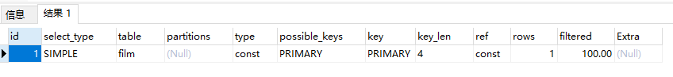

# Explain详解

# 0 目标

## explain详解

使用explain关键字可以模拟优化器执行SQL语句，分析查询语句或是结构的性能瓶颈。

在select语句之前增加explain关键字，MySQL会在查询上设置一个标记，执行查询会返回执行计划的信息，而不是执行这条SQL。

# 1 explain详解

## 1.1 explain extend

会在explain的基础上额外提供一些优化的信息，紧随其后的show warning命令可以得到优化后的查询语句，从而看出优化器优化了什么。

```sql
explain extended select * from film where id = 1;
show warnings;
```


## 1.2 explain中的列

### 1.2.1 id列

id列的编号是select的序列号，有几个select就有几个id，并且id的顺序是按照select出现的顺序增长的。id列越大执行的优先级越高，id相同则从上往下执行，id为null最后执行。

### 1.2.2 select_type列

select_type表示对应的行是简单查询或者复杂查询。

1）simple：简单查询。查询不包含子查询和union。

```sql
explain select * from film where id = 2;
```



2）primary：复杂查询中最外层的select

3）subquery：包含在select中的子查询(不在from中)

4）derived：包含在from子句中的子查询。MySQL会将结果存放在一个临时表中，也成为派生表。

```sql
set session optimizer_switch='derived_merge=off';
explain select (select 1 from actor where id = 1) from (select * from film where id = 1) der;
```


从上面表中可分析，首先按照id的顺序执行，越大优先级越高。可以得到id=3的行先执行；

还可以看出，from后面的子查询是film表，因此select_type是derived，actor表在select后面，所以select_type为subquery，最外层的select语句为primary。

还原默认配置

```sql
set session optimizer_switch='derived_merge=on';
```

### 1.2.3 table列

这一列表示explain的一行正在访问的表。

当from子句中有子查询时，table列是<derivedN>，表示当前查询的是id= N的查询，于是优先执行id=N的查询。

当有union时，UNION RESULT的table列的值为<union1,2>，1和2表示union的select行id。

### 1.2.4 type

这一列表示关联类型或访问类型，即MySQL决定如何查找表中的行，查找数据行记录的大概范围。

依次从最优到最差分为别：system > const > eq_ref > ref > range > index > ALL

一般来讲，得保证查询达到range级别，最好达到ref级别。

null：MySQL能够在优化阶段分解查询语句，在执行阶段用不着再访问表和索引。例如：在索引列中选取最小值，可以单独查询索引来完成，不需要执行访问表。

```sql
explain select min(id) from film;
```


const,system：MySQL能对查询的某部分进行优化并将其转化成一个常量。用于primary key 或union key 的所有列与常数比较时，所以表最多有一个匹配行，读取一次，速度比较快。system是const的特例，表里只有一条元组匹配时为system。**主键和索引查询。**

```sql
explain extended select * from (select * from film where id = 1) tmp;
```


eq_ref：primary key和unique key 索引的所有部分被连接使用，最多只会返回一条符合条件的记录。这可能是在const之外最好的联接类型，简单的select查询不会出现这种type。**主键关联。**

```sql
explain select * from film_actor left join film on film_actor.film_id = film.id;
```


ref：相比eq_ref，不使用唯一索引，而是使用普通索引或者唯一性索引的部分前缀，索引要和某个值比较，可能会找到符合条件的多个行。

1.简单select查询，name是普通索引(非唯一索引)

```sql
 explain select * from film where name = 'film1';
```


2.关联表查询，

```sql
explain select film_id from film left join film_actor on film.id = film_actor.film_id;
```


range：扫描范围通常出现在in()，between，>，<，>=等操作中。使用一个索引来检索给定范围的行。

```sql
 explain select * from actor where id > 1;
```


index：扫描全索引就能拿到结果，一般是扫描某个二级索引，这种扫描不会从索引树根节点开始快速寻找，而是对二级索引的叶子节点遍历和扫描，速度还是比较慢的，这种查询一般为使用覆盖索引，二级索引一般比较小，通常比ALL快一些。

```sql
explain select * from film;
```


ALL：即全表扫描，扫描聚簇索引的所有叶子节点。通常情况下需要增加索引来进行优化。


### 1.2.5 possible_keys

这一列显示查询可能使用哪些索引来查找。

explain时可能出现possible_keys有列，而key中无列的情况，这种情况一般都是表中数据不多，MySQL认为索引对检索的帮助性不大，选择了全表查询。

如果该列是null，则没有相关的索引。在这种情况下，可以通过检查where子句是否可以创造出一个适当的索引来提高查询性能，然后用explain查看效果。

### 1.2.6 key

这一列显示MySQL实际采用哪个索引来优化对该表的访问。

如果没有使用索引，则该列为null。如果想强制MySQL使用或者忽视possible_keys列中的索引，在查询中使用force index、ignore index。

**查找内容在主键和二级索引都有，一般选择二级索引。辅助索引占据的空间小，主键索引扫描数据量大。**

### 1.2.7 key_len

这一列显示MySQL在索引里使用的字节数，通过这个值可以算出具体使用了索引中的哪些列。

film_actor的联合索引idx_film_actor_id由film_id和actor_id两个int组成，并且每个int是4字节。通过结果中的key_len=4可推断出查询使用了第一列：film_id列来执行索引查找。

```sql
 explain select * from film_actor where film_id = 2;
```


key_len计算规则：

字符串，char(n)和varchar(n)，5.0.3以后的版本中，n均代表字符数，而不是字节数，如果是utf-8，一个数字或一个字母占一个字节，一个汉字占三个字节	             char(n)：如果存汉字，长度就是3n字节。

varchar(n)：如果存汉字则长度是3n+2字节，加的2字节是用来存储字符串长度的，因为varchar是变长字符串。

数值类型

tinyint：1字节

smallint：2字节

int：4字节

bigint：8字节

时间类型

date：3字节

timestamp：4字节

datetime：8字节

如果字段允许为null，需要1字节记录是否为null

索引最大长度是768字节，当字符串过长，MySQL会做一个类似做前缀索引的处理，对前半部分的字符提取出来做索引。

### 1.2.8 ref

这一列显示了在key列记录的索引中，表查找值所用到的列或常量，常见的有const(常量)、字段名(例：file.id)

表示查询的那个字段1.2.9中的截图，此时film_id=1为一个常量const来进行表示。

### 1.2.9 rows

这一列是MySQL估计要读取并检测的行数，这个不是结果集中的行数。

1.2.10 extra

1）Using index

使用覆盖索引

覆盖索引定义：MySQL执行计划explain结果里的key有使用索引，如果select后面查询的字段都可以从这个索引中的树中获得，那么通常来讲就使用了覆盖索引，extra列中就会有Using index；覆盖索引通常情况下是针对的是辅助索引，整个查询结果都能在辅助索引中找到，而不需要从辅助索引找到表的主键，然后再通过主键去主键索引树中获取其他字段。

```sql
explain select film_id from film_actor where film_id = 1;
```


2）Using Where 

使用where语句来处理结果，并且查询的语句未被索引覆盖

```sql
 explain select * from actor where name = 'a';
```


3）Using index condition

查询的列不完全被索引覆盖，where条件中是一个前导列的范围

```sql
explain select * from film_actor where film_id > 1;
```


4）Using temporary：MySQL需要创建一张临时表来处理查询。出现这种情况一般是要进行优化的，首先想到的是索引优化。

1.actor.name没有索引，此时创建一张临时表distinct

```sql
explain select distinct name from actor;
```


2.film.name建立了idx_name索引，此时查询extra是using index ，没用临时表

```sql
explain select distinct name from film;
```


5）Using filesort：将用外部排序而不是使用索引排序，数据较小时从内存排序，否则需要在磁盘中进行排序。这种情况下一般需要考虑使用索引进行优化。针**对的是聚簇索引进行的排序。**

1.actor.name未创建索引，会浏览整个表，保存排序关键字name和对应的id，然后排序name并检索行记录。

```sql
 explain select * from actor order by name;
```


2.film.name建立了idx_name索引，此时查询extra是using index

```sql
 explain select * from film order by name;
```


6）select table optimized away 使用某些聚合函数(max min) 来访问索引的某个字段

```sql
explain select min(id) from film;
```


