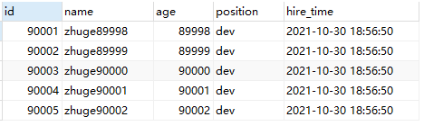

# MySQL索引优化实战二

## 0 目标

分页查询优化详情

表join关联原理详解及优化

表count查询优化

## 1 分页查询优化

在很多业务场景中，实现分页查找可能会用到下面的SQL

```sql
 select * from employees limit 10000,10;
```

这个SQL表示在employees表中从10001行开始的10行记录。数据仅仅展示了10条记录，但实际上SQL是先读取了10010行数据，然后忽略掉前10000行数据，读取到想要的10行数据。因此，想要查询一张比较大的表靠后的数据，执行效率是非常低的。

常见的分页场景优化：

### 1.1.根据自增且连续的主键排序的分页查询

根据自增且连续主键排序的分页查询的例子：

```sql
select * from employees limit 90000,5;
```



该SQL表示查询从90001行开始，没有使用order by，可以看出是根据主键排序。因为表是根据主键递增排序的，所以可以改写主键从90001行开始的数据。

```sql
select * from employees where id > 90000 limit 5;
```


这里其实可以看到查询到的数据是一样的，但是查询的复杂度确实不一样，通过explain可以看出来

```sql
EXPLAIN select * from employees limit 90000,5;
```


```sql
EXPLAIN select * from employees limit 90000,5;
```


通过结果对比不难看出，选择走索引的查询语句明显比走全表的查询的行数要少，执行效率大大减少。

但是，对于这种情况在很多场景中其实并不适用，假设随机删除掉前10000行中的某条数据。在执行上面两个SQL

```sql
select * from employees where id > 90000 limit 5;
```


```sql
select * from employees where id > 90000 limit 5;
```


这个时候就会发现不同点了，第一个SQL，因为100000中删除掉了一行，所以90000行记录，和大于90000会是不同的数据。

因此主键如何并不连续的话，是很难查询到相同的数据的。

另外如果SQL是order by 非主键的字段，按照上面的方法执行SQL的结果会不一样的。所以需要满足下面两个条件：

- 主键自增且连续
- 结果是按照逐渐排序的

### 1.2 根据非主键字段排序的分页查询

```SQL
select * from employees ORDER BY name limit 90000,5;
```


```sql
EXPLAIN select * from employees ORDER BY name limit 90000,5;
```


这里可以发现，extra中是Using filesort，磁盘排序。这里并没有使用索引name字段进行排序，原因大概是，MySQL认为选择索引的查询方式所消耗的成本比全表扫描消耗的成本是要高的，所以优化器放弃了使用索引。

设计索引的初衷就是为了更好的利用索引进行检索数据，当前确实又涉及到索引字段name，如何进行优化？

关键点在于让排序的字段尽可能的少，可以先让排序和分页操作先查出来主键，然后根据主键找到对应的记录。

```sql
select * from employees e inner join (select id from employees order by name limit 90000,5) ed on e.id = ed.id;
```


这里的结果是没有变化的。

然后再看下执行计划

```sql
EXPLAIN select * from employees e inner join (select id from employees order by name limit 90000,5) ed on e.id = ed.id;
```


在这里可以看出，employees表首先根据索引找到对应行并进行排序，Using index也说明了这里使用了覆盖索引，并且排序没有使用Using filesort，这时候剩下的数据就是非常少的，并且是有序的，此时，再根据id去聚簇索引中找到对应的行并提取输出全部数据，这个时候就是常量级的查找。

优化之前SQL语句进行filesort，在优化以后使用了index排序。

## 2 Join关联查询优化

MySQL的表关联常见有两种算法

- Nested-Loop Join
- Block Nest-Loop Join

### 1.嵌套循环连接Nested-Loop Join(NLJ)算法

一次一行在第一张表(驱动表)中取出一行，在这行中找到关联字段，然后根据关联字段在第二张表中找到满足条件的行，然后取出两张表的合集。

```sql
EXPLAIN select * from t1 INNER join t2 on t1.a= t2.a;
```


执行计划信息：

- 驱动表是t2，被驱动表是t1。首先执行的是驱动表，优化器通常会选择小表作为驱动表，当使用inner join的时候，通常较小的表会是驱动表；
- 当使用left join的时候，驱动表是left join左边的表，被驱动表是left join右边的表；当使用right join的时候，驱动表是右边的表，被驱动表是左边的表；当使用join的时候，MySQL会选择数量比较小的表作为驱动表，大表作为被驱动表。
- 使用了NLJ算法，一般join语句，如果执行计划中extra没有Using join buffer则表示使用的join算法是NLJ。

SQL的执行流程:

1. 首先执行驱动表t2，读取一行数据；
2. 在第1步中取出关联字段a，到表1中关联查找；
3. 取出表t1中满足条件的行，跟t2中取到的结果合并返还给客户端；
4. 重复上面三步

整个过程会扫描t2表(100行)所有的数据，然后遍历每行数据中的a字段，根据t2表中a的值索引扫描t1表中的对应行(扫描100次t1的表，**但是每次只会扫描一行t1中完整行的数据，查找数据时，仅仅走的索引，而不是数据行，只需要根据索引找到主键所在位置，才会读取整行数据，这里并不会扫描扫有的数据行，不用和其他数据行做任何判断，所以每次扫描的行数为1**，也就是总共t1也扫描了100行)。整个过程可以认为扫描了200行。**这里指的是扫描磁盘中的行数。**

如果驱动表的关联字段不是索引，使用NLJ算法的效率比较差，MySQL会选择Block Nest-Loop Join。

### 2.基于块的嵌套循环连接Block Nest-Loop Join(BNL)

把驱动表的数据放入到join_buffer中，然后扫描被驱动表，把被驱动表中的数据一行行的拿出来和join_buffer中的数据做对比。

```sql
EXPLAIN select * from t1 inner join t2 on t1.b= t2.b;
```


extra中的Using join buffer (Block Nested Loop)说明当前使用了BNL算法。

SQL的执行流程如下：

1. 将t2表中的数据放入到join_buffer中；
2. 在t1中每次取一行数据，跟join_buffer中的数据做对比；
3. 返回满足join条件的数据

整个过程中t1和t2表都做了全表扫描，t2经过扫描进入到join_buffer中，而t1每一行经过扫描都会去join_buffer中去比较，**整个查询扫描的次数为10000+100**，并且join_buffer中的数据是无序的，因此对于t1中的每一行数据，都需要做100次判断，因此，**内存中需要执行10000*100 =100万次判断。**

假设t2中的数据很多，join_buffer的容量有限，如果装不下t2数据的话，只能分段放。

t2中有1000行数据，而join_buffer只能放800行，那么先放800行数据，t1表先进行扫描，然后再将剩下200行放入join_buffer中，t1在进行扫描，整个过程t1表进行了两次扫描。

**如果被驱动表的关联字段没有用索引，为什么要选择BNL算法而不选择NLJ算法？**

如果上面的SQL语句使用BLJ算法的话，那么扫描的行数为100 * 10000 = 100万，为什么是100W呢，以为每次t2中拿出一条数据，都要去磁盘中扫描t1，这时候每次都要扫描10000次，这里的扫描指的是**磁盘扫描。**

很显然，BNL磁盘扫描的次数会少很多，更多的是在内存中进行判断，而内存的速度是明显要快于磁盘的速度的。

因此MySQL对于被驱动表的关联字段没索引的关联查询，一般都会使用BNL算法，如果有索引一般都会使用NLJ算法，有索引的情况下NLJ算法比BNL算法的性能要高。

### 2.3 对于关联SQL的优化

关键字段加索引，让MySQL做join时尽量选择NLJ算法；

小表驱动大表，写多表连接SQL时，如果明确知道哪张表是小表可以用straight_join写法固定连接驱动方式，省去MySQL优化器自己判断的时间。

**straight_join解释：**straight_join的功能和join类似，但能让左边的表驱动右边的表，能改变表优化器对于联表查询的执行顺序。

比如：select * from t2 straight_join t1 on t2.a = t1.a; 代表指定mysql选着 t2 表作为驱动表。

- straight_join只能用于inner join ，但不能用于left join和right join，left join和right join已经指定了表的执行顺序。
- 尽量让优化器去判断，因为大部分情况下MySQL优化器比人要聪明。使用straight_join一定要慎重，因为部分人为指定的执行顺序并不一定比优化引擎要靠谱。

**对于小表的定义要明确**

在决定哪张表做驱动表的时候，首先两张表都按照各自的条件进行过滤， 过滤完成以后，计算参与join的各字段的总的数据量，数据量比较小的那张表，就是小表，作为驱动表。

## 3.in和exists的优化

**原则：小表驱动大表** ，小的数据集驱动大的数据集。

in:当A的数据集大于B的数据集，in优于exists

```sql
select * from A where id in (select id from B )
#等价于：
 for(select id from B){
 select * from A where A.id = B.id
 }
```

exists:当A的数据集小于B的数据集，exists优于in

```sql
select * from A where exists(select 1 from B where B.id = A.id);
#等价于:
 for(select * from A){
 select * from B where B.id = A.id
 }

 #A表与B表的ID字段应建立索引
```

1.exists只返回true和false，因此子查询中的select *也可以用select 1进行替换

2.exists子查询的实际执行过程可能经过了优化而不是理解的逐条对比

3.exists子查询往往也可以永join来代替，还要具体问题具体分析。

## 4 count(*)查询优化

```sql
EXPLAIN select count(1) from employees;
EXPLAIN select count(id) from employees;
EXPLAIN select count(name) from employees;
EXPLAIN select count(*) from employees;
```


通过上面可以看到，这四个SQL语句的执行效率是差不多的。

字段有索引:count(*) ≈ count(1) > count(索引字段) > count(id)，字段有索引，count(字段)统计走二级索引，二级索引的存储数据比主键索引少，所以count(索引字段) > count(id)。

字段无索引：count(*) ≈ count(1)  > count(id) > count(索引字段) ，字段没有索引，count(字段)走不了索引，count(id)还可以走主键索引，所以count(id) > count(索引字段) 。

count(1)和count(字段)执行过程类似，不过count(1)不需要取出字段进行统计，就用常量1进行统计，count(字段)还需要取出字段，所以理论count(1)比count(字段)的效率要高一点。

对于count(*)而言，MySQL并不会把所有的字段取出来，而是做了优化，不取值，按行累加，效率很高，不需要count(列名)或count(常量)来代替count(*)。

为什么对于count(id)，MySQL最终选择辅助索引而不选择主键索引？因为二级索引储存的数据相对而言较少，检索的效率相对来说比较高。

## 5.常见优化方法

### 5.1查询MySQL自己维护的总行数

对MyISAM存储引擎的表做不带where的count查询性能是非常高的，因为MyISAM存储引擎的表的总行数会被MySQL存储在磁盘上，查询不需要计算。

对于InnoDB存储引擎的表， MySQL不会存储表的总记录的行数，查询count要进行实时计算。

### 5.2 show table status

如果只是需要表的总行数的估计值，可以使用这个SQL，效率很高

```sql
SHOW TABLE STATUS LIKE 'employees';
```


### 5.3 将总数维护到Redis中

插入或删除表数据行的时候同时维护redis里的表的总行数key的计数值(用incr或decr命令)，但这种方式可能不准确，很难保证表操作和redis操作事务的一致性。

### 5.4 增加数据库计数表

插入或删除表数据行的时候同时维护计数表，让他们在同一个事务里面执行。