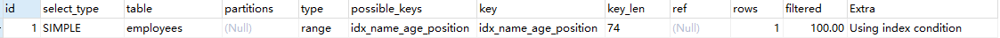

# Mysql索引优化实战

## 目标

- 索引下推优化详解
- MySQL优化器索引选择探究
- 索引优化order by 与group by
- Using filesort文件排序详解
- 索引设计原则与实战

### 1.联合索引第一个字段用范围不走索引

```sql
EXPLAIN SELECT * FROM employees WHERE name > 'LiLei' AND age = 22 AND position ='manager';
```


联合索引第一个字段就使用范围查找索引，MySQL可能觉得一个字段就适用范围查找，结果集应该非常大，因此选择走全表扫描。

### 2.强制走索引

```sql
EXPLAIN SELECT * FROM employees force index(idx_name_age_position) WHERE name > 'LiLei' AND age = 22 AND position ='manager';
```


虽然使用了强制索引，扫描的行数看上去少了不少，但最终查询的效率也不一定比全表扫描的效率高，可能涉及的到的回表效率不高。

测试

```sql
关闭缓存
set global query_cache_size=0;
set global query_cache_type=0;

SELECT * FROM employees WHERE name > 'LiLei';
0.422s
SELECT * FROM employees force index(idx_name_age_position) WHERE name > 'LiLei';
0.656s
```

### 3.覆盖索引优化

```sql
EXPLAIN SELECT name,age,position FROM employees WHERE name > 'LiLei' AND age = 22 AND position ='manager';
```


此处优化使用覆盖索引，查询字段使用索引中的列，这样就不需要回表进行查询，效率提升。

### 4.in 和or在数据量比较大的情况下会走索引，在数据量比较小的情况下会走全表扫描。

```sql
EXPLAIN SELECT * FROM employees WHERE name in ('LiLei','HanMeimei','Lucy') AND age = 22 AND position='manager';
```


```sql
EXPLAIN SELECT * FROM employees WHERE (name = 'LiLei' or name = 'HanMeimei') AND age = 22 AND position='manager';
```


创建一个表employees_copy和employees的表结构一样，但是数据量比较少。

```sql
EXPLAIN SELECT * FROM employees_copy WHERE name in ('LiLei','HanMeimei','Lucy') AND age = 22 AND position='manager';
```


```sql
EXPLAIN SELECT * FROM employees_copy WHERE (name = 'LiLei' or name = 'HanMeimei') AND age = 22 AND position='manager';
```


根据上面的对比可以看出，in和or检索的数据范围和整个表的数据也是MySQL是否选择走索引的一个重要原因。

### 5.like kk%一般都会走索引

```sql
EXPLAIN SELECT * FROM employees WHERE name like 'LiLei%' AND age = 22 AND position ='manager';
```


```sql
EXPLAIN SELECT * FROM employees_copy WHERE name like 'LiLei%' AND age = 22 AND position ='manager';
```


通过上面的例子可以看出来，employees和employees_copy两张表都走了索引。

## 索引下推

对于辅助的联合索引，正常情况下遵照最左前缀原则执行```SELECT * FROM employees WHERE name like 'LiLei%' AND age = 22 AND position ='manager';```，这种情况下只会走索引的第一列，而后面的数据都是无序的，无法很好的利用索引。

在MySQL5.6之前的版本，只会走索引列name是”LILEI“开头的数据，然后再拿这些索引所对应的主键逐个回表，根据主键索引找到对应的数据，在逐渐比较age和position列的数据。

在MySQL5.6引入索引下推优化，**可以在索引遍历的过程中，对索引的所有字段都进行判断，筛选完成以后，在进行回表查询，这样可以有效的减少回表的次数**。在使用索引下推以后，上面的查询在匹配到name是”LILEI“后，还会对age和position进行匹配，当发现符合条件以后，再根据主键id回表找到对应数据。

索引下推会减少回表次数，对InnoDB搜索引擎的表索引下推只针对二级索引，InnoDB的主键索引的叶子节点上面保存的全行数据，这时候使用索引下推并不会减少查询的全行数据的效果。

**为什么范围查找没有使用索引下推进行优化？**

MySQL可能认为范围查找的范围比较大，像like kk% 在大多数情况下数据集还是比较小的，所以MySQL给like kk% 使用了索引下推，在实际情况中like kk% 并非全都会走索引下推。

## MySQL如何选择合适的索引

```sql
 EXPLAIN select * from employees where name > 'a';
```


如果name索引需要遍历name字段联合索引树，然后还需要根据遍历出来的主键再回聚簇索引中寻找数据，成本对比全表扫描还高，可以用覆盖索引进行优化，这样只需要遍历name字段所在的索引树就可以了：

```sql
EXPLAIN select name,age,position from employees where name > 'a' ;
```


```sql
 EXPLAIN select * from employees where name > 'zzz' ;
```



针对上面的name > 'a' 和name > 'zzz'，MySQL执行了不一样的结果，MySQL可以使用trace工具进行查询，开启trace工具会影响MySQL的性能，所以只能作为临时分析sql语句使用，用完之后立即关闭。

```sql
set session optimizer_trace="enabled=on",end_markers_in_json=on; 
```

执行语句

```sql
select * from employees where name > 'a' order by position;
SELECT * FROM information_schema.OPTIMIZER_TRACE;
```

```json
trace语句
{
  "steps": [
    {
      "join_preparation": { ‐‐第一阶段：SQL准备阶段，格式化sql
        "select#": 1,
        "steps": [
          {
            "expanded_query": "/* select#1 */ select `employees`.`id` AS `id`,`employees`.`name` AS `name`,`employees`.`age` AS `age`,`employees`.`position` AS `position`,`employees`.`hire_time` AS `hire_time` from `employees` where (`employees`.`name` > 'a') order by `employees`.`position`"
          }
        ] /* steps */
      } /* join_preparation */
    },
    {
      "join_optimization": {‐‐第二阶段：SQL优化阶段
        "select#": 1,
        "steps": [
          {
            "condition_processing": {‐‐条件处理
              "condition": "WHERE",
              "original_condition": "(`employees`.`name` > 'a')",
              "steps": [
                {
                  "transformation": "equality_propagation",
                  "resulting_condition": "(`employees`.`name` > 'a')"
                },
                {
                  "transformation": "constant_propagation",
                  "resulting_condition": "(`employees`.`name` > 'a')"
                },
                {
                  "transformation": "trivial_condition_removal",
                  "resulting_condition": "(`employees`.`name` > 'a')"
                }
              ] /* steps */
            } /* condition_processing */
          },
          {
            "substitute_generated_columns": {
            } /* substitute_generated_columns */
          },
          {
            "table_dependencies": [‐‐表依赖详情
              {
                "table": "`employees`",
                "row_may_be_null": false,
                "map_bit": 0,
                "depends_on_map_bits": [
                ] /* depends_on_map_bits */
              }
            ] /* table_dependencies */
          },
          {
            "ref_optimizer_key_uses": [
            ] /* ref_optimizer_key_uses */
          },
          {
            "rows_estimation": [‐‐预估表的访问成本
              {
                "table": "`employees`",
                "range_analysis": {
                  "table_scan": { ‐‐全表扫描情况
                    "rows": 99926,‐‐扫描行数
                    "cost": 20340‐‐查询成本
                  } /* table_scan */,
                  "potential_range_indexes": [‐‐查询可能使用的索引
                    {
                      "index": "PRIMARY",‐‐主键索引
                      "usable": false,
                      "cause": "not_applicable"
                    },
                    {
                      "index": "idx_name_age_position",‐‐辅助索引
                      "usable": true,
                      "key_parts": [
                        "name",
                        "age",
                        "position",
                        "id"
                      ] /* key_parts */
                    }
                  ] /* potential_range_indexes */,
                  "setup_range_conditions": [
                  ] /* setup_range_conditions */,
                  "group_index_range": {
                    "chosen": false,
                    "cause": "not_group_by_or_distinct"
                  } /* group_index_range */,
                  "analyzing_range_alternatives": {‐‐分析各个索引使用成本
                    "range_scan_alternatives": [
                      {
                        "index": "idx_name_age_position",
                        "ranges": [ ‐‐索引使用范围
                          "a < name"
                        ] /* ranges */,
                        "index_dives_for_eq_ranges": true,
                        "rowid_ordered": false, ‐‐使用该索引获取的记录是否按照主键排序
                        "using_mrr": false,
                        "index_only": false,‐‐是否使用覆盖索引
                        "rows": 49963,‐‐索引扫描行数
                        "cost": 59957,‐‐索引使用成本
                        "chosen": false,‐‐是否选择该索引
                        "cause": "cost"
                      }
                    ] /* range_scan_alternatives */,
                    "analyzing_roworder_intersect": {
                      "usable": false,
                      "cause": "too_few_roworder_scans"
                    } /* analyzing_roworder_intersect */
                  } /* analyzing_range_alternatives */
                } /* range_analysis */
              }
            ] /* rows_estimation */
          },
          {
            "considered_execution_plans": [
              {
                "plan_prefix": [
                ] /* plan_prefix */,
                "table": "`employees`",
                "best_access_path": { ‐‐最优访问路径
                  "considered_access_paths": [ ‐‐最优访问路径
                    {
                      "rows_to_scan": 99926,
                      "access_type": "scan", ‐‐访问类型：为scan，全表扫描
                      "resulting_rows": 99926,
                      "cost": 20338,
                      "chosen": true,‐‐确定选择
                      "use_tmp_table": true
                    }
                  ] /* considered_access_paths */
                } /* best_access_path */,
                "condition_filtering_pct": 100,
                "rows_for_plan": 99926,
                "cost_for_plan": 20338,
                "sort_cost": 99926,
                "new_cost_for_plan": 120264,
                "chosen": true
              }
            ] /* considered_execution_plans */
          },
          {
            "attaching_conditions_to_tables": {
              "original_condition": "(`employees`.`name` > 'a')",
              "attached_conditions_computation": [
              ] /* attached_conditions_computation */,
              "attached_conditions_summary": [
                {
                  "table": "`employees`",
                  "attached": "(`employees`.`name` > 'a')"
                }
              ] /* attached_conditions_summary */
            } /* attaching_conditions_to_tables */
          },
          {
            "clause_processing": {
              "clause": "ORDER BY",
              "original_clause": "`employees`.`position`",
              "items": [
                {
                  "item": "`employees`.`position`"
                }
              ] /* items */,
              "resulting_clause_is_simple": true,
              "resulting_clause": "`employees`.`position`"
            } /* clause_processing */
          },
          {
            "reconsidering_access_paths_for_index_ordering": {
              "clause": "ORDER BY",
              "steps": [
              ] /* steps */,
              "index_order_summary": {
                "table": "`employees`",
                "index_provides_order": false,
                "order_direction": "undefined",
                "index": "unknown",
                "plan_changed": false
              } /* index_order_summary */
            } /* reconsidering_access_paths_for_index_ordering */
          },
          {
            "refine_plan": [
              {
                "table": "`employees`"
              }
            ] /* refine_plan */
          }
        ] /* steps */
      } /* join_optimization */
    },
    {
      "join_execution": {‐‐第三阶段：SQL执行阶段
        "select#": 1,
        "steps": [
          {
            "filesort_information": [
              {
                "direction": "asc",
                "table": "`employees`",
                "field": "position"
              }
            ] /* filesort_information */,
            "filesort_priority_queue_optimization": {
              "usable": false,
              "cause": "not applicable (no LIMIT)"
            } /* filesort_priority_queue_optimization */,
            "filesort_execution": [
            ] /* filesort_execution */,
            "filesort_summary": {
              "rows": 100003,
              "examined_rows": 100003,
              "number_of_tmp_files": 30,
              "sort_buffer_size": 262056,
              "sort_mode": "<sort_key, packed_additional_fields>"
            } /* filesort_summary */
          }
        ] /* steps */
      } /* join_execution */
    }
  ] /* steps */
}
结论：全表扫描的成本低于索引扫描，所以mysql最终选择全表扫描
select * from employees where name > 'zzz' order by position;
SELECT * FROM information_schema.OPTIMIZER_TRACE;

查看name > 'zzz' 的trace可以看出，索引扫描的成本低于全表扫描，可能是因为name > 'zzz' 的数据并没有存在，因此不存在回表的可能。
```

## 常见SQL深入优化

order by和group by优化

Case1:

```sql
 EXPLAIN SELECT * FROM employees WHERE name = 'LiLei' and position ='dev' ORDER BY age;
```


这里利用最左前缀法则，可以发现name使用了索引字段，其实age也使用了索引字段，当使用order by时，此时extra没有体现Using filesort，意味着这里使用的是索引排序而不是外部的排序，因此age走了索引；同时，key_len的值只展示了name的长度，这是因为key_len只统计的是where后面”=“的索引长度。这里的position字段是没有走索引的。

Case2:

```sql
EXPLAIN SELECT * FROM employees WHERE name = 'LiLei' ORDER BY position;
```


根据最左前缀法则，只使用了name索引，由于使用了position进行排序，跳过了age，因此并没有使用position索引，使用order by，但没有使用position索引排序，因此就会使用Using filesort进行排序。

Case3:

```sql
  EXPLAIN SELECT * FROM employees WHERE name = 'LiLei' ORDER BY age,position;
```


查找用到了name索引，但是排序使用的是age和position索引。extra列中没有出现Using filesort，可以看出age和postion都是使用的索引排序。

Case4:

```sql
  EXPLAIN SELECT * FROM employees WHERE name = 'LiLei' ORDER BY position,age;
```


当order by的顺序发生变化时，就会发现只有在查找时，使用了name索引，而在排序的过程中，使用了Using filesort，可以看出，order by的顺序是不会发生改变的，这与创建索引的顺序不一致。

Case5:

```sql
  EXPLAIN SELECT * FROM employees WHERE name = 'LiLei' and age = 18 ORDER BY position,age;
```


这个SQL语句在查找时，选择了name和age索引，排序的时候的顺序时position，age，但是由于age=18已经是常量了，对于age的排序已经没有任何意义，这部分已经被优化，所以此时的排序只有position。

Case6：

```sql
  EXPLAIN SELECT * FROM employees WHERE name = 'LiLei' ORDER BY age asc,position DESC;
```


在查找时选择了name索引，在排序的时候age选择升序，符合索引的排序，position则是按照降序排列的，因此和索引排序不能保持一致，所以使用Using filesort。

Case7：

```sql
   EXPLAIN SELECT * FROM employees WHERE name in ('LiLei','zhuge') ORDER BY age ,position;
```


对于排序而言，多个相等条件也是范围查询。

Case8：

```sql
EXPLAIN SELECT * FROM employees WHERE name >'a' ORDER BY name;
```


这里使用的是Using filesort，进行了全表扫描，原因可能是数据量太大，MySQL优化器认为全表扫描更优。filesort是对聚簇索引进行的排序，而不是对二级索引。

优化：

```sql
EXPLAIN SELECT name,age,position FROM employees WHERE name >'a' ORDER BY name;
```


这里直接缩小查询范围，仅仅将数据字段锁定在二级索引树中，使用覆盖索引进行优化。

## 优化总结：

1.MySQL支持的排序扫描的方式有两种index和filesort，**Using index是MySQL扫描索引本身进行的排序，Using filesort则是对聚簇索引进行的全表扫描排序**。因此，index效率高，而filesort则是效率比较低。

2.order by下面两种情况会使用Using index

1）order by语句索引使用最左前缀法则

2）使用where子句和order by子句条件列组合满足索引最左前列原则

3.尽量在索引列上完成排序，遵循索引建立(索引创建的顺序)时的最左前缀法则。

4.如果order by不在索引列上，就会产生filesort

5.能用覆盖索引尽量使用覆盖索引

6.group by和order by很类似，其实质先进行排序再进行分组，遵照索引的最左前缀法则。对于group by如果不需要排序 ，加上order by null禁止排序。注，where优先级高于having，能写在where中的限定条件就不要限定在having中。

Using filesort解析

filesort排序方式

单路排序：一次性把满足条件的行的所有字段都拿出来，然后在sort buffer中进行排序；用trace工具可以看到sort_mode信息里显示<sort_ket,additional_fields>或<sort_ket,packed_additional_fields>。


双路排序：首先找到满足条件的对应的行，然后把需要排序的字段，以及主键id拿出来，在sort buffer中进行排序，在进行回表，取出整个行的数据；用trace攻击可以看到sort_mode信息里显示<sort_key,rowid>。


MySQL通过比较系统变量max_length_for_sort_data(默认1024字节)的大小和需要查询的字段总大小判断使用哪种排序模式。

如果字段总长度小于max_length_for_sort_data，那么使用单路排序；

如果字段总长度大于max_length_for_sort_data，那么使用双路排序。

验证排序方式：

```sql
EXPLAIN SELECT * FROM employees WHERE name = 'Lilei'  ORDER BY position;
```


```sql
set session optimizer_trace="enabled=on",end_markers_in_json=on;
select * from employees where name = 'Lilei' order by position;
select * from information_schema.OPTIMIZER_TRACE;
```

```json
{
      "join_execution": {--sql执行阶段
        "select#": 1,
        "steps": [
          {
            "filesort_information": [
              {
                "direction": "asc",
                "table": "`employees`",
                "field": "position"
              }
            ] /* filesort_information */,
            "filesort_priority_queue_optimization": {
              "usable": false,
              "cause": "not applicable (no LIMIT)"
            } /* filesort_priority_queue_optimization */,
            "filesort_execution": [
            ] /* filesort_execution */,
            "filesort_summary": {--文件排序信息
              "rows": 0,--预计扫描行数
              "examined_rows": 0,--参与排序的行
              "number_of_tmp_files": 0,--使用临时文件的个数，如果为0则是全部使用sort buffer进行排序，否则使用磁盘文件排序
              "sort_buffer_size": 262056,--排序缓存的大小，单位byte
              "sort_mode": "<sort_key, packed_additional_fields>"--排序方式，这里使用的是单路排序
            } /* filesort_summary */
          }
        ] /* steps */
      } /* join_execution */
    }
```

单路排序：

1.从索引中找到第一个name=‘Lilei’的条件的主键id;

2.根据主键id取出整行，取出所有字段的值，存入sort buffer中；

3.从索引name中找到下一个满足name=’Lilei‘的条件的主键id；

4.重复2 3步骤，直到所有行都不满足name=’Lilei‘；

5.对sort buffer中的数据按照position字段进行排序

6.返回结果

双路排序：

1.从索引中找到第一个name=’Lilei‘的条件的主键id；

2.根据主键id取出整行，把排序字段position和主键id的这两个字段都放到sort buffer中；

3.从索引name中取下一个满足name=’Lilei‘行的主键id；

4.重复2 3 步骤，知道所有行都不满足name=’Lilei‘；

5.对sort buffer中的字段position和主键id按照position的方式进行排序；

6.排好序的id和position，然后按照主键id在聚簇索引中取出所有剩下的字段。


两种排序方式，单路排序把所有的字段都放在sort buffer中进行排序，而双路排序只会把排序字段和主键id放到sort buffer中进行排序，然后再回表取出剩下字段的顺序。

MySQL排序内存sort buffer比较小，并且受制于各种条件因素没办法扩容，这时候可以考虑减小max_length_for_sort_data，让优化器选择双路排序，这样可以在sort buffer中排序更多的行，最后只需要回表取出剩下的字段。

如果MySQL排序内存sort buffer比较大，这时候可以适当的配置max_length_for_sort_data大一点，让优化器选择单路排序的方式，把所有的字段都放到sort buffer中，这样排好序的数据可以直接使用。

MySQL可以根据max_length_for_sort_data的大小在不同场景中灵活配置，不断提升排序的效率。

需要提醒一下，虽然sort buffer中排序的效率明显高于磁盘排序的效率，但是并不意味着随意可以扩大sort buffer的大小，MySQL对很多参数都已做过优化，不要轻易进行调整。

## 索引设计原则

### 1.代码先行，索引后上

等到主体业务功能已经开发完成，然后把涉及到该表相关sql拿出来分析以后在建立索引。

### 2.联合索引尽量覆盖条件

设计一个或者两三个联合索引(尽量减少单值索引)，让每一个联合索引都尽量包含SQL语句中where、order by 、group  by 的字段，还要确保这些年和索引字段的顺序尽量满足，SQL排序的最左前缀原则。

### 3.不要在小基数字段上建立索引

索引基数指的是表中某个字段具有不同数值的数量，假设某张表有性别字段，这个字段的索引基数应该就是2。

假设对这种字段设立索引，还不如全表扫描，因为索引树中的字段只有男女两种，根本没有办法进行快速的二分查找，索引存在的意义不大。

一般建立索引，通常都找那些基数比较大的字段，值比较多的字段，才能发挥B+树的作用。

### 4.长字符串可以采用前缀索引

尽量对字段类型比较小的字段建立索引，比如说tinyint之类的，字段比较小的话，占用的磁盘空间也会比较小，搜索时性能也会比较好。

对小字段建立索引，也并非绝对，很多时候需要对varchar(255)这种字段建立索引，多点磁盘空间还是有必要的。

对于varchar(255)这种字段比较占用空间，可以针对字段前20个字符建立索引，对于这个字段前20个字符建立索引，放在索引树中，类似于key index(name(20),age,position)。

如果where字段搜索时，根据name搜索，先到索引树中根据name前20个字符进行搜索，定位之后前20个字符的前缀匹配成功，再回到聚簇索引中取出完整的name字段进行匹配。

假如要使用order by name，此时name因为在索引树中仅仅包含前20个字符，所以排序无法用上索引，group by也是同理。

### 5.where和order by冲突时，优先选择where

一般情况下通常选用where条件去使用索引快速筛选出一部分指定的数据，接着在进行排序。

在大多数的情况下，基于where的查询条件可以快速筛选出需要的少部分数据，做排序的成本会减小很多。

## 索引设计实战


随便找个例子。

经常使用的社交软件进行举例，社交软件通常的操作都是筛选，利用各种条件找到符合自己条件的人。假设用户的表是user表，一般而言数据量是比较大的，通常会筛选地区(省市)，性别，年龄，身高，爱好之类的，有的APP可能用户还有评分，比如用户的受欢迎程度评分，我们可能还会根据评分来排序等等。对于后台程序来说除了过滤用户的各种条件，还需要分页之类的处理，可能会生成类似sql语句执行：select xx from user where xx=xx and xx=xx order by xx limit xx,xx

对于这种常见的情况，可以将(province,city,sex)设计成联合索引，这些字段查询的频率非常的高。

同时，年龄也是一个非常频繁查询的一个条件，通常年龄的筛选都是一个范围，而对于索引而言，范围的查询往往都要尽量放在后面，这样可以让更多的字段走索引。可以涉及索引为(province,city,sex,age)。很多时候用户会选择直接查询地区，城市，年龄。这个时候，用户并没有对性别进行过滤，该如何优化，让年龄可以使用索引，可以写成这样 where  province=xx and city=xx and sex in ('female','male') and age>=xx and age<=xx。对于性别而言，只有两个，这样写可以直接走索引，in通常情况是不走索引的，但是对于这么多数据量的情况下，还是会走索引的。同理，对于hobby这样的字段可以和sex这样的字段一样。

社交软件的活跃性，有时也是一个非常重要的筛选条件，近期登录是一个很重要的选择条件，比如想要查询最近几天登录的情况:where  province=xx and city=xx and sex in ('female','male') and age>=xx and age<=xx and latest_login_time>= xx。这样对于两个范围的判断，显然第二个不会选择索引字段。这里可以设置7天内登录设置为1，无登录设置为0，同时将索引字段放在age前面，这样对于所有的字段而言都走了索引(province,city,sex,hobby,is_login_in_latest_7_days,age)  。

通常而言，这样的过滤方式已经筛选出了极少的数据，留下来很小的一部分数据可以使用order by语句进行排序，然后依据limit进行分页，这样性能还是比较高的。

其实，当有的用户想要查看较受欢迎的女性，where  sex = 'female'  order by score limit xx,xx，之前涉及的索引很难满足这样的查询，这时候可以考虑设计一个辅助联合索引，比如 (sex,score)，这样就能满足查询要求了。

以上就是给大家讲的一些索引设计的思路了，核心思想就是，尽量利用一两个复杂的多字段联合索引，抗下你80%以上的查询，然后用一两个辅助索引尽量抗下剩余的一些非典型查询，保证这种大数据量表的查询尽可能多的都能充分利用索引，这样就能保证你的查询速度和性能了！

