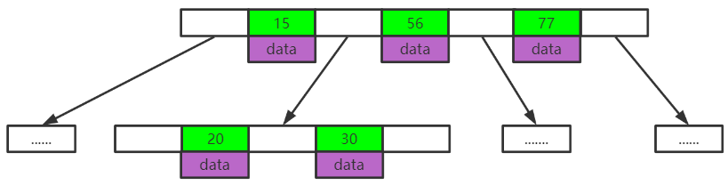
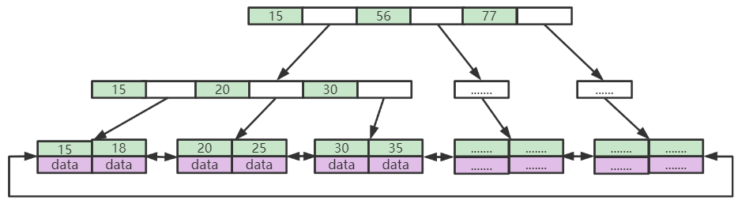
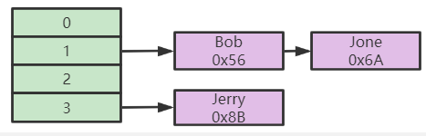
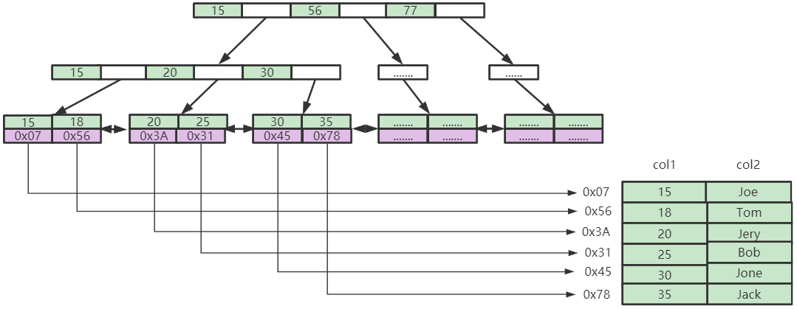
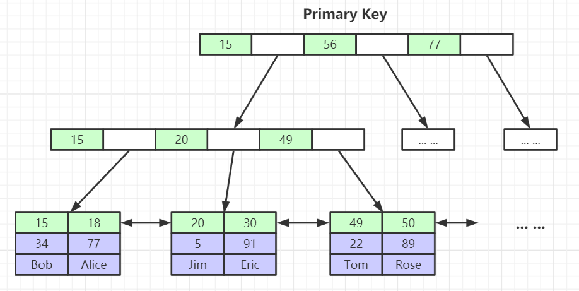
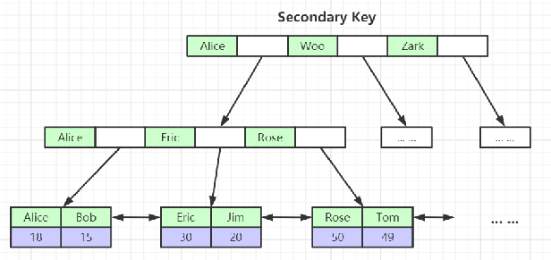
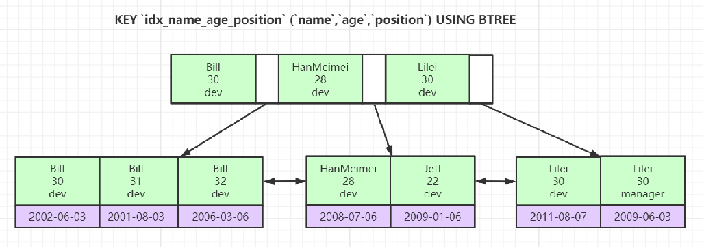

# Mysql索引底层数据结构与算法

## 1.索引数据结构类型

1. 二叉树
2. 红黑树
3. Hash表
4. B-Tree

对于二叉树和红黑树来讲，存放数据量有限。

### 1.1 B-Tree

1. 叶节点具有相同深度，叶节点的指针为空
2. 所有索引元素不重复，索引不是冗余索引
3. 节点中的数据索引从左到右递增排列

B-Tree每个索引节点下面都包含了本条数据的信息，并且不重复索引。而在节点处则是存放下一层节点所在的位置。

### 1.2 B+Tree

1. 非叶子节点不存储data，只存储索引(冗余)，可以放更多的索引
2. 叶子节点包含所有索引字段
3. 叶子节点用指针连接，提高区间访问性能。

### 1.3 Hash表

1. 对索引的key进行一次hash计算就可以定位出数据存储的位置
2. 很多时候Hash索引要比B+Tree索引更高效
3. 仅能满足“=”、“IN”，不支持范围查找
4. hash冲突

### 1.4 B-Tree和B+Tree的区别

1. 存放数量，B-Tree由于每层索引处都存放此索引的数据，故占据了比较大内存，而B+Tree只是在节点处存放索引，故占据空间较小，因此B+Tree存放的数据量更多
2. 同样的，B+Tree只在节点处存放索引，不存数据，所以存放的索引的数量更多，在数据量的场景下，更容易控制高度。

## 2.MyISAM

MyISAM对数据表的存储分为三个文件，frm表示表结构相关信息，MYD表示数据相关信息，MYI表示索引相关信息。

1. 首先根据索引查找到某个节点，得到这条数据的地址
2. 根据这个地址找到对应的数据。

## 3.InnoDB

InnoDB对数据表的存储分为两个文件，frm表示表结构相关信息，ibd表示数据和索引。

1. 表数据文件本身就是按照B+Tree的方式存储的；
2. 聚集索引的叶子节点中包含了完整的数据记录；
3. 建议InnoDB表必须创建主键，并且推荐使用整型的自增主键。如果不出主键，那么mysql会自动为表格创建主键，作为隐藏列，占用内存空间，影响mysql工作，整形自增则是方便主键存储和查找
4. 非主键索引结构叶子节点存储的是主键值（一致性和节省存储空间），一致性表示每张表都只有一个存储的方式，当插入一条数据时，先在主键索引的表中添加数据，再将数据插入到非聚集索引表中，并且只有一张表存有数据节省了空间。

### 3.1 聚集索引和非聚集索引

聚集索引指叶子节点包括索引和数据，而非聚集索引叶子节点包括索引和主键，然后回表到主键索引的表格中寻找数据。

相对来说聚集索引的速度会比非聚集索引的查找速度要快，因为不需要回表查询。

## 4.联合索引

联合索引按照最左前缀原则进行存储，使用时要注意查找的索引的位置。

​                

