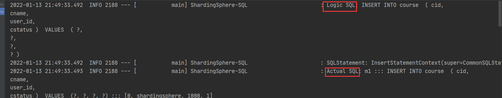
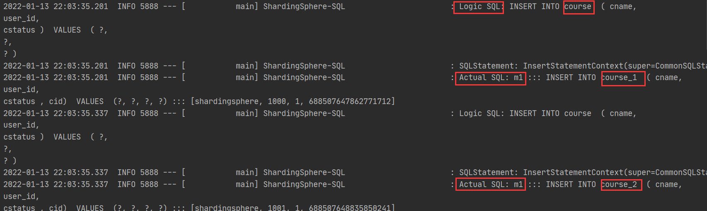
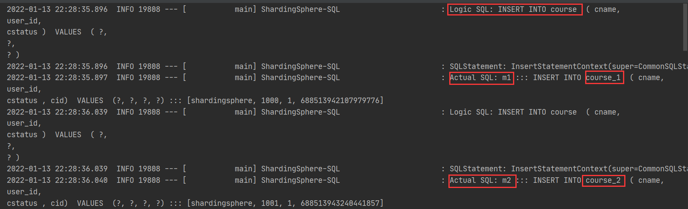
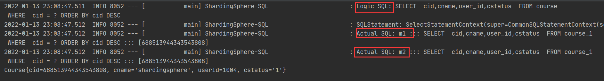
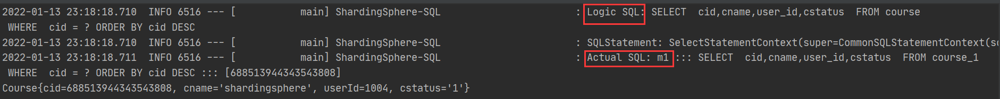
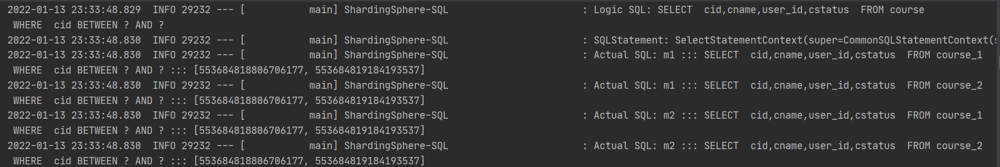
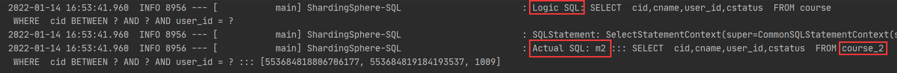
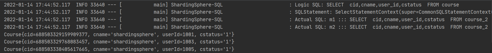
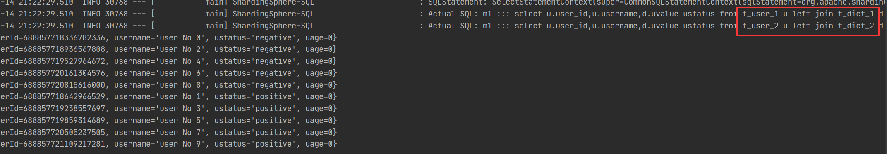

# shardingsphereJDBC实战

## 1.直接操作表

实现需要配置数据库

```properties
spring.shardingsphere.datasource.names=m1

spring.shardingsphere.datasource.m1.type=com.alibaba.druid.pool.DruidDataSource
spring.shardingsphere.datasource.m1.driver-class-name=com.mysql.cj.jdbc.Driver
spring.shardingsphere.datasource.m1.url=jdbc:mysql://10.225.8.33:3306/coursedb?serverTimezone=GMT%2B8
spring.shardingsphere.datasource.m1.username=root
spring.shardingsphere.datasource.m1.password=Jira@123
```

配置上面的一些配置以后，就可以直接对数据库进行操作。

需要在mapper包下面创建需要操作表的mapper

```java
public interface CourseMapper extends BaseMapper<Course> {
}
```

需要在spring boot的启动类上面加上mapper所在的包，便于扫描

```java
@MapperScan("com.jonewang.mapper")
@SpringBootApplication
public class Application {
    public static void main(String[] args) {
        SpringApplication.run(Application.class, args);
    }
}
```

当我们进行插入数据时，就可以看到下面的结果，这里可以看到直接是对数据库进行了操作。

 ```java
	@Resource
    CourseMapper courseMapper;

    @Test
    public void addCourse(){
        for (int i = 0; i < 10; i++) {
            Course course = new Course();
            course.setCid(Long.valueOf(i));
            course.setCname("shardingsphere");
            course.setUserId(Long.valueOf("" + (1000 + i)));
            course.setCstatus("1");
            courseMapper.insert(course);
        }
    }
 ```



## 2.分表插入数据

```properties
#配置真是表分布
spring.shardingsphere.sharding.tables.course.actual-data-nodes=m1.course_$->{1..2}
#主键生成策略
spring.shardingsphere.sharding.tables.course.key-generator.column=cid
spring.shardingsphere.sharding.tables.course.key-generator.type=SNOWFLAKE
spring.shardingsphere.sharding.tables.course.key-generator.props.worker.id=1

#配置分表策略
spring.shardingsphere.sharding.tables.course.table-strategy.inline.sharding-column=cid
spring.shardingsphere.sharding.tables.course.table-strategy.inline.algorithm-expression=course_$->{cid%2+1}
```

actual-data-nodes：首先是m1中有两个真实的表course_1和course_2

key-generator定义了他的主键列和主键生成策略，生成策略可以是SNOWFLAKE和UUID

table-strategy定义了分表的策略，分键片是cids属性，分片算法为course_$->{cid%2+1}，。



这里我们可以清晰的看到操作的logic table依然是sourse，但是实际的操作的是sourse_1和sourse_2，根据上面的插入算法，cid为偶数插入到course_1，cid为奇数插入到course_2中。

## 3.分库分表插入

```properties
spring.shardingsphere.datasource.names=m1,m2

spring.shardingsphere.datasource.m1.type=com.alibaba.druid.pool.DruidDataSource
spring.shardingsphere.datasource.m1.driver-class-name=com.mysql.cj.jdbc.Driver
spring.shardingsphere.datasource.m1.url=jdbc:mysql://10.225.8.33:3306/coursedb?serverTimezone=GMT%2B8
spring.shardingsphere.datasource.m1.username=root
spring.shardingsphere.datasource.m1.password=Jira@123

spring.shardingsphere.datasource.m2.type=com.alibaba.druid.pool.DruidDataSource
spring.shardingsphere.datasource.m2.driver-class-name=com.mysql.cj.jdbc.Driver
spring.shardingsphere.datasource.m2.url=jdbc:mysql://10.225.8.33:3306/coursedb2?serverTimezone=GMT%2B8
spring.shardingsphere.datasource.m2.username=root
spring.shardingsphere.datasource.m2.password=Jira@123
#配置表分布，分库、分表
spring.shardingsphere.sharding.tables.course.actual-data-nodes=m$->{1..2}.course_$->{1..2}

#主键生成策略
spring.shardingsphere.sharding.tables.course.key-generator.column=cid
spring.shardingsphere.sharding.tables.course.key-generator.type=SNOWFLAKE
#配置分表策略
spring.shardingsphere.sharding.tables.course.table-strategy.inline.sharding-column=cid
spring.shardingsphere.sharding.tables.course.table-strategy.inline.algorithm-expression=course_$->{cid%2+1}
#配置分表策略
spring.shardingsphere.sharding.tables.course.database-strategy.inline.sharding-column=cid
spring.shardingsphere.sharding.tables.course.database-strategy.inline.algorithm-expression=m$->{cid%2+1}


spring.shardingsphere.props.sql.show = true
spring.main.allow-bean-definition-overriding=true

```

这里配置了两个数据库。

还是按照单个分片键生成主键，并保存在不同数据库的数据表中。




## 4.shardingshpere分片策略


上面提到了inline算法，inline算法表示的是，一个分片键和一个分片表达式来制定分片算法。对于大多数的场景来说，这种分片算法已经可以满足了，但是对于一些复杂的分片策略，例如多分片键、按范围分片等场景，inline算法就有力不从心了。

shardingshpere当前提供了五种分片策略：

### 4.1**NoneShardingStrategy**

InlineShardingStrategy

最常用的分片方式 配置参数： inline.shardingColumn分片键；inline.algorithmExpression分片表达式 实现方式： 按照分片表达式来进行分片。

### 4.2**StandardShardingStrategy**

只支持单分片键的标准分片策略。 

配置参数：standard.sharding-column 分片键；standard.precise-algorithm-class-name 精确分片算法类名；standard.range-algorithmclass-name 范围分片算法类名 

实现方式：shardingColumn指定分片算法。

preciseAlgorithmClassName指向一个实现了 io.shardingsphere.api.algorithm.sharding.standard.PreciseShardingAlgorithm接口的java类名，提供按照 = 或者 IN 逻辑的精确分片 示例： com.jonewang.algorithem.MyPreciseTableShardingAlgorithm

rangeAlgorithmClassName指向一个实现了 io.shardingsphere.api.algorithm.sharding.standard.RangeShardingAlgorithm接口的java类名，提供按照Between 条件进行的范围分片。示例：com.jonewang.algorithem.MyRangeShardingAlgorithm

说明： 其中精确分片算法是必须提供的，而范围分片算法则是可选的。

先来看下精准查找的例子

```java
public class MyPreciseTableShardingAlgorithm implements PreciseShardingAlgorithm<Long> {
    //select * from course where cid = ? or cid in (?,?)
    @Override
    public String doSharding(Collection<String> collection, PreciseShardingValue<Long> preciseShardingValue) {
        //String cid = preciseShardingValue.getColumnName();
        //logic table
        String logicTableName = preciseShardingValue.getLogicTableName();
        //cid value
        Long cidVal = preciseShardingValue.getValue();
        BigInteger shardingValueB = BigInteger.valueOf(cidVal);
        //table-strategy
        BigInteger res = shardingValueB.mod(new BigInteger("2")).add(new BigInteger("1"));
        String key = logicTableName + "_" + res;
        if (collection.contains(key)) {
            return key;
        }
        //couse_1, course_2
        throw new UnsupportedOperationException("route " + key + " is not supported ,please check your config");
    }
}
```


```properties
#standard分片策略
spring.shardingsphere.sharding.tables.course.table-strategy.standard.sharding-column=cid
spring.shardingsphere.sharding.tables.course.table-strategy.standard.precise-algorithm-class-name=com.jonewang.algorithem.MyPreciseTableShardingAlgorithm
```

当使用分表的策略时，我们进行查询发现查找了两个库里的表，这样会影响我们的查询效率。

```java
	@Test
    public void queryCourse() {
        QueryWrapper<Course> wrapper = new QueryWrapper<>();
        wrapper.orderByDesc("cid");
        wrapper.eq("cid", 688513944343543808L);
        List<Course> courses = courseMapper.selectList(wrapper);
        courses.forEach(course -> System.out.println(course));
    }
```



```properties
#standard分片策略
spring.shardingsphere.sharding.tables.course.table-strategy.standard.sharding-column=cid
spring.shardingsphere.sharding.tables.course.table-strategy.standard.precise-algorithm-class-name=com.jonewang.algorithem.MyPreciseTableShardingAlgorithm

spring.shardingsphere.sharding.tables.course.database-strategy.standard.sharding-column=cid
spring.shardingsphere.sharding.tables.course.database-strategy.standard.precise-algorithm-class-name=com.jonewang.algorithem.MyPreciseDSShardingAlgorithm
```

```java
public class MyPreciseDSShardingAlgorithm implements PreciseShardingAlgorithm<Long> {
    //select * from course where cid = ? or cid in (?,?)
    @Override
    public String doSharding(Collection<String> collection, PreciseShardingValue<Long> preciseShardingValue) {
        String logicTableName = preciseShardingValue.getLogicTableName();
        Long cidVal = preciseShardingValue.getValue();
        BigInteger shardingValue = BigInteger.valueOf(cidVal);
        BigInteger bigInteger = shardingValue.mod(new BigInteger("2")).add(new BigInteger("1"));
        String key = "m" + bigInteger;
        if (collection.contains(key)){
            return key;
        }
        //couse_1, course_2
        throw new UnsupportedOperationException("route "+ key +" is not supported ,please check your config");
    }
}
```



再看下范围查找的例子

```properties
#standard分片策略
spring.shardingsphere.sharding.tables.course.table-strategy.standard.sharding-column=cid

spring.shardingsphere.sharding.tables.course.table-strategy.standard.range-algorithm-class-name=com.jonewang.algorithem.MyRangeTableShardingAlgorithm

spring.shardingsphere.sharding.tables.course.database-strategy.standard.sharding-column=cid

spring.shardingsphere.sharding.tables.course.database-strategy.standard.range-algorithm-class-name=com.jonewang.algorithem.MyRangeDBShardingAlgorithm

```

```java
public class MyRangeTableShardingAlgorithm implements RangeShardingAlgorithm<Long> {
    @Override
    public Collection<String> doSharding(Collection<String> collection, RangeShardingValue<Long> rangeShardingValue) {
        String logicTableName = rangeShardingValue.getLogicTableName();

        return Arrays.asList(logicTableName + "_1", logicTableName + "_2");

    }
}
public class MyRangeTableShardingAlgorithm implements RangeShardingAlgorithm<Long> {
    @Override
    public Collection<String> doSharding(Collection<String> collection, RangeShardingValue<Long> rangeShardingValue) {
        String logicTableName = rangeShardingValue.getLogicTableName();

        return Arrays.asList(logicTableName + "_1", logicTableName + "_2");

    }
}
```

```java
	@Test
    public void queryOrderRange(){
        //select * from course
        QueryWrapper<Course> wrapper = new QueryWrapper<>();
        wrapper.between("cid",553684818806706177L,553684819184193537L);
//        wrapper.in()
        List<Course> courses = courseMapper.selectList(wrapper);
        courses.forEach(course -> System.out.println(course));
    }
```



### **4.3ComplexShardingStrategy**

支持多分片键的复杂分片策略。

配置参数：complex.sharding-columns 分片键(多个);

complex.algorithm-class-name 分片算法实现类。

实现方式：

shardingColumn指定多个分片列

algorithmClassName指向一个实现了

org.apache.shardingsphere.api.sharding.complex.ComplexKeysShardingAlgorithm接口的java类名。提供按照多个分片列进行综合分片的算法。 示例： com.jonewang.algorithem.MyComplexKeysShardingAlgorithm

```properties
#complex分片策略
spring.shardingsphere.sharding.tables.course.table-strategy.complex.sharding-columns=cid, user_id
spring.shardingsphere.sharding.tables.course.table-strategy.complex.algorithm-class-name=com.jonewang.algorithem.MyComplexTableShardingAlgorithm

spring.shardingsphere.sharding.tables.course.database-strategy.complex.sharding-columns=cid, user_id
spring.shardingsphere.sharding.tables.course.database-strategy.complex.algorithm-class-name=com.jonewang.algorithem.MyComplexDBShardingAlgorithm
```

```java
public class MyComplexDBShardingAlgorithm implements ComplexKeysShardingAlgorithm<Long> {
    //    SELECT  cid,cname,user_id,cstatus  FROM course
//    WHERE  cid BETWEEN ? AND ? AND user_id = ?
    @Override
    public Collection<String> doSharding(Collection<String> collection, ComplexKeysShardingValue<Long> complexKeysShardingValue) {
        Range<Long> cidRange = complexKeysShardingValue.getColumnNameAndRangeValuesMap().get("cid");
        Collection<Long> user_id = complexKeysShardingValue.getColumnNameAndShardingValuesMap().get("user_id");

        List<String> res = new ArrayList<>();

        for (Long userid : user_id) {
            BigInteger bigInteger = BigInteger.valueOf(userid);
            BigInteger add = bigInteger.mod(new BigInteger("2")).add(new BigInteger("1"));
            res.add("m" + add);
        }
        return res;
    }

}
```

```java
@Test
    public void queryCourseComplex(){
        QueryWrapper<Course> wrapper = new QueryWrapper<>();
        wrapper.between("cid",553684818806706177L,553684819184193537L);
        wrapper.eq("user_id",1009L);
//        wrapper.in()
        List<Course> courses = courseMapper.selectList(wrapper);
        courses.forEach(course -> System.out.println(course));
    }
```




### 4.4**HintShardingStrategy**

不需要分片键的强制分片策略。这个分片策略，简单来理解就是说，他的分片键 不再跟SQL语句相关联，而是用程序另行指定。对于一些复杂的情况，例如 select count(*) from (select userid from t_user where userid in (1,3,5,7,9)) 这样的SQL语句，就没法通过SQL语句来指定一个分片键。这个时候就可以通过 程序，给他另行执行一个分片键，例如在按userid奇偶分片的策略下，可以指定 1作为分片键，然后自行指定他的分片策略。

配置参数：hint.algorithm-class-name 分片算法实现类。

实现方式：

algorithmClassName指向一个实现了 org.apache.shardingsphere.api.sharding.hint.HintShardingAlgorithm 接口的java类名。 

示例： com.jonewang.algorithem.MyHintTableShardingAlgorithm

在这个算法类中，同样是需要分片键的。而分片键的指定是通过 HintManager.addDatabaseShardingValue方法(分库)和 HintManager.addTableShardingValue(分表)来指定。 

使用时要注意，这个分片键是线程隔离的，只在当前线程有效，所以通常建 议使用之后立即关闭，或者用try资源方式打开。

```properties
#hint分片策略
spring.shardingsphere.sharding.tables.course.table-strategy.hint.algorithm-class-name=com.jonewang.algorithem.MyHintTableShardingAlgorithm
```

```java
public class MyHintTableShardingAlgorithm implements HintShardingAlgorithm<Long> {
    @Override
    public Collection<String> doSharding(Collection<String> collection, HintShardingValue<Long> hintShardingValue) {
        String key = hintShardingValue.getLogicTableName() + "_" + hintShardingValue.getValues().toArray()[0];
        if (collection.contains(key)){
            return Arrays.asList(key);
        }
        throw new UnsupportedOperationException("route "+ key +" is not supported ,please check your config");
    }
}

```

```java
	@Test
    public void queryCourseByHint(){
        HintManager hintManager = HintManager.getInstance();
        hintManager.addTableShardingValue("course",2);
        List<Course> courses = courseMapper.selectList(null);
        courses.forEach(course -> System.out.println(course));
        hintManager.close();
    }
```



# 5.绑定表示例

````properties
spring.shardingsphere.sharding.tables.t_dict.actual-data-nodes=m1.t_dict_$->{1..2}

spring.shardingsphere.sharding.tables.t_dict.key-generator.column=dict_id
spring.shardingsphere.sharding.tables.t_dict.key-generator.type=SNOWFLAKE

spring.shardingsphere.sharding.tables.t_dict.table-strategy.inline.sharding-column=ustatus
spring.shardingsphere.sharding.tables.t_dict.table-strategy.inline.algorithm-expression=t_dict_$->{ustatus.toInteger()%2+1}

spring.shardingsphere.sharding.tables.t_user.actual-data-nodes=m1.t_user_$->{1..2}

spring.shardingsphere.sharding.tables.t_user.key-generator.column=user_id
spring.shardingsphere.sharding.tables.t_user.key-generator.type=SNOWFLAKE

spring.shardingsphere.sharding.tables.t_user.table-strategy.inline.sharding-column=ustatus
spring.shardingsphere.sharding.tables.t_user.table-strategy.inline.algorithm-expression=t_user_$->{ustatus.toInteger()%2+1}
````

```java
public interface UserMapper extends BaseMapper<User> {
    @Select("select u.user_id,u.username,d.uvalue ustatus from t_user u left join t_dict d on u.ustatus = d.ustatus")
    public List<User> queryUserStatus();
}

```

```java
	@Test
    public void addDict(){
        Dict d1 = new Dict();
        d1.setUstatus("1");
        d1.setUvalue("positive");
        dictMapper.insert(d1);

        Dict d2 = new Dict();
        d2.setUstatus("0");
        d2.setUvalue("negative");
        dictMapper.insert(d2);

        for(int i = 0 ; i < 10 ; i ++){
            User user = new User();
            user.setUsername("user No "+i);
            user.setUstatus(""+(i%2));
            user.setUage(i*10);
            userMapper.insert(user);
        }
    }

    @Test
    public void queryUserStatus(){
        List<User> users = userMapper.queryUserStatus();
        users.forEach(user -> System.out.println(user));
    }
```


其实这个结果是有问题的，出现了不该有的数据，这些并不是我们想要查询的内容，根据上面的sql我们只想要的是u.ustatus = d.ustatus。因此

```properties
spring.shardingsphere.sharding.binding-tables[0]=t_user,t_dict
```



