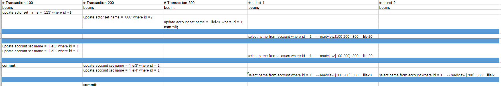

# 深入理解MVCC与BufferPool缓存机制

##  0 目标

Undo日志版本链与Read View机制详解

MVCC多版本并发控制机制详解

InnoDB引擎bufferpool缓存机制

Redo 与Undo日志详解

## 1 MVCC多版本并发控制机制

MySQL在可重复隔离机制下如何保证事务较高的隔离性，当执行同一个查询SQL语句时，多次查询的结果是相同的，就算其他事务对数据的修改依然不会影响查询SQL的结果。

隔离性依靠MVCC机制实现，对一行数据的读和写操作默认是不会通过加锁互斥保证隔离性，避免了频繁加锁互斥，而在串行化隔离级别为了保证较高的隔离性是通过将所有的操作加锁互斥来实现的。

MVCC机制简单来讲就是通过版本控制实现事务隔离性，从而保证数据一致性。

## 2 undo日志版本链与read view机制详解

undo日志版本链是指一行数据被多个事务多次修改以后，每个事务修改完以后，MySQL都会保留修改前的数据undo回滚日志，并且用两个隐藏字段trx_id和roll_point字段把这些undo日志串联起来形成一个历史记录版本链。

在可重复读隔离级别中，当事务开启时，执行任何的查询SQL都会生成当前事务的一致性视图read-view，该视图在事务结束之前都不会发生任何变化(如果隔离级别是读已提交，那么每执行一次查询SQL都会重新生成)，这个视图由执行查询时所有未提交的事务数组和已创建的最大事务id组成。任何事务的SQL查询结果需要从版本链中最新数据开始逐条和read view做对比从而得到最终的结果。

版本链对比规则：

1.如果，trx_id<min_id，说明当前事务已提交，数据可见。

2.如果 min_id <= trx_id <= max_id，这个时候就会出现两种状态，已提交或者未提交，若trx_id在read view数组中，那么说明事务未提交，数据不可见；若trx_id不在read view数组中，说明事务已提交，数据可见。

3.如果trx_id > max_id，说明这个版本是由将来启动的事务进行提交的，数据不可见。

对于删除的情况可以认为是update的特殊情况，会将版本链上最新的数据复制一份，然后将trx_id修改成删除操作的trx_id，同时在该条记录的头信息(record header)里的(delete_flag)标记上true，来表示当前记录已经被删除，在查询时按照上面的规则查到对应的记录如果是delete_flag标记为true，意味着记录已删除，则不返回数据。

**这里需要声明一下，当一个事务执行第一个查询语句的时候，read_view就已经生成了，但是，直到第一个update操作的时候，trx_id才正式生成。** MySQL内部是严格按照事务的启动顺序分配事务id的。

下面的图片是事务执行的过程

1.首先执行trx_id = 100的事务，`update actor set name = '123' where id =1;` 再执行trx_id=200的事务，`update actor set name = '666' where id =2;` 在trx_id = 300中执行`update account set name = 'lilei20' where id = 1;` 并提交trx_id = 300。

2.这时候执行查询SQL操作，`select name from account where id = 1;` 此时生成的read view：[100,200],300。查询的是id=1的数据，找到版本链最上面的name=lilei20，对比trx_id和read view中维护的trx_id相比较，发现并不在未提交事务数组内，又发现trx_id = max_id，trx_id=300已提交，即当前记录name为最新值；

3.此时继续执行，`update account set name = 'lilei1' where id = 1; 和update account set name = 'lilei2' where id = 1;` 此时在进行`select name from account where id = 1;` 此时生成的read view：[100,200],300。经过对比发现，trx_id = 100在未提交事务数组中，数据不可见，向下继续对比trx_id ，直到发现trx_id = 300，所以这时候读取的值还是‘lilei20’。

4.此时，trx_id = 100执行commit操作，trx_id = 200执行，`update account set name = 'lilei3' where id = 1;和update account set name = 'lilei4' where id = 1;` ，这时候在执行`select name from account where id = 1;` 此时read view：[100,200],300。经过对比发现，trx_id = 100在未提交事务数组中，数据不可见，向下继续对比trx_id ，直到发现trx_id = 300，所以这时候读取的值还是‘lilei20’。

5.此时，再重新启动一个事务，当前事务在此时执行`select name from account where id = 1;` 此时read view：[200],300。经过对比发现，trx_id = 200在未提交事务数组中，数据不可见，向下继续对比trx_id ，直到发现trx_id = 100  < min_id=200，所以这时候读取的值还是‘lilei2’。

总结：

MVCC机制的实现就是通过read view 和undo版本链对比机制，使得不同的事务会根据数据版本链对比规则读取同一条数据在版本链上不同版本数据。

## 3 InnoDB引擎SQL执行的bufferpool缓存机制

为什么MySQL不能直接更新磁盘上的数据而要设置这么一套复杂的机制来执行SQL？

因为来一个请求就直接对磁盘数据进行随机读写，然后更新磁盘文件里面的数据性能可能更差。

因为磁盘随机读写的性能是非常差的，所以直接更新数据库磁盘文件是不能让数据库抗住很大的并发量的。

MySQL这一套机制看起来很复杂，但可以保证每个请求都是更新内存bufferpool，然后顺序写日志文件，同时还能保证各种情况下的数据的一致性。

更新内存的性能是非常高的，然后顺序写磁盘上的日志的文件的性能也是非常高的，要远远高于随机读写磁盘文件。

正是通过这套机制，才让MySQL数据库在有较高配置的机器上每秒可以抗下几千的读写。