# 深入理解Mysql事务隔离级别与锁机制

## 0.目标

###  1.Mysql事务及ACID特性详解

###  2.MySQL事务隔离级别详解

###  3.MySQL锁机制

###  4.MySQL锁优化建议

## 1.事物及其ACID属性

### 1.1 事务

事务是由一组SQL语句组成的逻辑处理单元，事务具有下面四个属性，简称ACID。

原子性(Atomicity)：事务是一个原子操作单元，其对数据的修改，要么全部执行，要么全部不执行。强调的是**操作一致性**。

一致性(Consistent)：在事务开始和完成时，数据都必须保持一致状态。这意味着所有的数据都必须应用于事务的修改，以保持数据的完整性。强调的是数**据的一致性。**

隔离性(Isolation)：数据库提供给事务一定的隔离机制，保证事务处在不受并发的影响的”隔离环境“独立执行。这意味着事务处理过程中的中间状态对外部是不可见的。

持久性(Durable)：事务完成以后，对数据的修改是永久性的，即使出现系统故障也能保持。

### 1.2 并发事务所带来的问题

脏写：当两个或者更多事务对同一行进行操作时，基于最初选定的值更新该行时，由于每个事务不知道其他事务的存在，就会发生更新问题，**最后的更新覆盖掉其他事务所做的更新。**

脏读：一个事务对一条记录进行修改时，在这个事务未提交之前，就会出现数据不一致状态；当另外一个事务读取此条记录时，如果不加控制，那么第二个事务就会读取到这个脏数据，并会对该数据做进一步的操作，就会产生未提交的数据依赖关系。**事务A读取到未提交事务B修改但未提交的数据**，并在此基础上进行了操作。此时，如果B事务进行回滚操作，A读取到数据无效，不符合一致性的要求。

不可重复读：一个事务在读取某条记录后，隔段时间再次读取此条记录，发现读取的数据已经发生了变化，或者已经删除！**事务A内部执行sql语句查询的数据在不同时刻读出的结果不一致，不符合隔离性。**

幻读：一个事务按相同的查询条件重新读取之前检索的数据，发现其他事务插入了符合当前查询条件的新数据。**事务A读取到事务B提交的新增数据，不符合隔离性。**

### 1.3 事务隔离级别

| 隔离级别                  | 脏读(Dirty Reads) | 不可重复读(Dirty Reads) | 幻读(Dirty Reads) |
| ------------------------- | ----------------- | ----------------------- | ----------------- |
| 读未提交(Read Uncommited) | 可能              | 可能                    | 可能              |
| 读已提交(Read commited)   | 不可能            | 可能                    | 可能              |
| 可重复读(Repeatable Read) | 不可能            | 不可能                  | 可能              |
| 可串行化(Serializable)    | 不可能            | 不可能                  | 不可能            |

数据库的隔离级别越严格，并发的副作用越小，但付出的代价越大，因为事务隔离实质上就是使事务在一定程度上”串行化“进行，这显然与”并发“是矛盾的。

同时，不同应用对读一致性和隔离事务级别的要求也是不一样的，比如很多应用对不可重复读和幻读并不敏感，可能更关心数据库的并发访问的能力。

常看当前数据库的事务隔离级别: show variables like 'tx_isolation'; 

设置事务隔离级别：set tx_isolation='REPEATABLE-READ';

Mysql默认的事务隔离级别是可重复读，用Spring开发程序时，如果不设置隔离级别默认用Mysql设置的隔离级别，如果Spring设置了就用已经设置的隔离级别。

## 2.锁详解

锁是计算机协调多个线程并发访问同一资源的控制机制。

在数据库中，除了对传统的计算资源的征用外，数据也是一种供不同用户共享的一种资源。如何保证数据的一致性、有效性是一个重要的问题，锁冲突也是影响数据库并发访问性能的重要因素。

### 2.1 锁分类

从性能上分为乐观锁(基于版本号进行比较)和悲观锁

乐观锁：当前事务修改一条记录，并记录初始值的版本，与数据库中这条记录对应的版本号进行比较，版本号相同则可以修改，如果不同，知道当前版本值后，再进行操作。

悲观锁：事务A修改一条记录，事务B对同一条记录进行修改时，只能等待事务A完成操作以后，事务B才能进行操作。

从数据库操作中分为读锁和写锁，这两种锁都属于悲观锁。

读锁(共享锁，S锁(Shared))： 针对同一份数据，多个读操作可以同时进行而相互之间不受影响

写锁(排他锁，X锁(eXclusive))： 当前写操作没有完成时，会阻断其他读锁和写锁。

从对数据操作粒度上，分为表锁和行锁。

### 2.2 表锁

每次锁住整张数据表。开销小，速度快；不会出现死锁；锁定粒度大，发生锁冲突的概率高，并发度最低；一般用于整张表迁移的场景。

手动增加表锁

 lock table 表名称 read(write),表名称2 read(write);

查看表上加过的锁

 show open tables；

删除表锁

 unlock tables;

#### 加读锁


当前session和其他session都可以读该表

当前session中插入数据或者更新锁定的表都会报错，其他session插入或更新则会等待。

#### 加写锁

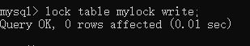

当前session对该表的增删改查都没有问题，其他session对该表的所有操作都会被阻塞。

**对MyISAM表的读操作(加读锁)，不会阻塞其他进程对同一表的读请求，但会阻塞对同一表的写请求。只当读锁释放后，才会执行其他进程的写操作。**

**对MyISAM的写操作(加写锁)，会阻塞其他进程对同一表的读和写的操作，只有当写锁释放后，才可以执行其他进程的读写操作。**

### 2.3 行锁

每次锁住一行记录。开销大，速度慢；会出现死锁；锁定力度小，发生锁冲突的概率不高，并发度高。

InnoDB与MyISAM不同点：

- **InnoDB支持事务**
- **InnoDB支持行级锁**

总结：

**MyISAM在执行查询语句select前，会自动给涉及的所有表加读锁，在执行update、insert、delete操作会自动给涉及的表加写锁。**

**InnoDB在执行查询语句select时(非串行隔离级别)，不会加锁。但是update、insert、delete操作会加行锁。**

<u>**读锁会阻塞写，但是不会阻塞读，而写锁则会把读和写都阻塞。**</u>

## 3.行锁与事务隔离级别案例分析

### 3.1 读未提交

1）在客户端A中，设置当前事务模式为'read-uncommitted'读未提交，查询表格的初始值：

set tx_isolation='read-uncommitted';

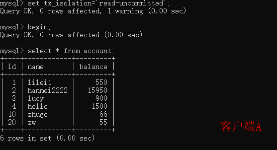

2）在客户端A提交之前，打开客户端B，更新account表：

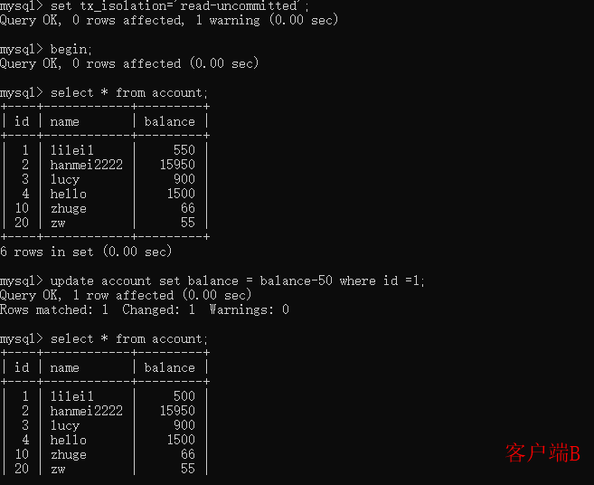

3）这时，虽然客户端B还没有提交事务，但是客户端A就能查到客户端B对数据的操作：

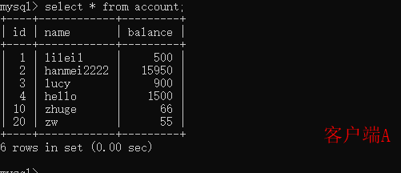

4）一旦客户端B事务因为某种原因回滚，所有的操作都将被撤销，那么客户端A事务查询到的数据其实就是脏数据：

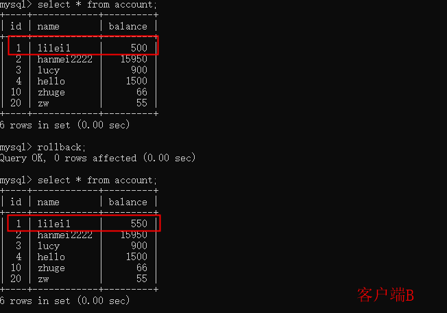

5）在客户端执行update操作，发现lilei1的balance居然不是450，而是500。这种情况客户端A读取到客户端B回滚操作，重新读取了balance的值。

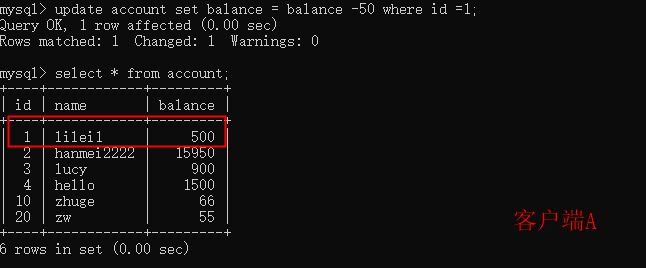

### 3.2 读已提交

1）客户端A中，设置当前事务模式为read commited(读已提交)

set tx_isolation='read-committed';

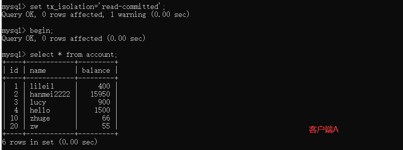

2）在事务A未提交之前，打开客户端B，执行更新操作

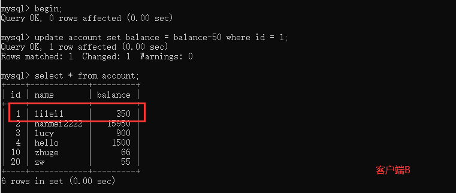

3）这时，事务B还没有提交，事务A查询不到事务B更新的数据，解决了脏读问题

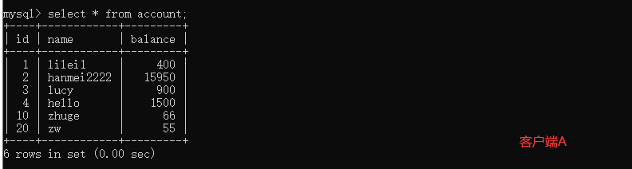

4）事务B提交

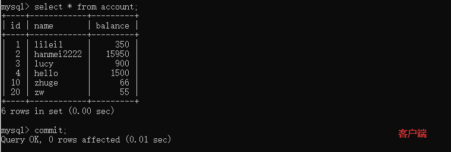

5）事务A执行相同查询操作，结果与之前不同，产生了不可重复读的问题

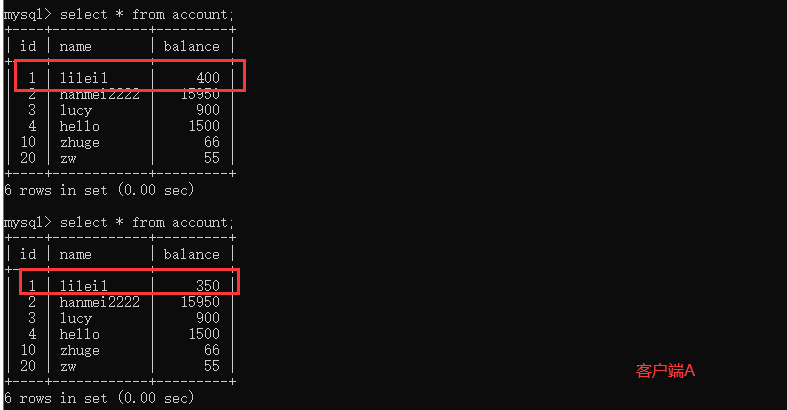

### 3.3 可重复读

1）打开客户端A，并设置当前的事务模式为repeatable read

set tx_isolation='repeatable-read';

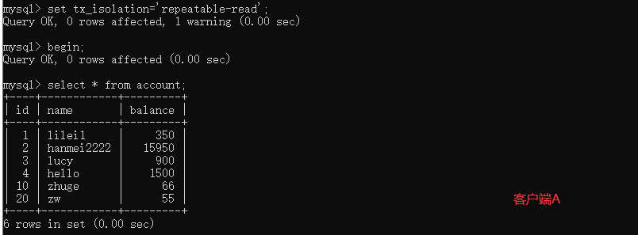

2）在事务A未提交之前，打开客户端B，更新account表

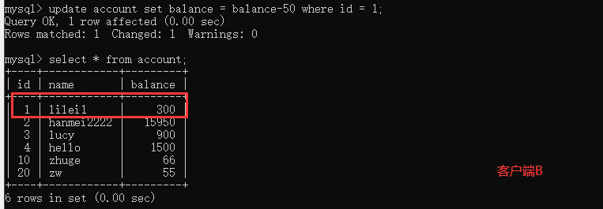

3）事务B提交，在事务A中执行相同查询操作，前后查询的数据结果一致

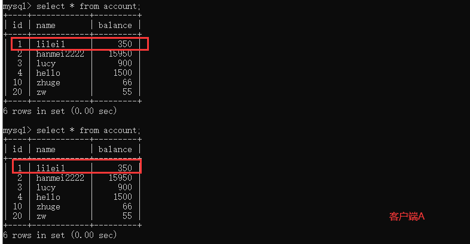

4）在客户端A中执行更新操作，update account set balance = balance - 50 where id =1; **balance没有在350的基础上执行操作，反而是用到了数据库中实际的数据进行了更新，数据的一致性没有被破坏。可重复读的隔离级别下，使用MVCC机制，select操作不会更新版本号，是快照版，insert、update和delete会更新版本号，是当前读。**

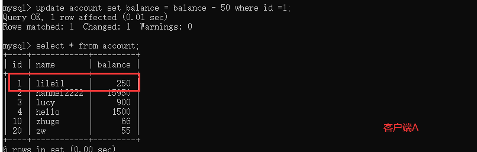

5）在客户端B中插入一条数据，并提交。

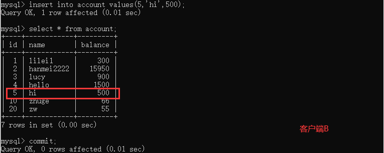

6）在客户端A中查询account所有数据，发现并没有新增数据，所以没有出现幻读

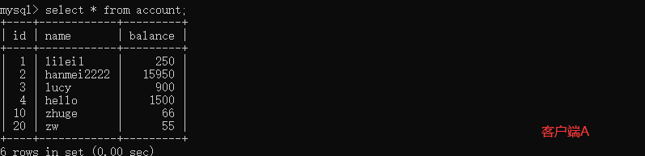

7）在客户端A中执行update account set balance = balance - 50 where id =5; 能更新成功，再次查询能够查到事务B更新的数据

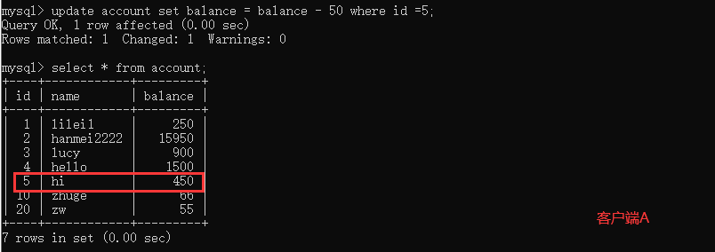

### 3.4 串行化

1）打开客户端A，并设置当前事务模式为serializable，查询account值

set tx_isolation='serializable';

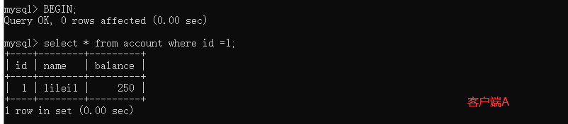

2）打开客户端B，执行相同行的更新操作会阻塞等待，更新id=2的记录可以成功，说明在串行模式下InnoDB的查询也会被加上行锁。

如果客户端A执行的是范围查找，那么在范围内的所有行包括每行记录所在的间隙的区间范围都会被加锁，此时如果在客户端B中执行插入此区间的操作，都会被阻塞，避免了幻读。

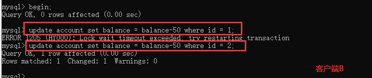

### 3.5 间隙锁

间隙锁，锁的两个值之间的空隙。MySQL默认级别是repeatable-read，间隙锁在某些情况下可以解决幻读：

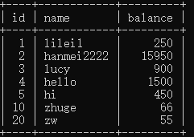

间隙有(5,10) (10,20),(20,+∞)三个区间

在客户端A中执行update account set name='wang' where id>8 and id<18; 在客户端B中，执行这区间所有的更新操作都无法进行，并且，对于边界值在表中不存在的情况，边界自动延伸至离边界最近并且大于(小于)这个边界的值，在本表中比8小的值是5，比18大的是20。

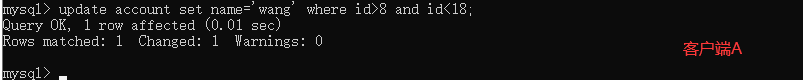

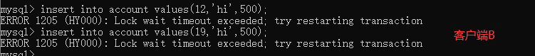

### 3.6 临键锁(Next-key Locks)

临键锁是行锁和间隙锁的组合。(5,20]整个区间可以叫做临键锁。

无索引行锁会升级为表锁。锁主要是加在索引上，如果对非索引字段进行更新，行锁可能会变成表锁。


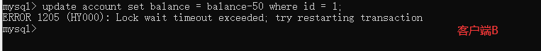

锁定某一行还可以使用lock in share mode (共享锁)和for update (排它锁)，例如 select * from test_innodb_lock where id =2 for update ，这样其他session只能读取这一行，修改则会被阻塞，直到锁定的session提交。


### 3.7 结论

InnoDB存储引擎由于实现了行级锁定，虽然在锁定机制的实现方面所带来的性能损耗可能比表级锁定会更高一点，但是在整体并发处理能力方面要远远优于MYISAM的表级锁定。当系统并发量高的时候，InnoDB的整体性能和MYISAM相比具有明显的优势。

但是，InnoDB的行级锁同时也有脆弱的一面，当我们使用不当的时候，可能让我们InnoDB的性能会比MYISAM更差。


### 3.8 行锁分析

通过检查InnoDB_row_lock 状态变量来分析系统上的行锁的争夺情况：

```show status like "innodb_row_lock%"```

各个状态量的的说明如下：

- Innodb_row_lock_current_waits: 当前正在等待锁定的数量 
- Innodb_row_lock_time: 从系统启动到现在锁定总时间长度 
- Innodb_row_lock_time_avg: 每次等待所花平均时间 
- Innodb_row_lock_time_max：从系统启动到现在等待最长的一次所花时间
-  Innodb_row_lock_waits:系统启动后到现在总共等待的次数

对于这5个状态变量，比较重要的主要是：

-  Innodb_row_lock_time_avg （等待平均时长） 
- Innodb_row_lock_waits （等待总次数）
-  Innodb_row_lock_time（等待总时长）
- 

查看INFORMATION_SCHEMA系统库锁相关数据表

```
‐‐ 查看事务
2 select * from INFORMATION_SCHEMA.INNODB_TRX;
3 ‐‐ 查看锁
4 select * from INFORMATION_SCHEMA.INNODB_LOCKS;
5 ‐‐ 查看锁等待
6 select * from INFORMATION_SCHEMA.INNODB_LOCK_WAITS;
7
8 ‐‐ 释放锁，trx_mysql_thread_id可以从INNODB_TRX表里查看到
9 kill trx_mysql_thread_id
10
11 ‐‐ 查看锁等待详细信息
12 show engine innodb status\G;
```

### 3.9 锁优化建议

- 尽可能让所有数据检索都通过索引实现，避免无索引行锁升级为表锁；
- 合理设计索引，尽量缩小锁的范围；
- 尽可能减小检索范围，避免间隙锁；
- 尽量控制事务的大小，减少锁定资源量和锁定时间，涉及事务加锁的sql尽量放在事务的最后执行；
- 尽可能降低事务隔离级别。


