# 索引最佳实践

1. ## B+树底层分析常见索引优化原则

2. ## MySQL索引最佳实践

下面用到的标为employees表，

```sql
主键索引 id 索引 idx_name_age_position `name`, `age`, `position`
```

### 1.全值匹配

```sql
EXPLAIN SELECT * FROM employees WHERE name= 'LiLei';
```

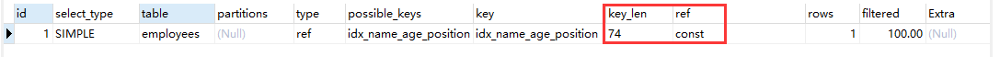

首先看一下key_len = 74，在之前explain的文章中写到关于key_len的计算方式，这里24*3+2 = 74。ref则是指的是查询字段，这里name是索引中字段，因此这里用const(常量)。

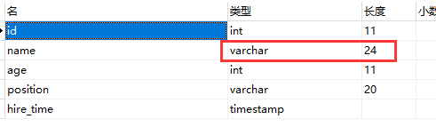

```sql
EXPLAIN SELECT * FROM employees WHERE name= 'LiLei' AND age = 22;
```

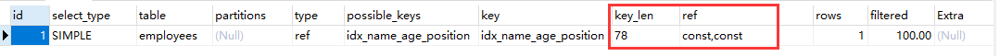

int类型占用四个字节 key_len = 74 + 4 = 78，name和age用到索引中的前两个，所以ref这里是两个const

```sql
EXPLAIN SELECT * FROM employees WHERE name= 'LiLei' AND age = 22 AND position ='manager';
```

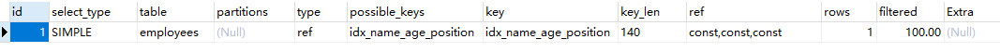

同样的对于索引中的三个字段，这里key_len = 74 + 4 + 20*3 + 2 = 140， ref对应三个const

### 2.最左前缀法则

如果索引用了多列，就要遵照最左前缀法则。具体指的是从索引的最左列开始不跳过索引中间列。

```sql
EXPLAIN SELECT * FROM employees WHERE name = 'Bill' and age = 31;
EXPLAIN SELECT * FROM employees WHERE age = 30 AND position = 'dev';
EXPLAIN SELECT * FROM employees WHERE position = 'manager';
```

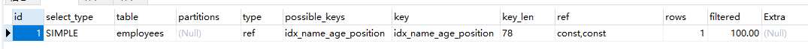

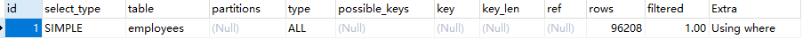

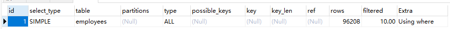

在这里Using where 表示查询的语句未被索引覆盖。这三个sql语句只有第一个符合索引的查找规则，从索引的第一列开始进行检索，而后面两个都是用到的索引的后面的列，显然是不符合最左前缀法则的，故后两个SQL使用了type为ALL的全表扫描的方式间进行数据检索。

### 3.不在索引上的任何列进行任何操作(计算、函数、(自动or手动)类型转换)，会导致索引失效转而向全表扫描。

```sql
EXPLAIN SELECT * FROM employees WHERE name = 'LiLei';
EXPLAIN SELECT * FROM employees WHERE left(name,3) = 'LiLei';
```

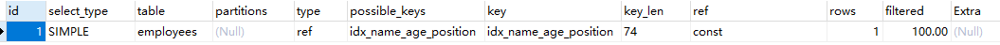

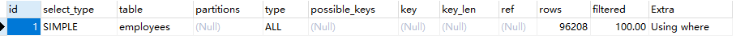

这里left(a,b)作为一个函数，在SQL执行之前的优化中并不会对函数进行优化，因此这里涉及到函数计算选择的全表扫描，而这只是MySQL的预估计算，实际执行情况是未知的。

### 4.存储引擎中不能使用索引中条件范围右边的列

```sql
EXPLAIN SELECT * FROM employees WHERE name= 'LiLei' AND age = 22 AND position ='manager';
EXPLAIN SELECT * FROM employees WHERE name= 'LiLei' AND age > 22 AND position ='manager';
```

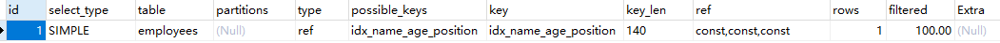

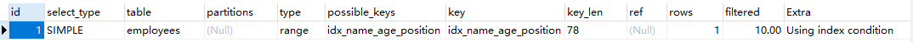

第一个sql都是按照索引列中的顺序进行检索，索引都走了索引；第二个sql第二列使用的是范围查找，对于索引的第三列而言结果是无序的，所以无法使用索引的第三列，在extra中使用了Using index condition则说明所有列并没有完全被索引覆盖。这里其实也涉及到最左前缀法则的概念。

### 5.尽量使用覆盖索引的语句(只访问索引的查询(查询列都在索引列中))，减少使用select *的查询。

```sql
EXPLAIN SELECT name,age FROM employees WHERE name= 'LiLei' AND age = 23 AND position='manager';
```

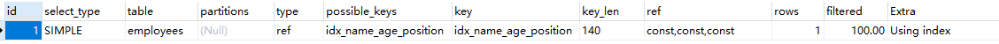

### 6.MySQL在使用不等于(!= 或< >)，not in , not exists的时候无法使用索引会导致全表扫描

< ，> ，<= ，>=这些，MySQL内部优化器会根据检索比例、表大小等多种因素来决定是否选择索引查询。

  ```sql
EXPLAIN SELECT * FROM employees WHERE name != 'LiLei';
  ```

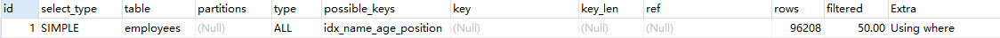

### 7.is null ，is not null一般情况下也不能使用索引

```sql
EXPLAIN SELECT * FROM employees WHERE name is null;
```

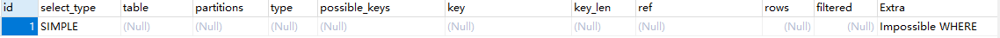

### 8.like以通配符开头，MySQL索引失效变成全表扫描操作

```sql
EXPLAIN SELECT * FROM employees WHERE name like '%Lei';
```

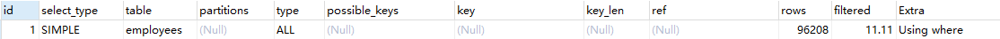

索引列的数据都是按照顺序排列的，当开头是%，无法跳过开头的字符而对中间的子序列进行检索，因此只能选择全表扫描的方式。

```sql
EXPLAIN SELECT * FROM employees WHERE name like 'Lei%';
```

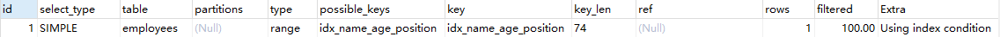

like符合最左前缀法则，实际上在MySQL语句执行按照的是=执行的，与前面left函数不同，like是可以在预执行层面做简单的优化的，所以这里是走索引的。

解决like '%str%'索引不被使用的方法？

1）使用覆盖索引，查询字段必须全都在索引里。

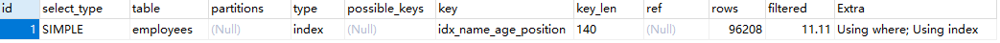

### 9.字符串不加单引号索引失效

```sql
EXPLAIN SELECT * FROM employees WHERE name = '1000';
EXPLAIN SELECT * FROM employees WHERE name = 1000;
```

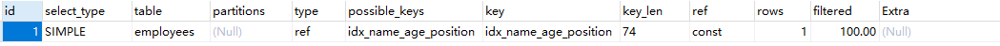

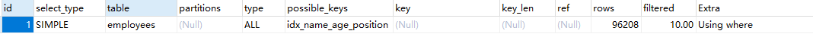

### 10.少用or或in ，用它查询时，MySQL不一定使用索引，MySQL内部优化器会根据检索比例、表达小等多个因素整体评估是否使用索引。

```sql
EXPLAIN SELECT * FROM employees WHERE name = 'LiLei' or name = 'HanMeimei';
```

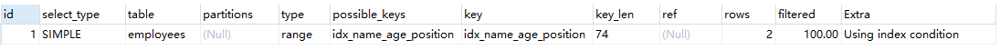

### 11.范围查询优化

给年龄添加单值索引

```sql
ALTER TABLE `employees` ADD INDEX `idx_age` (`age`) USING BTREE ;
explain select * from employees where age >=1 and age <=2000;
```

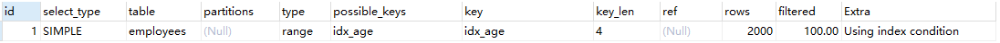

这里key中是有索引的，原因是我数据量较小或其他原因，这里想要说的是，很多时候按照某个字段进行范围查找，明明是按照索引字段查找，但是却进行的是全表扫描，MySQL会根据检索的数据比例、表大小等多种因素进行决定是否使用索引。如果不走索引，可能就是由于检索的数据量太多导致优化器选择不走索引。

优化办法：

可以将大的范围拆解成小的搜索范围。

```sql
explain select * from employees where age >=1 and age <=1000;
explain select * from employees where age >=1001 and age <=2000;
```

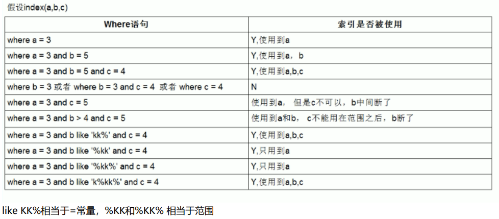

