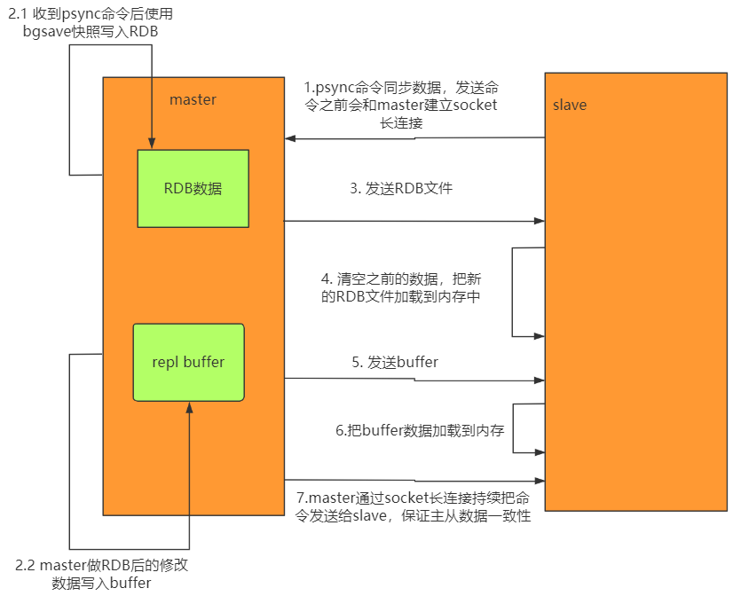
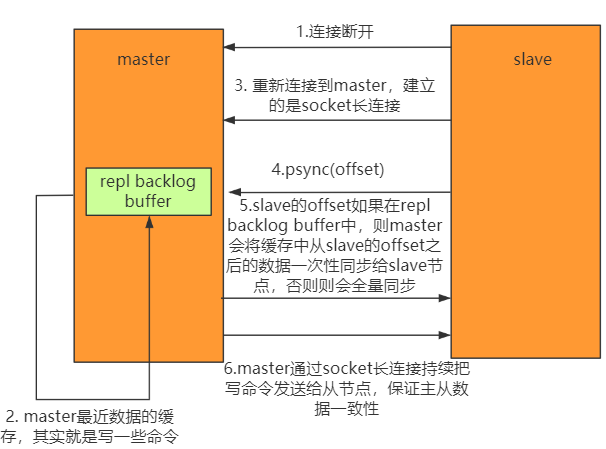
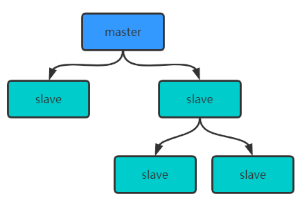
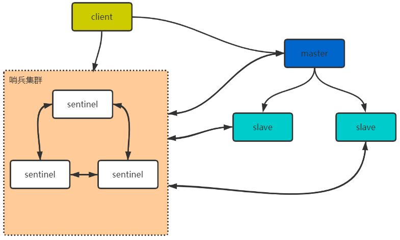

# Redis主从架构

## Redis主从工作原理

如果为master配置了一个slave，不管这个slave是否是第一次连接上Master，都会发送一个PSYNC命令给master请求复制数据。

### 数据全量复制

master收到PSYNC命令后，会在后台进行数据持久化，通过bgsave生成最新的RDB快照文件，持久化期间的，master会继续接收客户端的请求，他会把这些修改的数据集的请求缓存在内存中。当持久化进行完成后，master会把这个份RDB文件数据集发送个slave，slave把接收到的数据进行持久化生成RDB，然后在加载到内存中。最后，master再将之前缓存的数据发送给slave。

当master与slave之间的连接由于某种原因断开，slave能够自动重连master，如果master收到多个slave的并发请求连接，它只会进行一次持久化操作，而不是一个连接一次，然后再把这一份持久化的数据发送给多个并发连接的slave。

1. 从服务器向主服务器发送PSYNC请求；
2. 1.  主服务器收到PSYNC命令后，开始执行bgsave快照生成RDB文件；
   2. 执行bgsave命令那一刻以后的命令都写入到buffer缓存中；
3.  将RBD文件发送到slave；
4. slave清空内存把新的RDB文件加入到内存中；
5. master将生成快照文件时缓存的命令都发给slave；
6. slave把buffer中的数据写入到内存中；
7. 持续写入命令。

### 数据部分复制

当master和slave断开后重连，一般会对整份数据进行复制。但从redis2.8版本开始，redis改用可以支持部分数据复制的命令PSYNC去master同步数据，slave和master能够在网络连接断开重连后只进行部分数据复制，即断点续传。

master会在其内存中创建一个复制数据用的缓存队列，缓存最近一段时间的数据，master和它所有的slave都维护了复制的数据下标offset和master的进程id，因此，当网络连接断开后，slave会请求master继续进行未完成的复制，从所记录的数据下标开始。如果master进程的id变化了，或者从节点数据下标offset太旧，已经不在master的缓存队列里了，那么将会进行一次全量复制。

如果有很多节点，为了缓解主从复制风暴(多个从节点同时复制主节点导致主节点压力过大)，可以做如下架构，让部分从节点与从节点(与主节点同步)同步数据。

## Redis哨兵高可用架构

sentinel哨兵是特殊的redis服务，不提供读写服务，主要是用来监控redis实例节点。

1. 服务端向redis集群发送请求，首先向哨兵集群确认master主节点；
2. 确认完master以后，client下次请求直接向master发送请求；
3. 如果master挂掉以后，哨兵集群会感应到，并选举出新的master，某个slave获得超过半数的sentinel支持，即为新的master。

 

