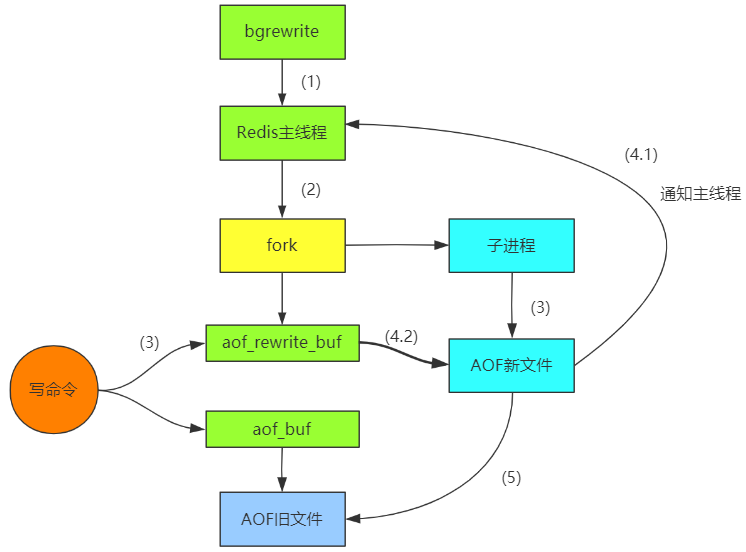
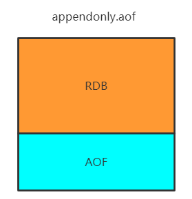
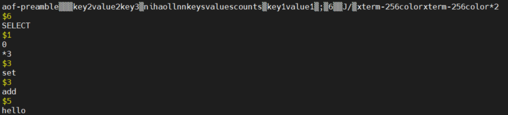

# Redis持久化

## RDB快照

在默认情况下，Redis将内存数据库快照保存在名字为**dum.rdb**的二进制文件中。

你可以对Redis进行设置，让它在“N秒内数据集至少有M个改动”这一条件被满足时，自动保存数据集。

比如说，以下设置会让Redis在满足“60秒内至少有1000个键被改动”这一条件时，自动保存数据集：

`#save 60 1000 //关闭RDB只需要将所有的save保存策略注释掉即可 `

还可以手动执行生成RDB快照，进入Redis客户端执行save或bgsave可以生成**dum.rdb**文件，每次命令执行都会将所得Redis内存快找到一个新的RDB文件中，并覆盖原有的RDB快照文件。

**但是按照RDB写数据意味着在写的过程中会重用主线程，加入数据量较大，则会造成其他命令的阻塞。**

### bgsave的写时复制(COW)机制

Redis借助操作系统提供的写时复制技术(Copy-On-Write,COW)，在生成快照的同时，依然可以正常处理命令。**简单来说，bgsave子进程是由主线程fork生成的，可以共享主线程的所有内存数据，在生成子进程时会短暂阻塞主线程，时间很短。**

bgsave子进程运行后，开始读取主线程的内存数据，并把他们写入到RDB文件中。如果此时，主线程对这些数据都是进行的读操作，那么主线程和bgsave子进程相互不影响。但是，如果主线程要修改数据，那么这一块数据就会被复制一份，生成该数据的副本；bgsave子进程会将副本数据写入到RDB文件中，在此过程中，主线程依然可以修改原来的数据。

| 命令                  | save             | bgsave                                   |
| --------------------- | ---------------- | ---------------------------------------- |
| IO类型                | 同步             | 异步                                     |
| 是否阻塞其他Redis命令 | 是               | 否(在生成子进程时调用fork会有短暂的阻塞) |
| 复杂度                | O(n)             | O(n)                                     |
| 优点                  | 不会消耗额外内存 | 不会阻塞客户端命令                       |
| 缺点                  | 阻塞客户端命令   | 需要fork子进程，消耗内存                 |

 配置自动生成rdb文件后台使用的是bgsave方式。

## AOF

快照功能并不是非常耐久，如果Redis因为某些原因造成故障停机，那么服务器将丢失最近写入、且仍未保存在快照中的那些数据。从1.1版本开始，Redis增加了一种完全耐久的持久化方式：AOF持久化，将修改的每一条指令记录进文件appendonly.aof中(先写入os cache，每个一段时间fsync到磁盘)

可以通过修改配置文件来打开AOF功能

`# appendonly yes`

每当Redis执行一个改变数据集的命令时(比如set)，这个命令就会追加到AOF文件的末尾。这样的话，当Redis重新启动时，程序就可以通过重新执行AOF文件中的命令来达到重建数据集的目的。

你可以配置Redis多久才将数据fsync到磁盘一次。

有三个选项

```react
appendfsync always:每次有新命令追加到AOF文件就执行一次fsync，非常慢，也非常安全。
appendfsync everysec：每秒fsync一次，足够快，并且在故障时只会丢失1秒钟的数据。
appendfsync no：从不fsync，将数据交给操作系统来处理。更快，也更不安全的选择。
```

**推荐(并且也是默认)的措施为每秒fsync一次，这种fsync策略可以兼顾速度和安全性。**


上面是一组在Redis设置的值，打开文件appendonly.aof，可以看到之前输入的值已经在文件中了，其中*3代表是有三个值，$3代表set长度。

### AOF重写

AOF文件里可能有太多没用的指令，比如多次更新某个key的值，那么实际只需要记录最新的key值就可以，所以AOF会定期根据内存的最新数据生成AOF文件。

当我们执行以下命令：

```react
127.0.0.1:6379> incr counts
(integer) 1
127.0.0.1:6379> incr counts
(integer) 2
127.0.0.1:6379> incr counts
(integer) 3
127.0.0.1:6379> incr counts
(integer) 4
127.0.0.1:6379> incr counts
(integer) 5

```

在文件appendonly.aof中就会出现同一数据多次增加的结果，而实际我们需要的仅仅是counts为5的结果。


为了对上面结果进行优化，可以使用AOF重写。

```react
# auto‐aof‐rewrite‐min‐size 64mb //aof文件至少要达到64M才会自动重写，文件太小恢复速度本来很快，重写意义不大
# auto‐aof‐rewrite‐percentage 100 //aof文件自上次重写后生成的文件大小后，在生成文件大小的基础上再增长100%再次触发重写。
```

**AOF还可以手动重写，进入到Redis客户端执行命令bgrewriteaof重写AOF。**

AOF重写Redis会fork出一个子进程去做(于bgsave命令类似)，不会对Redis正常处理有太多影响。

AOF重写的具体实现：



1. 首先看当前是否正在进行save或bgrewrite命令，倘若当前正在执行，等待执行完成后在执行bgrewrite；
2. Redis主线程发送fork指令，创建子进程进行，在这个过程中会出现短暂阻塞；
3. 主线程fork完子进程后，依然接收客户端新的请求。当前执行写入命令时，同时将数据写入到aof_rewrite_buf和aof_buf缓冲区；一方面是写入aof_buf缓冲区并根据appendfsync策略到磁盘，保证原有的AOF文件的完整性和正确性。另一方面写入aof_rewrite_buf缓冲区，保存fork以后客户端的写请求，也可以防止在生成新的AOF文件过程中的这部分数据丢失；
4. 把aof_rewrite_buf写入到新的AOF文件中，把aof_buf写入到旧的AOF文件中。当生成完新的AOF文件后，通知主线程更新信息;
5. 使用新的AOF文件将旧的AOF文件覆盖。

RDB和AOF比较

| 命令       | RDB        | AOF          |
| ---------- | ---------- | ------------ |
| 启动优先级 | 低         | 高           |
| 体积       | 小         | 大           |
| 恢复速度   | 快         | 慢           |
| 数据安全性 | 容易丢数据 | 根据策略决定 |


## Redis 4.0 混合持久化

重启Redis时，我们很少使用RDB来恢复内存状态，因为会丢失大量数据。我们通常会使用AOF日志重放，但是重放AOF日志性能相对RDB来说会慢很多，这样在Redis实例很大的情况下，启动需要花费很长的时间。Redis4.0为了解决这个问题，带来了一个新的持久化选项——混合持久化。

通过下面配置可以开启混合持久化(必须先开启AOF)

```react
# aof‐use‐rdb‐preamble yes
```

如果开启了混合持久化，AOF再重写时，不再单纯的将内存数据转换为RESP命令写入到AOF文件中，而是将重写这一刻之前的内存做RDB快照处理，并且将RDB快照内容和增量的AOF修改内存数据的命令存放在一起，都写入新的AOF文件，新的文件一开始不叫appendonly.aof，等到重写完成新的AOF文件才会进行改名，覆盖原有的AOF文件，完成新旧两个AOF文件的替换。

于是在Redis重启的时候，可以先加载RDB的内容，然后再重访增量AOF日志就可以完全替代之前的AOF全量文件重放，因此重启效率大幅得到提升。



如上图所示，加入当前进行持久化，先进行RDB持久化，重写这一刻以后的数据都AOF方式写入到appendonly.aof中。

当执行下面命令

```react
127.0.0.1:6379> bgrewriteaof
Background append only file rewriting started
127.0.0.1:6379> keys *
1) "key2"
2) "key3"
3) "ni"
4) "ll"
5) "keys"
6) "counts"
7) "key1"
127.0.0.1:6379> set add hello
OK

```

当打开appendonly.aof时，如下图所示。



### Redis数据备份策略

1. 写crontab定时调度脚本，每小时都copy一份RDB或AOF的备份到一个目录中，仅仅保留过去48小时的记录；
2. 每天都保存一份当日的数据备份到一个目录中去，可以保留近一个月的备份；
3. 每次copy备份时，都把太旧的备份删掉；
4. 每天晚上都将当前机器上的备份复制到另外一台机器上面，以防机器坏损。

