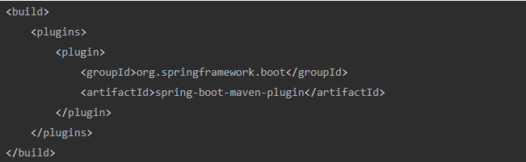

# SpringBoot启动原理

## 1.jar包启动

**首先需要在pom文件中引入maven插件，在编译的时候，maven会将程序所需要的jar包都放进jar文件中；**

**先看一下jar包的目录结构**

**其中META-INF下面的MANIFEST.MF文件是最核心的文件。在这个文件中记录了相关jar包的基础信息，以及入口程序中。**Main-Class是程序的启动类。start-Class则是jar包应用的Main函数。

jar包的启动流程

1.spring boot打包完成以后会生成fat jar(jar包中有依赖的jar包)

2.fat jar的启动Main函数的JarLauncher，JarLauncher会创建ClassLoader加载lib下面的以来的jar包，并以一个新的线程来启动jar包的应用Main函数。SpringBoot通过扩展JarFile、JarURLConnection及URLStreamHandler，实现了jar in jar中资源的加载。SpringBoot通过扩展URLClassLoader–LauncherURLClassLoader，实现了jar in jar中class文件的加载

## 2.SpringBoot是如何启动spring容器

上面的部分已经简单描述了jar包的启动，当找到start-class以后，执行`SpringApplication.run(Application.class)`，

1）`new SpringApplication(primarySources)`，初始化SpringApplication，

          1. 将启动类加载进来，`this.primarySources = new LinkedHashSet(Arrays.asList(primarySources));`
             2.  选择webApplicationType 加载方式，`this.webApplicationType = WebApplicationType.deduceFromClasspath();`
             3. 初始化上下文环境，`this.setInitializers(this.getSpringFactoriesInstances(ApplicationContextInitializer.class));`
             4. 读取监听器，`this.setListeners(this.getSpringFactoriesInstances(ApplicationListener.class));`
             5. 获取应用Main方法所在的类，`this.mainApplicationClass = this.deduceMainApplicationClass();`

2)  `.run()`方法

​    1.`ConfigurableApplicationContext context = null;`创建上下文

​    2.`SpringApplicationRunListeners listeners = this.getRunListeners(args);`获取`SpringApplicationRunListeners`监听器；

​    3.`listeners.starting();`发布ApplicationStartingEvent事件，在运行开始时发送

  

  4.`ApplicationArguments applicationArguments = new DefaultApplicationArguments(args);`根据命令行参数实例化一个ApplicationArguments

  5.`ConfigurableEnvironment environment = this.prepareEnvironment(listeners, applicationArguments);`预初始化环境：读取环境变量，读取配置文件信息

​      5.1 `ConfigurableEnvironment environment = this.getOrCreateEnvironment();`根据WebApplicationType获取环境变量对象

​      5.2 `this.configureEnvironment((ConfigurableEnvironment)environment, applicationArguments.getSourceArgs());`配置环境变量

​      5.3 `ConfigurationPropertySources.attach((Environment)environment);`将现有的环境变量设置成新的configurationProperties的数据源，并放在第              一位

​      5.4 `listeners.environmentPrepared((ConfigurableEnvironment)environment);`发布ApplicationEnvironmentPreparedEvent    

​      5.5 `this.bindToSpringApplication((ConfigurableEnvironment)environment);`将spring main的配置绑定到SpringApplication上

​      5.6 `ConfigurationPropertySources.attach((Environment)environment);` 将现有的环境变量设置成新的configurationProperties的数据源，并放在第              一位

  6 `context = this.createApplicationContext();`实例AnnotationConfigServletWebServerApplicationContext

  7 `this.prepareContext(context, environment, listeners, applicationArguments, printedBanner);`准备上下文

​     7.1 `context.setEnvironment(environment);`设置当前环境到context中

​     7.2 `this.applyInitializers(context);`调用ApplicationContextInitializer

​     7.3 `listeners.contextPrepared(context);`发布ApplicationContextInitializedEvent

​     7.4 `ConfigurableListableBeanFactory beanFactory = context.getBeanFactory();`获取beanfactory

​     7.5 `beanFactory.registerSingleton`将springApplicationArguments和springBootBanner注册成bean

​     7.6 `((DefaultListableBeanFactory)beanFactory).setAllowBeanDefinitionOverriding(this.allowBeanDefinitionOverriding);`设置不允许同名的bean

​     7.7 `context.addBeanFactoryPostProcessor(new LazyInitializationBeanFactoryPostProcessor());`设置是否懒加载

​     7.8 `this.load(context, sources.toArray(new Object[0]));`读取启动类为BeanDefinition

​     7.9 `listeners.contextLoaded(context);`将springboot监听器添加到context中，发布ApplicationEnvironmentPreparedEvent    

   8 `this.refreshContext(context);`这部分涉及到加载IOC容器。

