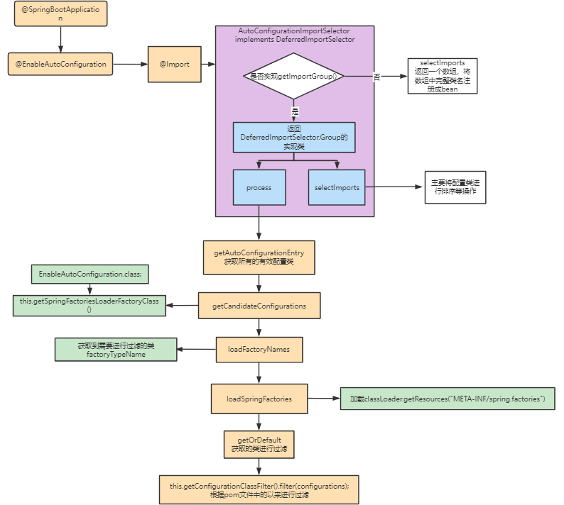

# SpringBoot自动配置原理

使用springboot时，无需繁琐的配置文件，而只需要在类上添加注解，使用javaconfig的配置方式就可以启动。

### 1.@SpringBootApplication

只需要在启动类中添加@SpringBootApplication注解，表明这个一个SpringBoot主配置类，需要运行这个类的main方法启动springBoot。

### 2.@SpringBootApplication注解

   @Target({ElementType.TYPE})设置当前注解可以标记在哪里，具体可以详细查看ElementType中的值

​    @Retention(RetentionPolicy.RUNTIME)当前标记的类编译以什么方式保留

​    @Documented Java doc会生成注解信息

​    @Inherited 可以被继承

​    @SpringBootConfiguration SpringBoot的配置类  可以看到在SpringBootConfiguration上面有configuration注解。表明这个一个配置类

   @EnableAutoConfiguration 开启自动配置功能，spring boot开启自动配置，自动加载自动配置类。

   @ComponentScan 扫描的包。 相当于在配置文件中写\<context:comonent-scan> ，但是没有指定具体的package位置，默认扫描当前配置类所在的包。

### 3.现在看一下最重要的一个注解@EnableAutoConfiguration。

   @AutoConfigurationPackage  当前配置类所在的包保存在BasePackages的bean中，给spring内部使用。

   @Import({AutoConfigurationImportSelector.class})

 `EnableAutoConfiguration`注解内使用import注解导入配置功能，`AutoConfigurationImportSelector`继承`DeferredImportSelector`类

同时实现了`getImportGroup()`方法，返回了`AutoConfigurationGroup`类

`AutoConfigurationGroup`继承了Group类，并且实现了process和selectImport两个方法。

process和selectImports方法

`getAutoConfigurationEntry`方法获取所有有效的自动配置类

`this.getCandidateConfigurations(annotationMetadata, attributes);`方法根据自动配置类读取自动配置的类。`this.getSpringFactoriesLoaderFactoryClass()`是获取`EnableAutoConfiguration.class`类，由于之前已经在读取了配置类，因此只需要在缓存中加载类加载器。只加载进来`EnableAutoConfiguration.class`的配置类。

`loadFactoryNames`方法根据类路径直接去获取需要的配置类，然后根据`getOrDefault`方法进行了过滤

这样就会去引入的包下面找spring.factories，这里面存放的是配置类的键值对。

`getCandidateConfigurations`共获取到128个类

获取到这些类以后，在进行过滤，比如exclusions的类进行的过滤等。

`selectImports()`的方法只要是进行组内排序，根据各种配置规则进行排序，比如@Order，@conditional等注解的排序。

