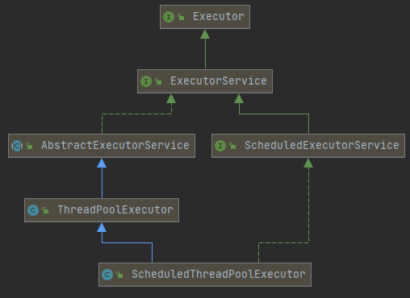

## ScheduleThreadPoolExecutor 定时任务线程池

之前讲到ThreadPoolExecutor，ScheduleThreadPoolExecutor继承自ThreadPoolExecutor，它的主要作用是用于定时任务的的线程池，给定延迟时间，来继续执行任务。

ScheduleThreadPoolExecutor比Timer使用起来更方便，也避免了因为任务抛出异常，无法在进行任务的尴尬。



定时任务线程池接收ScheduleFutureTask类型的任务，有三种提交方式

1. schedule 

2. scheduledAtFixedRate()方法的作用是预定在初始的延迟结束后，周期性地执行给定的任务，周期长度为period，其中initialDelay为初始延迟。此处的周期性的时间间隔指的是此次开始任务执行到下次任务开始执行的时间间隔。

   ```java
   public ScheduledFuture<?> scheduleAtFixedRate(Runnable command,
                                                     long initialDelay,
                                                     long period,
                                                     TimeUnit unit)
   ```

3. scheduledWithFixedDelay()方法的作用是预定在初始的延迟结束后周期性地执行给定任务，在一次调用完成和下一次调用开始之间有长度为delay的延迟，其中initialDelay为初始延迟。

```java
public ScheduledFuture<?> scheduleWithFixedDelay(Runnable command,
                                                     long initialDelay,
                                                     long delay,
                                                     TimeUnit unit) 
```


定时任务队列中就没有非核心线程的概念了，在线程池中都是核心线程，当开始执行任务时，首先把任务放到队列中，然后判断活跃线程数是否小于核心线程数，如果小于就创建线程，如果线程都已经创建满了，就会不断的在队列中取任务，不断的执行。

首先看下scheduleWithFixedDelay()的构造函数，

```java
 public ScheduledFuture<?> scheduleWithFixedDelay(Runnable command,//任务
                                                     long initialDelay,//初始延迟时间
                                                     long delay,//延迟时间
                                                     TimeUnit unit) {//单位
        if (command == null || unit == null)
            throw new NullPointerException();
        if (delay <= 0)
            throw new IllegalArgumentException();
        ScheduledFutureTask<Void> sft =
            new ScheduledFutureTask<Void>(command,
                                          null,
                                          triggerTime(initialDelay, unit),
                                          unit.toNanos(-delay));
        RunnableScheduledFuture<Void> t = decorateTask(command, sft);
        sft.outerTask = t;//此处把RunnableScheduledFuture给自己，从而可以不断的执行任务
        delayedExecute(t);//执行任务
        return t;
    }
```

```java
void ensurePrestart() {
        int wc = workerCountOf(ctl.get());
        if (wc < corePoolSize)
            addWorker(null, true);
        else if (wc == 0)
            addWorker(null, false);
    }
```

当活跃线程小于核心线程数，继续创建worker，如果当前并没有线程，直接创建一个新的线程。

addWorker()方法在之前已经聊过，现在就不再赘述了。后面的就和线程池都一样了。只不过没有了非核心线程的概念。

## ScheduleFutureTask类

ScheduleFutureTask接受的参数：

```java
private final long sequenceNumber;//任务的序号
private long time;//任务开始执行的时间
private final long period;//任务执行的时间间隔
```


### run()实现方法

```java
 public void run() {
            boolean periodic = isPeriodic();
            if (!canRunInCurrentRunState(periodic))//不是运行状态直接结束
                cancel(false);
            else if (!periodic)//如果不是定时任务，直接执行FutureTask的run()方法。
                ScheduledFutureTask.super.run();
            else if (ScheduledFutureTask.super.runAndReset()) {//如果是定时任务，执行FutureTask的runAndReset()方法在执行完任务后，设置下次的执行时间
                setNextRunTime();
                reExecutePeriodic(outerTask);
            }
        }
```

```java
private void setNextRunTime() {
            long p = period;
            if (p > 0)
                time += p;
            else
                time = triggerTime(-p);
        }
```

这里的设计是非常的巧妙的，也是上面所说的两个时间间隔设置不同的地方的源码出入。一个是直接在当前时间基础上加上时间间隔，而另一个则是在本次任务结束后再加上时间间隔。

### DelayedWorkQueue队列

这部分就暂时不写了


