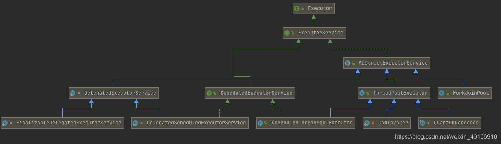
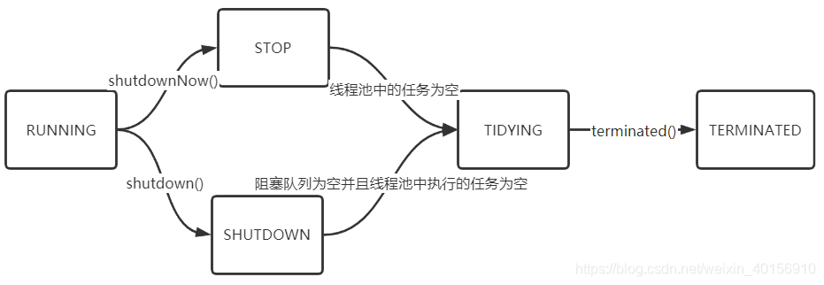
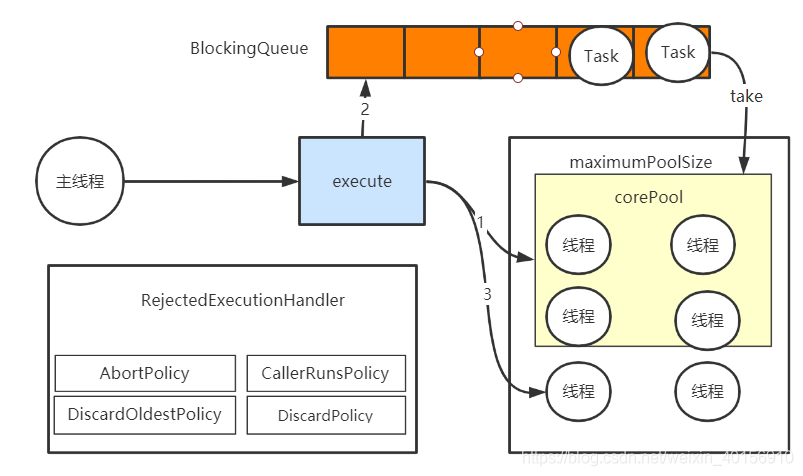

# 线程池

对于线程的介绍在这里就不多赘述了，直接就说说线程池吧。线程池其实就是线程的缓存，线程是稀缺资源，如果被无限制的创建，不仅会消耗系统资源，还会降低系统的稳定性，因此Java提供线程池对线程进行统一的分配、调优和监控。 

## 线程池介绍

在Web开发中，服务器接受请求并处理，一般会为每个请求都分配一个线程进行处理，在低并发场景下这种做法看起来很方便，但是这样是存在问题的：
		假设在高并发的场景下，每个线程执行一个请求，每个线程的执行时间都很短，这样就会频繁的进行线程的创建以及销毁，这样会严重影响系统的执行效率。可能会出现系统创建和销毁线程的花费的时间和消耗系统的资源比实际处理用户的请求的时间和资源还多。
这样线程池的作用就体现出来了，通过对任务重用线程，把线程创建的分销被分摊到多个任务当中。
线程池的使用场景：

1. 单个任务处理的时间较短；
2. 需要处理的任务数量多。

线程池的优势：
1. 重用存在的线程，减少线程的创建和销毁，提高性能；
2. 提升响应速度。当任务到达时，不用创建线程就可以执行任务；
3. 提高线程的可管理性。线程是稀缺资源，如果无限制的创建，不仅会消耗系统资源，还会降低系统的稳定性，使用线程池可以统一分配、调优和监控。

## Executor框架

Executor接口是线程池框架中最基础的部分，定义了一个用于执行Runnable的execute方法。如下图所示，Executor下有一个重要的子接口ExecutorService，其中定义了线程池的行为。



1. execute(Runnable command)：执行Runnable类型的任务。
2. submit(Callable task)：用来提交Callable或Runnable任务，并返回Future对象。
3. shutdown():在完成已提交的任务后封闭，不再接受新任务。
4. shutdownNow()：停止正在执行的任务并封闭。
5. isTerminated():测试是否所有的任务都已经完成。
6. isShutdown():测试该ExecutorService已被关闭。   

## 线程池属性

```java
private final AtomicInteger ctl = new AtomicInteger(ctlOf(RUNNING, 0));
private static final int COUNT_BITS = Integer.SIZE - 3;
private static final int CAPACITY   = (1 << COUNT_BITS) - 1;
```

ctl是对线程池的运行状态和线程池中有效线程数量进行控制的字段，包含两部分信息：线程池的运行状态(runState)和线程池内的有效线程数量(workCount)。`COUNT_BITS`表示用低29位表示workerCount，高3位表示runState，`CAPACITY`表示workerCount的上限值。

ctl相关方法

```java
// Packing and unpacking ctl
private static int runStateOf(int c)     { return c & ~CAPACITY; }
private static int workerCountOf(int c)  { return c & CAPACITY; }
private static int ctlOf(int rs, int wc) { return rs | wc; }
```

线程池的五种状态

```java
// runState is stored in the high-order bits
    private static final int RUNNING    = -1 << COUNT_BITS;
    private static final int SHUTDOWN   =  0 << COUNT_BITS;
    private static final int STOP       =  1 << COUNT_BITS;
    private static final int TIDYING    =  2 << COUNT_BITS;
    private static final int TERMINATED =  3 << COUNT_BITS;
```

RUNING
 1. 状态说明：线程池处于RUNNING状态时，能够接受新的任务，以及对已填加的任务进行处理。
 2. 状态切换：线程池的初试状态是RUNNING，线程池一旦被创建，就处于RUNNING状态，并且线程池中的任务数为0。

SHUTDOWN
 1. 状态说明：线程池处在SHUTDOWN状态时，不接收新的任务，但还是可以处理已填加的任务。
 2. 状态切换：调用线程池的`shutdown()`接口时，线程池由RUNING->SHUTDOWN进行状态转换。

STOP
 1. 状态说明：线程池处于STOP状态时，不接收新任务，不处理已添加的任务，并且会中断正在处理的任务。
 2. 状态切换：调用线程池的`shutdownNow()`接口时，线程池由(RUNNING or SHUTDOWN)—>STOP。

TIDYING
 1. 状态说明：当所有任务已终止，ctl记录的任务数量为0，线程池状态变为TIDYING。当线程池变为TIDYING时，会执行函数`terminated()`。`terminated()`在ThreadPoolExecutor类中是空的。
 2. 状态切换：当线程池在SHUTDOWN状态下，阻塞队列为空并且线程池中执行的任务为空时，就会由SUTDOWN->TIDYING。

TERMINATED
 1. 状态说明：线程池彻底终结，就会变成TERMINATED状态。

 2. 状态切换：线程池在TIDYING状态时，执行完`terminated()`之后，就会由TIDYING->TERMINATED，进入到TERMINATED的条件如下：
     1.线程池不是RUNNING状态；
     2.线程池状态不是TIDYING状态或TERMINATED状态；
     3.线程池是SHUTDOWN并且workerQueue为空；
     4.workCount为0；
     5.设置TIDYING状态成功。
     
     
     
     

## 线程池实现原理

创建线程池

```java
public ThreadPoolExecutor(int corePoolSize,//核心线程数
                              int maximumPoolSize,//最大线程数
                              long keepAliveTime,//线程池允许的空闲时间
                              TimeUnit unit,//keepAliveTime时间单位
                              BlockingQueue<Runnable> workQueue) {//阻塞队列
        this(corePoolSize, maximumPoolSize, keepAliveTime, unit, workQueue,
             Executors.defaultThreadFactory(), defaultHandler);
    }
```



假设设置`corePoolSize = 4`，`maximumPoolSize=6`.
1. 当一个`Task-1`开始执行`execute()`，此时会在`corePool`中创建一个线程`thread-1`，用于执行`task-1`，然后`task-2`执行，此时不管`thread-1`是否执行，都会重新创建线程`thread-2`用于执行`task-2`,直到当前线程数等于`corePoolSize`；
2. 当`corePool`已经到达可执行线程数，并且当前线程都正在执行，此时进来`task-3`将会进入到阻塞队列`BlockingQueue`(阻塞队列可以设置size)，当`corePool`会从阻塞队列中去拿task执行；
3. 当阻塞队列满了，就会在非核心线程区创建线程，还是符合核心线程创建的规则，直到线程数量等于`maximumPoolSize`；
4. 当线程都在运行，并且阻塞队列有已经满了，那么就会执行拒绝策略。


# ThreadPoolExecutor

## 线程池执行

程序执行`submit()`线程池启动:

```java
public <T> Future<T> submit(Runnable task, T result) {
        if (task == null) throw new NullPointerException();
        RunnableFuture<T> ftask = newTaskFor(task, result);
        execute(ftask);
        return ftask;
    }
```


```java
public void execute(Runnable command) {
        if (command == null)
            throw new NullPointerException();
        int c = ctl.get();
        if (workerCountOf(c) < corePoolSize) {
            if (addWorker(command, true))
                return;
            c = ctl.get();
        }
        if (isRunning(c) && workQueue.offer(command)) {
            int recheck = ctl.get();
            if (! isRunning(recheck) && remove(command))
                reject(command);
            else if (workerCountOf(recheck) == 0)
                addWorker(null, false);
        }
        else if (!addWorker(command, false))
            reject(command);
    }
```

1. 当执行`execute(Runnable command)`，首先获取`workerCount`,如果满足` if (workerCountOf(c) < corePoolSize)`，则需要创建核心线程，并返回；
2. 如果满足`if (isRunning(c) && workQueue.offer(command))`，这里确保线程池处于RUNNING状态，并且核心线程池已经满了，task将放入阻塞队列，如果满足`if (! isRunning(recheck) && remove(command))`，此刻线程池并不是运行状态，需要将放入到阻塞队列的task删除，并执行拒绝策略，如果满足`else if (workerCountOf(recheck) == 0)`，此刻有效线程数为0，则会创建线程，这样做的目的是线程池中要有一个线程执行任务；
3. 如果` else if (!addWorker(command, false))`满足，则执行拒绝策略。

在这里补充一下吧，此处是在文章写完以后想到的，主要是非核心线程的取任务的逻辑。

当非核心线程已经创建满了，如果按照之前没有创建满的逻辑，那么此时是无法再去创建新的worker的，那么此时，非核心线程是要从阻塞队列里面去取任务，如果阻塞队列此时并没有任务，那么，意味着就会进入到超时等待，过了这段时间，那么非核心线程是会释放掉的；而此时，核心线程取不到任务就会进入到阻塞状态，直到新的任务进入到阻塞队列，此时核心线程就会重新取任务。


```java
private boolean addWorker(Runnable firstTask, boolean core) {
        retry:
        for (;;) {
            int c = ctl.get();
            int rs = runStateOf(c);

            // Check if queue empty only if necessary.
            if (rs >= SHUTDOWN &&
                ! (rs == SHUTDOWN &&
                   firstTask == null &&
                   ! workQueue.isEmpty()))
                return false;

            for (;;) {
                int wc = workerCountOf(c);
                if (wc >= CAPACITY ||
                    wc >= (core ? corePoolSize : maximumPoolSize))
                    return false;
                if (compareAndIncrementWorkerCount(c))
                    break retry;
                c = ctl.get();  // Re-read ctl
                if (runStateOf(c) != rs)
                    continue retry;
                // else CAS failed due to workerCount change; retry inner loop
            }
        }

        boolean workerStarted = false;
        boolean workerAdded = false;
        Worker w = null;
        try {
            w = new Worker(firstTask);
            final Thread t = w.thread;
            if (t != null) {
                final ReentrantLock mainLock = this.mainLock;
                mainLock.lock();
                try {
                    // Recheck while holding lock.
                    // Back out on ThreadFactory failure or if
                    // shut down before lock acquired.
                    int rs = runStateOf(ctl.get());

                    if (rs < SHUTDOWN ||
                        (rs == SHUTDOWN && firstTask == null)) {
                        if (t.isAlive()) // precheck that t is startable
                            throw new IllegalThreadStateException();
                        workers.add(w);
                        int s = workers.size();
                        if (s > largestPoolSize)
                            largestPoolSize = s;
                        workerAdded = true;
                    }
                } finally {
                    mainLock.unlock();
                }
                if (workerAdded) {
                    t.start();
                    workerStarted = true;
                }
            }
        } finally {
            if (! workerStarted)
                addWorkerFailed(w);
        }
        return workerStarted;
    }
```


1. 首先需要对线程池的运行状态进行判断，如果满足`if (rs >= SHUTDOWN &&
                            ! (rs == SHUTDOWN &&
                               firstTask == null &&
                               ! workQueue.isEmpty()))`其中一个条件，都会返回`false`。
                               1.`rs >= SHUTDOWN`,
                               2:`rs == SHUTDOWN`这时表示关闭状态，不再接收新的任务，但是可以继续处理已有的任务；` firstTask == null `;`!
            workQueue.isEmpty()`阻塞队列不为空。
 2. for循环，` if (wc >= CAPACITY ||
                                wc >= (core ? corePoolSize : maximumPoolSize))`判断当前是否已经超过线程的最大数量，第一个条件不满足，判断`wc`是否满足当前线程池的阈值，满足返回false,`if
            (compareAndIncrementWorkerCount(c))`尝试增加workCount，增加成功跳出循环，否则重新获取ctl，满足`
            if (runStateOf(c) != rs)`说明当前的运行状态变更了，则需要跳出循环。 
3. 此刻会`new Worker(firstTask)`创建一个新的线程，如果`if (rs < SHUTDOWN ||
                                    (rs == SHUTDOWN && firstTask == null))
    `，线程池正在运行状态或线程SHUTDOWN状态，并且`firstTask==null`时，向线程池中添加线程，因为线程SHUTDOWN状态不能添加新的任务，但是可以执行当前存在的任务。

```java
Worker(Runnable firstTask) {
            setState(-1); // inhibit interrupts until runWorker
            this.firstTask = firstTask;
            this.thread = getThreadFactory().newThread(this);
        }
```

线程池中的每个线程都被定义为`Worker`，线程池其实就是一组`Worker`对象。Task被设置成`firstTask`，然后创建Worker的线程。线程执行以后，调用`runWorker(Worker w)`方法。

```java
final void runWorker(Worker w) {
        Thread wt = Thread.currentThread();
        Runnable task = w.firstTask;
        w.firstTask = null;
        w.unlock(); // allow interrupts
        boolean completedAbruptly = true;
        try {
            while (task != null || (task = getTask()) != null) {
                w.lock();
                // If pool is stopping, ensure thread is interrupted;
                // if not, ensure thread is not interrupted.  This
                // requires a recheck in second case to deal with
                // shutdownNow race while clearing interrupt
                if ((runStateAtLeast(ctl.get(), STOP) ||
                     (Thread.interrupted() &&
                      runStateAtLeast(ctl.get(), STOP))) &&
                    !wt.isInterrupted())
                    wt.interrupt();
                try {
                    beforeExecute(wt, task);
                    Throwable thrown = null;
                    try {
                        task.run();
                    } catch (RuntimeException x) {
                        thrown = x; throw x;
                    } catch (Error x) {
                        thrown = x; throw x;
                    } catch (Throwable x) {
                        thrown = x; throw new Error(x);
                    } finally {
                        afterExecute(task, thrown);
                    }
                } finally {
                    task = null;
                    w.completedTasks++;
                    w.unlock();
                }
            }
            completedAbruptly = false;
        } finally {
            processWorkerExit(w, completedAbruptly);
        }
    }
```

1. 首先`while (task != null || (task = getTask()) != null)`在等待队列中通过`getTask()`方法获取任务；
2. 如果`if ((runStateAtLeast(ctl.get(), STOP) ||(Thread.interrupted() &&runStateAtLeast(ctl.get(), STOP))) &&!wt.isInterrupted())` ，当线程池正在停止，要保证当前线程是中断状态，否则保证线程不是中断状态；
3. 执行`task.run()`执行任务；
4. 当`(task = getTask()) == null)`时，跳出循环，执行`processWorkerExit(w, completedAbruptly)`。

```java
private Runnable getTask() {
        boolean timedOut = false; // Did the last poll() time out?//是否超时

        for (;;) {
            int c = ctl.get();
            int rs = runStateOf(c);

            // Check if queue empty only if necessary.
            if (rs >= SHUTDOWN && (rs >= STOP || workQueue.isEmpty())) {//线程池SHUTDOWN &&rs>STOP  ||阻塞队列为空  此时不允许向队列中添加任务
                decrementWorkerCount();//workerCount -1
                return null;
            }

            int wc = workerCountOf(c);

            // Are workers subject to culling?
            boolean timed = allowCoreThreadTimeOut || wc > corePoolSize;//allowCoreThreadTimeOut 默认为false,指核心线程不允许超时，对于非核心线程需要进行超时处理。

            if ((wc > maximumPoolSize || (timed && timedOut))//wc > maximumPoolSize的情况是因为可能在此方法执行阶段同时执行了setMaximumPoolSize方法；
                && (wc > 1 || workQueue.isEmpty())) {//有效线程>1||阻塞队列为空，workerCount-1
                if (compareAndDecrementWorkerCount(c))
                    return null;
                continue;
            }

            try {
                Runnable r = timed ?
                    workQueue.poll(keepAliveTime, TimeUnit.NANOSECONDS) :
                    workQueue.take();//超时？超时处理，如果队列为空直接返回null：take执行，如果队列为空，则造成阻塞直到队列不为空
                if (r != null)
                    return r;
                timedOut = true;//r ==null，则会发生超时
            } catch (InterruptedException retry) {
                timedOut = false;
            }
        }
    }
```

1. 当`if (rs >= SHUTDOWN && (rs >= STOP || workQueue.isEmpty())) `此处判断线程池是否停止运行，以及等待等待队列是否为空，如果满足条件则会workerCount-1处理；
2. `boolean timed = allowCoreThreadTimeOut || wc > corePoolSize`，默认`allowCoreThreadTimeOut`为`false`，`wc > corePoolSize`是对当前是否超过核心线程数的判断；
3. 当`if ((wc > maximumPoolSize || (timed && timedOut))&& (wc > 1 || workQueue.isEmpty())) `此处主要是判断是否更新`maximumPoolSize`，以及做超时处理，这里`wc>1`的原因是，当`wc==1`时，当前线程为线程池中唯一的线程，满足条件则判断workCount-1是否成功；
4. try中的部分如果超时则做超时处理，没有超时直接取任务，使用take()函数时，加入队列为空，则造成阻塞，直到有新的任务。